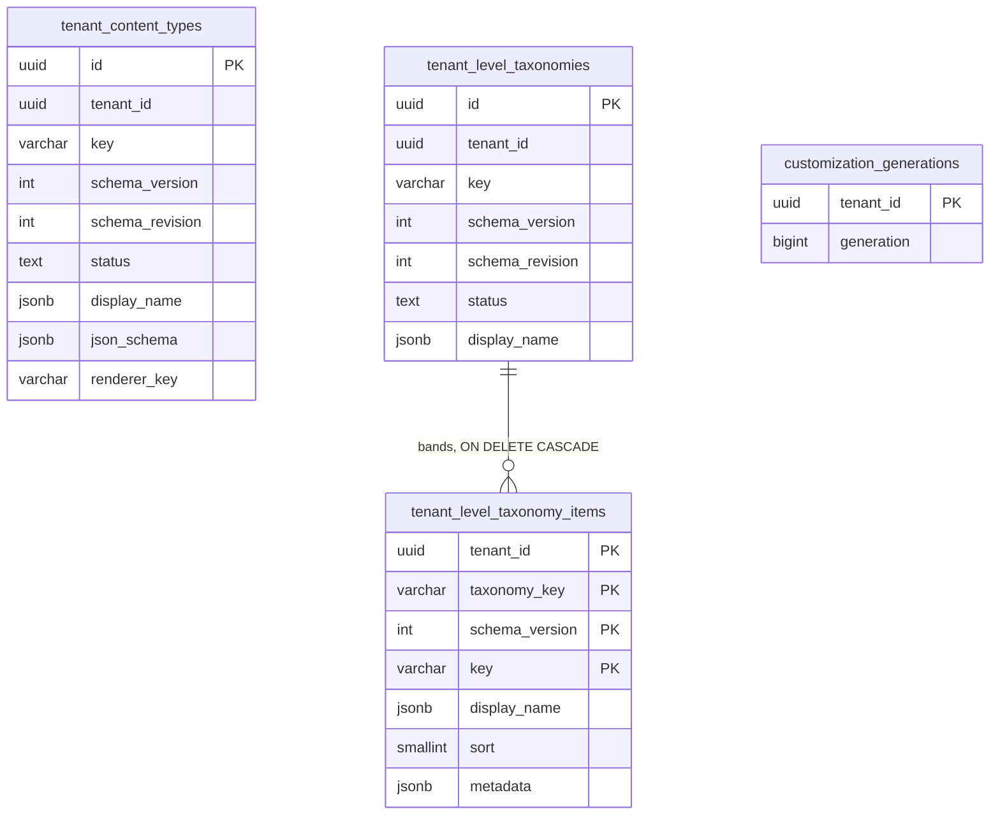
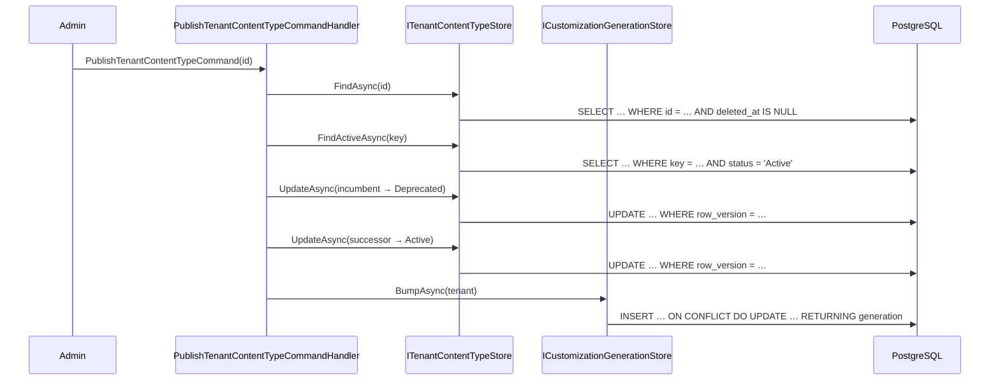
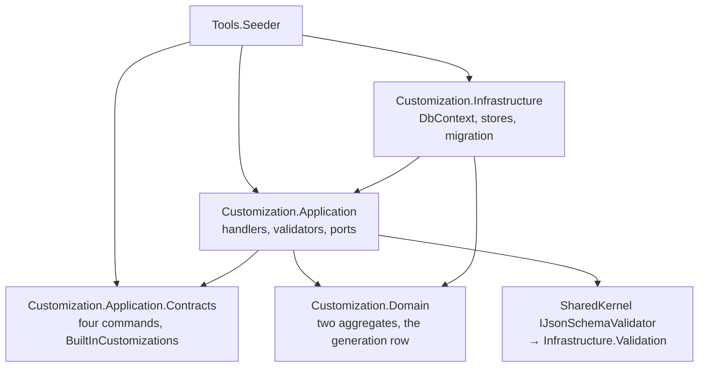

# Module Spec — Customization

**Status:** Design stable, partially implemented (Phase 02a Packet 8 shipped the
two aggregates, the schema and its isolation, the payload gate, and the write
path; the read path and its generation-keyed cache land with the first consumer
in [Phase 02d](../../roadmap/phase-02d-walking-skeleton.md), and the Admin Studio
editors with the phases that consume them).

The second module spec in the repository, per
[Documentation Standards § Per-Module Specifications](../../standards/13-documentation.md).

## Overview

Customization owns **the shapes a tenant declares its own data will take**, and
nothing about the data itself.

It is the module [ADR-0018](../../decisions/0018-tenant-driven-customization-model.md)
exists for: one binary and one schema serve a language school, a yoga studio and
a coding bootcamp because what differs between them is rows in these tables, not
code in any module. The boundary of that claim is
[Platform Vision § Genericity boundary](../../architecture/01-platform-vision.md)
— content shape, presentation and pure rule evaluation are tenant data; stateful
entitlement and external capability invocation are platform features gated by
plan.

**It owns:**

- **`TenantContentType`** — a tenant-authored JSON Schema declaring the shape of
  one kind of content, plus the composite renderer that draws it.
- **`TenantLevelTaxonomy`** — the tenant's level or difficulty vocabulary, and
  the bands inside it. CEFR for a language school, kyu/dan for a dojo, whatever
  a yoga studio calls its levels.
- **`customization_generations`** — one counter per tenant, embedded in every
  cache key this module's reads compose. Not an aggregate
  ([ADR-0043 § 7](../../decisions/0043-customization-payload-validation.md)).

**It does not own:**

- **The content.** A `TenantContentType` says what an article looks like; the
  articles live in Content, from [Phase 04](../../roadmap/phase-04-cms-media-pages.md).
- **The renderers.** `default-card` and its eight siblings are frontend
  components; this module stores their keys and
  `Composite_Renderer_Keys_Match_The_Frontend_Registry` holds the two lists
  equal.
- **The evaluator.** Scoring and completion rule bodies are `text` plus a
  `dialect` discriminator, decided here and given a table in
  [Phase 05](../../roadmap/phase-05-education-learning-content.md) once ADR-0025
  chooses the language.
- **Validation of instances against a schema.** `IJsonSchemaValidator` lives in
  the shared kernel because four modules need it, and this module is only its
  first caller. It admits LearnStack's own `x-renderer` / `x-taxonomy` /
  `x-language` keywords and reports where each one sits; **resolving** them
  against the registries is this module's, per
  [ADR-0043 § 4](../../decisions/0043-customization-payload-validation.md), because
  two of the registries are its own and the third is a tenant's rows.

## Entity-relationship diagram

Text fallback: four tables. The two definition tables are tenant-owned and
tenant-wide, keyed on a surrogate `id` with
`UNIQUE (tenant_id, key, schema_version)` as the natural key and a partial
`UNIQUE (tenant_id, key) WHERE status = 'Active' AND deleted_at IS NULL` holding
one live revision per concept. Taxonomy items are a child table inside the
taxonomy aggregate, keyed on `(tenant_id, taxonomy_key, schema_version, key)`
with a composite foreign key that includes `tenant_id` — because referential
integrity checks run with row security bypassed, and a single-column key would
let one tenant's band point at another's taxonomy. The generation counter is one
row per tenant and references nothing.

Every one of the four is under `ENABLE` **and** `FORCE ROW LEVEL SECURITY` with
the tenant-owned tenant-wide policy from
[Database Standards § Table classes](../../standards/05-database.md).

## State diagrams

```mermaid
stateDiagram-v2
    [*] --> Draft: Register
    Draft --> Active: Publish
    Active --> Deprecated: Publish of a successor
    Draft --> [*]: deleted, nothing referenced it
    Deprecated --> [*]: never; rows that pinned it still resolve
```

Text fallback: a definition is registered as `Draft`, published to `Active`, and
retired to `Deprecated` when a successor is published. Only a `Draft`'s body is
mutable — a published revision was validated against stored instances that
cannot be re-validated retroactively, so a change a stored instance could fail
raises `schema_version` instead. A `Deprecated` revision is history and is never
removed: content rows pin the version they were written against.

## Sequence diagrams

### Primary write: publishing a successor

Text fallback: the handler loads the successor, refuses anything that is not a
`Draft`, finds the live revision of the same key, deprecates it, publishes the
successor, and bumps the generation. **The order is load-bearing**: the partial
index admits one live row per key, so publishing before retiring is the one
ordering PostgreSQL rejects — and it would reject it after the successor's
`UPDATE` had already been sent. All of it is one transaction, because
[ADR-0040](../../decisions/0040-ambient-unit-of-work.md) gives the scope one.

### Primary integration-event flow: none

There is no integration-event diagram because there is no integration event —
see [§ Integration-event catalogue](#integration-event-catalogue) for why, and
for the condition under which one becomes owed.
[Documentation Standards § Per-Module Specifications](../../standards/13-documentation.md)
asks for a diagram of the primary integration-event flow; this records its
absence rather than substituting an unrelated diagram for it.

### Primary read flow: resolving a tenant's shapes

Not implemented. The read path is a projection keyed on
`customization_generations.generation`, so every write strands every stale key at
once across every pod without enumerating anything —
[§ 8.2](../../architecture/32-tenant-customization-model.md) has the design and
[ADR-0043 § 6](../../decisions/0043-customization-payload-validation.md) deletes
the compiled-validator cache that used to sit beside it. It lands with its first
consumer in [Phase 02d](../../roadmap/phase-02d-walking-skeleton.md).

## Component diagram

Text fallback: the seeder is the second composition root, so it references the
Application and Infrastructure projects as well as the contracts — it has to
register the ports itself. Contracts name only `SharedKernel` types, so a module
sending a command does not take a dependency on `Customization.Domain` — the forbidden
`Module A → Module B.Domain` edge. Application declares the ports; Infrastructure
implements them and is wired at the composition root. The JSON-Schema gate is a
shared-kernel port with one adapter, and `JsonSchema_Net_Types_NotImportedOutsideInfrastructure`
keeps the library's types inside it.

## Integration-event catalogue

**None yet.** Nothing outside this module reacts to a customization change today,
because nothing outside it reads customizations yet. The first consumer is the
renderer in [Phase 02d](../../roadmap/phase-02d-walking-skeleton.md), and it
reads through the generation-keyed cache rather than by subscription — a cache
key that changes is a cheaper invalidation than an event every pod has to
receive. An event becomes owed when a second module needs to *act* on a change
rather than merely notice it; [Phase 04](../../roadmap/phase-04-cms-media-pages.md)
is where that is decided, because it brings the content rows a schema change
would have to be reconciled against.

## Permission matrix

In [permissions.md](permissions.md), the file
[Permission Standards](../../standards/19-permissions.md) names.

## Audit coverage matrix

In [audit.md](audit.md), the file
[Audit Coverage](../../standards/18-audit-coverage.md) names.

## Performance budget

| Path | Budget | Why this number |
|---|---|---|
| Resolve a tenant's live definitions (cache hit) | **< 1 ms** | On every render of every page |
| Resolve a tenant's live definitions (cache miss) | **< 20 ms** p95 | Two indexed reads on partial unique indexes |
| Admit a tenant-authored schema (four gates) | **< 50 ms** p95 | Interactive, on save, and rare |
| Validate one instance at the § 8.4 caps | **742 ms, 1.6 GB** | Measured worst case, not a budget — see below |
| Publish a successor (2 reads, 2 updates, 1 upsert) | **< 100 ms** p95 | Interactive but rare |

The instance-validation number is the one to read carefully: it is a **measured
worst case** at
[§ 8.4](../../architecture/32-tenant-customization-model.md)'s declared caps —
100 properties over a 1 MiB instance — not a target. It is why the caps exist,
and why the compiled schema does not outlive a call: compiling is measured
*cheaper* than evaluating, so a cache would have added a hit-rate problem to
solve none.

## Risks and open questions

- **Which lifecycle stage a `schema_revision` bump belongs to is open.**
  [ADR-0043 § 6](../../decisions/0043-customization-payload-validation.md)
  deliberately leaves it open, having removed the cache that would have had to
  key on it. Today `AddItem` and `RemoveItem` each count as one additive edit, so
  a taxonomy registered with three bands is at revision 3 — consistent with the
  aggregate's own rule and unconstrained by anything else.
  [Phase 04 § Customization Key Shape](../../roadmap/phase-04-cms-media-pages.md)
  owns the answer.
- **No permission check gates these commands.** Reachability stands in for
  authorization exactly as it does in Tenancy, and for the same reason: there is
  no HTTP endpoint. [Phase 03](../../roadmap/phase-03-identity-admin.md) brings
  the registry, and [permissions.md](permissions.md) is the forward declaration.
- **No audit rows.** MUST-class audit is
  [ADR-0033](../../decisions/0033-audit-durability-model.md)'s and lands with
  Packet 9's infrastructure; [audit.md](audit.md) is the forward declaration and
  says what these handlers already do to make that addition a wiring change.
- **The additive claim on a revision is unchecked.** `ReviseSchema` enforces the
  half an aggregate can — that the body is still a draft — and leaves the diff
  that decides whether a change only *adds* to the editor,
  [Phase 04](../../roadmap/phase-04-cms-media-pages.md).
- **`x-language` is admitted without resolving.** `x-renderer` resolves against
  the twelve generic primitives and `x-taxonomy` against the tenant's own
  taxonomies, both on save; the set of languages a `code` field may declare is
  decided by nothing in the corpus and belongs to
  [Phase 04](../../roadmap/phase-04-cms-media-pages.md) with the field type that
  carries one. [§ 8.1](../../architecture/32-tenant-customization-model.md) records
  the gap rather than leaving the invariant reading as though it were closed.
- **Publishing an older revision silently demotes a newer live one.** `Publish`
  retires whatever is `Active` for the key without comparing `schema_version`, so
  a `Draft` left over at v1 makes v1 live again and deprecates v3. That is
  *coherent* with the model — an entry pins the version it was written against,
  and [ADR-0013](../../decisions/0013-page-block-schema-versioning.md) keeps the
  deprecated revision resolvable — so it is a rollback rather than a corruption,
  and refusing it would forbid one. What is missing is the editor that makes the
  choice deliberate: [Phase 04](../../roadmap/phase-04-cms-media-pages.md) owns
  the diff that decides additive from breaking, and this question with it.
- **The lifecycle guards do not mention soft delete, and nothing can reach them.**
  `Publish` and `ReviseSchema` do not ask whether the row is deleted. They cannot
  be handed one: there is no delete command, and both store reads exclude
  `deleted_at IS NOT NULL`. The guard is owed by whichever phase ships the delete
  command — [Phase 04](../../roadmap/phase-04-cms-media-pages.md) for content
  types, per [audit.md](audit.md)'s `soft delete` row — and writing it now would
  be a branch no test could kill.
- **A tenant can strand its own content.** Deprecating the only live revision of
  a key leaves content rows pinned to a version nothing publishes. The schema
  permits it and no command refuses it, because "is this key still needed?" is a
  question only the module that owns the content rows can answer —
  [Phase 04](../../roadmap/phase-04-cms-media-pages.md) again.
