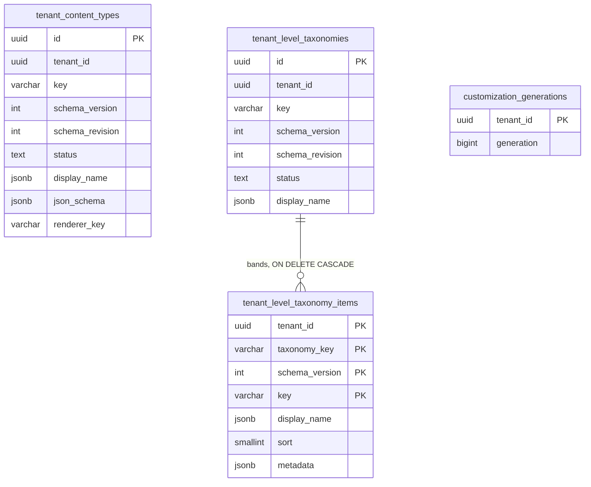
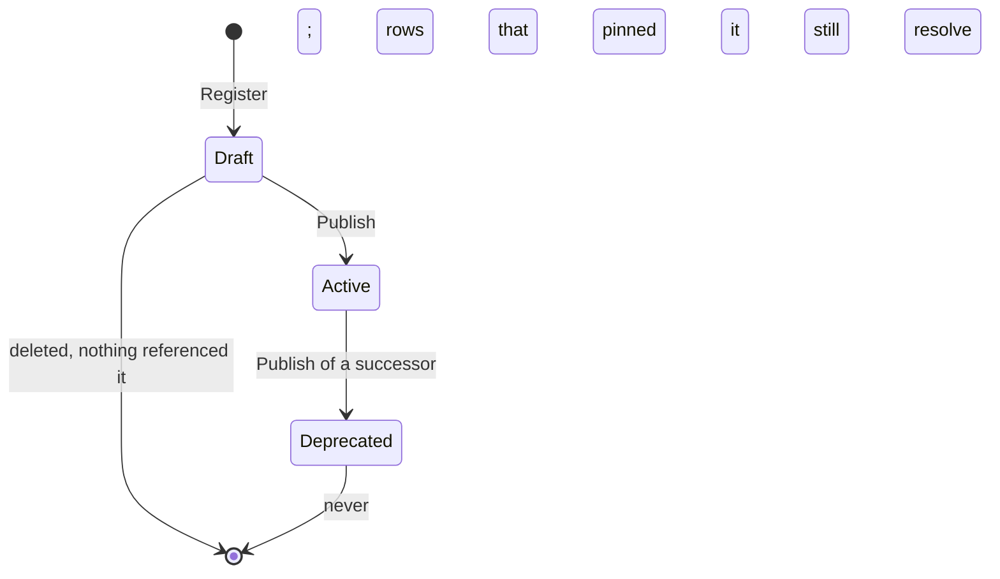
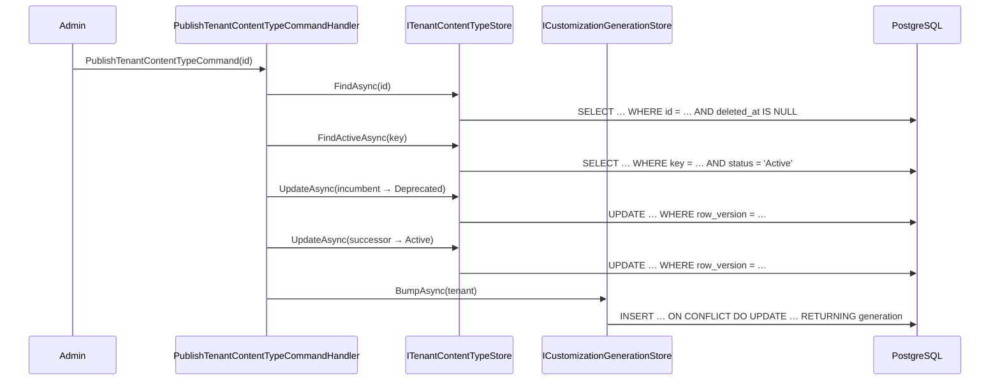
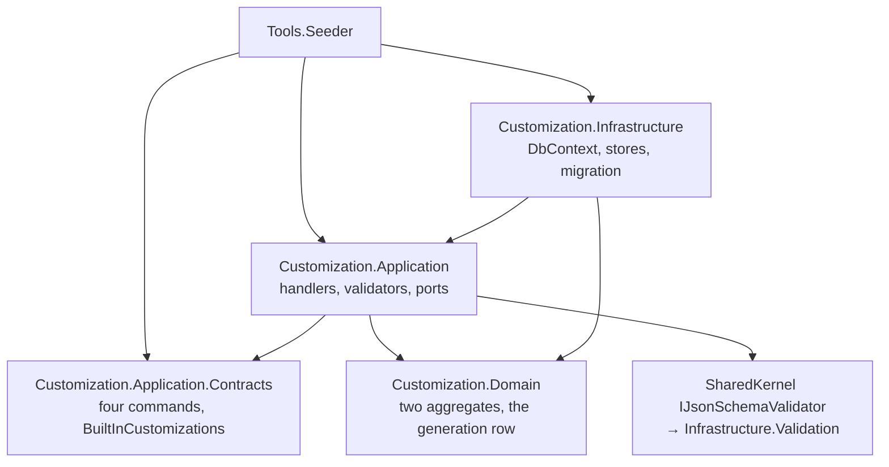

# Module Spec — Customization

**Status:** Design stable, partially implemented (Phase 02a Packet 8 shipped the
two aggregates, the schema and its isolation, the payload gate, and the write
path; P02d-2 Step 1 adds contextual exact-definition reads and metadata validation.
Public projections and their generation-keyed cache follow in P02d-3/4
in [Phase 02d](../../roadmap/phase-02d-walking-skeleton.md), and the Admin Studio
editors with the phases that consume them).

The second module spec in the repository, per
[Documentation Standards § Per-Module Specifications](../../standards/13-documentation.md).

## Overview

Customization owns **the shapes a tenant declares its own data will take**, and
nothing about the data itself.

It is the module [ADR-0018](../../decisions/0018-tenant-driven-customization-model.md)
exists for: one binary and one schema serve a language school, a yoga studio and
a coding bootcamp because what differs between them is rows in these tables, not
code in any module. The boundary of that claim is
[Platform Vision § Genericity boundary](../../architecture/01-platform-vision.md)
— content shape, presentation and pure rule evaluation are tenant data; stateful
entitlement and external capability invocation are platform features gated by
plan.

**It owns:**

- **`TenantContentType`** — a tenant-authored JSON Schema declaring the shape of
  one kind of content, plus the composite renderer that draws it.
- **`TenantLevelTaxonomy`** — the tenant's level or difficulty vocabulary, and
  the bands inside it. CEFR for a language school, kyu/dan for a dojo, whatever
  a yoga studio calls its levels.
- **`customization_generations`** — one counter per tenant, embedded in every
  cache key this module's reads compose. Not an aggregate
  ([ADR-0043 § 7](../../decisions/0043-customization-payload-validation.md)).

**It does not own:**

- **The content.** A `TenantContentType` says what an article looks like; the
  articles live in Content, from [Phase 04](../../roadmap/phase-04-cms-media-pages.md).
- **The renderers.** `default-card` and its eight siblings are keys of frontend
  composites; this module stores the keys, and
  [`Composite_Renderer_Keys_Match_The_Frontend_Registry`](../../standards/21-architecture-tests-catalogue.md#composite_renderer_keys_match_the_frontend_registry)
  holds the frontend's registered set inside the nine this module declares —
  containment, not equality.
- **The evaluator.** Scoring and completion rule bodies are `text` plus a
  `dialect` discriminator, decided here and given a table in
  [Phase 05](../../roadmap/phase-05-education-learning-content.md) once ADR-0025
  chooses the language.
- **Validation of instances against a schema.** `IJsonSchemaValidator` lives in
  the shared kernel because four modules need it, and this module is only its
  first caller. It admits LearnStack's own `x-renderer` / `x-taxonomy` /
  `x-language` keywords and reports where each one sits; **resolving** them
  against the registries is this module's, per
  [ADR-0043 § 4](../../decisions/0043-customization-payload-validation.md), because
  two of the registries are its own and the third is a tenant's rows.

## Entity-relationship diagram

```mermaid
erDiagram
    tenant_content_types {
        uuid id PK
        uuid tenant_id
        varchar key
        int schema_version
        int schema_revision
        text status
        jsonb display_name
        jsonb json_schema
        varchar renderer_key
    }
    tenant_level_taxonomies {
        uuid id PK
        uuid tenant_id
        varchar key
        int schema_version
        int schema_revision
        text status
        jsonb display_name
    }
    tenant_level_taxonomy_items {
        uuid tenant_id PK
        varchar taxonomy_key PK
        int schema_version PK
        varchar key PK
        jsonb display_name
        smallint sort
        jsonb metadata
    }
    customization_generations {
        uuid tenant_id PK
        bigint generation
    }

    tenant_level_taxonomies ||--o{ tenant_level_taxonomy_items : "bands, ON DELETE CASCADE"
```

Text fallback: four tables. The two definition tables are tenant-owned and
tenant-wide, keyed on a surrogate `id` with
`UNIQUE (tenant_id, key, schema_version)` as the natural key and a partial
`UNIQUE (tenant_id, key) WHERE status = 'Active' AND deleted_at IS NULL` holding
one live revision per concept. Taxonomy items are a child table inside the
taxonomy aggregate, keyed on `(tenant_id, taxonomy_key, schema_version, key)`
with a composite foreign key that includes `tenant_id` — because referential
integrity checks run with row security bypassed, and a single-column key would
let one tenant's band point at another's taxonomy. The generation counter is one
row per tenant and references nothing.

Every one of the four is under `ENABLE` **and** `FORCE ROW LEVEL SECURITY` with
the tenant-owned tenant-wide policy from
[Database Standards § Table classes](../../standards/05-database.md).

## State diagrams

```mermaid
stateDiagram-v2
    [*] --> Draft: Register
    Draft --> Active: Publish
    Active --> Deprecated: Publish of a successor
    Draft --> [*]: deleted, nothing referenced it
    Deprecated --> [*]: never; rows that pinned it still resolve
```

Text fallback: a definition is registered as `Draft`, published to `Active`, and
retired to `Deprecated` when a successor is published. Only a `Draft`'s body is
mutable — a published revision was validated against stored instances that
cannot be re-validated retroactively, so a change a stored instance could fail
raises `schema_version` instead. A `Deprecated` revision is history and is never
removed: content rows pin the version they were written against.

## Sequence diagrams

### Primary write: publishing a successor

```mermaid
sequenceDiagram
    participant Admin
    participant Handler as PublishTenantContentTypeCommandHandler
    participant Store as ITenantContentTypeStore
    participant Gen as ICustomizationGenerationStore
    participant DB as PostgreSQL

    Admin->>Handler: PublishTenantContentTypeCommand(id)
    Handler->>Store: FindAsync(id)
    Store->>DB: SELECT … WHERE id = … AND deleted_at IS NULL
    Handler->>Store: FindActiveAsync(key)
    Store->>DB: SELECT … WHERE key = … AND status = 'Active'
    Handler->>Store: UpdateAsync(incumbent → Deprecated)
    Store->>DB: UPDATE … WHERE row_version = …
    Handler->>Store: UpdateAsync(successor → Active)
    Store->>DB: UPDATE … WHERE row_version = …
    Handler->>Gen: BumpAsync(tenant)
    Gen->>DB: INSERT … ON CONFLICT DO UPDATE … RETURNING generation
```

Text fallback: the handler loads the successor, refuses anything that is not a
`Draft`, finds the live revision of the same key, deprecates it, publishes the
successor, and bumps the generation. **The order is load-bearing**: the partial
index admits one live row per key, so publishing before retiring is the one
ordering PostgreSQL rejects — and it would reject it after the successor's
`UPDATE` had already been sent. All of it is one transaction, because
[ADR-0040](../../decisions/0040-ambient-unit-of-work.md) gives the scope one.

P02d-2's concurrent seed proof exposed a same-revision publication race: the active
read can see a competitor's commit while EF retains the earlier tracked Draft.
Both publish handlers return typed concurrency refusal when that read identifies
the successor itself, without retiring it. Any failed publication save marks the
ambient unit rollback-only, including first publication with no incumbent.
[CustomizationPublicationConcurrencyTests](../../../backend/tests/LearnStack.Tests.Integration/Database/CustomizationPublicationConcurrencyTests.cs)
coordinates the intervening commit and proves absorbed post-save failures cannot
commit either the dirty successor or a later write.

Both publish commands accept an optional `RequireNoIncumbent` precondition.
Contextual Off queries check the logical key's Active identity before registration.
Convergent seed also passes true: a different Active revision is refused before mutation
as `business_rule_violation` / `lockey_customization_key_already_live`. Default false
retains ordinary revision succession. The same-row race remains typed concurrency;
an Active winner from another revision is never retired or adopted by seed.

### Primary integration-event flow: none

There is no integration-event diagram because there is no integration event —
see [§ Integration-event catalogue](#integration-event-catalogue) for why, and
for the condition under which one becomes owed.
[Documentation Standards § Per-Module Specifications](../../standards/13-documentation.md)
asks for a diagram of the primary integration-event flow; this records its
absence rather than substituting an unrelated diagram for it.

### Primary read flow: resolving a tenant's shapes

**P02d-3 Step 2 implemented — 2026-10-02; both review rounds passed.**
`ICustomizationDefinitionProjectionReader` resolves batched exact revision pins
through ADR-0010's application-contract mechanism. Values are immutable; no public
table, schema validation, HTTP endpoint or write is introduced. Active/Deprecated
nondeleted definitions are eligible; missing individual pins remain distinguishable
without failing unrelated members or substituting another revision. Labels resolve
per call with actual locale metadata from the caller's display-locale context.
The public response/refusal and page state remain P02d-4/6. The coherent loader
currently runs uncached; generation-keyed cache behavior is Step 3.

[Cache strategy § 8.2](../../architecture/32-tenant-customization-model.md#82-cache-strategy)
owns family keys, ambient snapshot loading, dirty-scope bypass, fault/cancellation
behavior and freshness. The two families include eligible retained revisions and
immutable bands; the writer's exact-purpose reader below stays uncached.
[P02d-3's accepted package](../../roadmap/phase-02d-walking-skeleton.md#p02d-3-decision-package-2026-10-02)
owns implementation steps and proof obligations. Public consumers arrive P02d-4.

## P02d-2 accepted exact write contract

**Step 1 implemented, both reviews passed — 2026-10-02.** An application interface in
`Customization.Application.Contracts` resolves an exact content-type or taxonomy
revision for the caller's announced tenant. DTOs contain values only: key, version,
status, JSON Schema/composite and validated presentation, or immutable bands/labels.
The selected interface is `IExactCustomizationDefinitionReader`; it takes an explicit
binding purpose (`NewBinding` or `ExistingPin`), never an inferred live version.

- New Course taxonomy and new Lesson content-type bindings require the exact Active
  revision; a present band must be declared in that revision.
- A translation on an existing Lesson can use its exact Active or Deprecated pin.
  No command rewrites a pin or replaces it with the newest revision.
- Absent, deleted, Draft or cross-tenant definitions return the same bounded binding
  `validation_failed`; an error cannot expose another tenant's revision or label.
- Read uncached in the caller's ambient transaction/context. Eligibility is observed
  at this read, not promised Active-at-commit; immutable schema/bands protect the pin
  if it is concurrently deprecated. Strict commit-time eligibility is not selected.
- Body validation uses `IJsonSchemaValidator` against that returned exact schema.
  Public response shape, generation-keyed read cache and renderer fallback remain
  P02d-3/4/6 gates, not features of this write contract.
- Module-owned contextual verification queries give the seeder exact IDs, revision
  data, labels/bands and state. They are audit Off and introduce no setter exception.

[ADR-0051](../../decisions/0051-ordered-text-card-presentation.md) defines the optional
root `x-fields` profile and semantic resolver. It preserves the four gates and legacy
schemas; P02d-2 Step 1 implements the parser and semantic resolver. Seed definitions opt
into the profile, whereas built-in `card`/`plain` remain unchanged and Active.

## Component diagram

```mermaid
graph TD
    Contracts[Customization.Application.Contracts<br/>four commands, BuiltInCustomizations]
    App[Customization.Application<br/>handlers, validators, ports]
    Domain[Customization.Domain<br/>two aggregates, the generation row]
    Infra[Customization.Infrastructure<br/>DbContext, stores, migration]
    Gate[SharedKernel IJsonSchemaValidator<br/>→ Infrastructure.Validation]
    Seeder[Tools.Seeder]

    Seeder --> Contracts
    Seeder --> App
    Seeder --> Infra
    App --> Contracts
    App --> Domain
    App --> Gate
    Infra --> App
    Infra --> Domain
```

Text fallback: the seeder is the second composition root, so it references the
Application and Infrastructure projects as well as the contracts — it has to
register the ports itself. Contracts name only `SharedKernel` types, so a module
sending a command does not take a dependency on `Customization.Domain` — the forbidden
`Module A → Module B.Domain` edge. Application declares the ports; Infrastructure
implements them and is wired at the composition root. The JSON-Schema gate is a
shared-kernel port with one adapter, and `JsonSchema_Net_Types_NotImportedOutsideInfrastructure`
keeps the library's types inside it.

## Integration-event catalogue

**None yet.** Nothing outside this module reacts to a customization change
through events. P02d-2 Step 1 introduces contextual exact reads for write validation;
The public renderer in [Phase 02d](../../roadmap/phase-02d-walking-skeleton.md)
will read through the generation-keyed cache rather than by subscription — a cache
key that changes is a cheaper invalidation than an event every pod has to
receive. An event becomes owed when a second module needs to *act* on a change
rather than merely notice it; [Phase 04](../../roadmap/phase-04-cms-media-pages.md)
is where that is decided, because it brings the content rows a schema change
would have to be reconciled against.

## Permission matrix

In [permissions.md](permissions.md), the file
[Permission Standards](../../standards/19-permissions.md) names.

## Audit coverage matrix

In [audit.md](audit.md), the file
[Audit Coverage](../../standards/18-audit-coverage.md) names.

## Performance budget

| Path | Budget | Why this number |
|---|---|---|
| Resolve batched definitions (warm) | **< 1 ms** for in-memory resolution, excluding SQL probe | One fresh generation SELECT; no definition query. End-to-end timing measured separately in P02d-3 |
| Resolve batched definitions (cold/partial/fault) | **< 20 ms** p95 target, not yet measured | At most two SELECTs: probe plus coherent generation/rows snapshot; seeded rows/bytes and query plans measured in P02d-3, not a production p95 claim |
| Admit a tenant-authored schema (four gates) | **< 50 ms** p95 | Interactive, on save, and rare |
| Validate one instance at the § 8.4 caps | **742 ms, 1.6 GB** | Measured worst case, not a budget — see below |
| Publish a successor (2 reads, 2 updates, 1 upsert) | **< 100 ms** p95 | Interactive but rare |

The instance-validation number is the one to read carefully: it is a **measured
worst case** at
[§ 8.4](../../architecture/32-tenant-customization-model.md)'s declared caps —
100 properties over a 1 MiB instance — not a target. It is why the caps exist,
and why the compiled schema does not outlive a call: compiling is measured
*cheaper* than evaluating, so a cache would have added a hit-rate problem to
solve none.

## Risks and open questions

- **Which lifecycle stage a `schema_revision` bump belongs to is open.**
  [ADR-0043 § 6](../../decisions/0043-customization-payload-validation.md)
  deliberately leaves it open, having removed the cache that would have had to
  key on it. Today `AddItem` and `RemoveItem` each count as one additive edit, so
  a taxonomy registered with three bands is at revision 3 — consistent with the
  aggregate's own rule and unconstrained by anything else.
  [Phase 04 § Customization Key Shape](../../roadmap/phase-04-cms-media-pages.md)
  owns the answer.
- **No permission check gates these commands.** Reachability stands in for
  authorization exactly as it does in Tenancy, and for the same reason: there is
  no HTTP endpoint. [Phase 03](../../roadmap/phase-03-identity-admin.md) brings
  the registry, and [permissions.md](permissions.md) is the forward declaration.
- **Audit rows ride the pipeline.** Since Packet 9 the four shipped commands write
  MUST rows through `AuditLogBehavior` and `TransactionBehavior`
  ([ADR-0033](../../decisions/0033-audit-durability-model.md)); [audit.md](audit.md)
  classifies them and the eight `(planned)` operations.
- **The additive claim on a revision is unchecked.** `ReviseSchema` enforces the
  half an aggregate can — that the body is still a draft — and leaves the diff
  that decides whether a change only *adds* to the editor,
  [Phase 04](../../roadmap/phase-04-cms-media-pages.md).
- **`x-language` is admitted without resolving.** `x-renderer` resolves against
  the twelve generic primitives and `x-taxonomy` against the tenant's own
  taxonomies, both on save; the set of languages a `code` field may declare is
  decided by nothing in the corpus and belongs to
  [Phase 04](../../roadmap/phase-04-cms-media-pages.md) with the field type that
  carries one. [§ 8.1](../../architecture/32-tenant-customization-model.md) records
  the gap rather than leaving the invariant reading as though it were closed.
- **Publishing an older revision silently demotes a newer live one.** `Publish`
  retires whatever is `Active` for the key without comparing `schema_version`, so
  a `Draft` left over at v1 makes v1 live again and deprecates v3. That is
  *coherent* with the model — an entry pins the version it was written against,
  and [ADR-0013](../../decisions/0013-page-block-schema-versioning.md) keeps the
  deprecated revision resolvable — so it is a rollback rather than a corruption,
  and refusing it would forbid one. What is missing is the editor that makes the
  choice deliberate: [Phase 04](../../roadmap/phase-04-cms-media-pages.md) owns
  the diff that decides additive from breaking, and this question with it.
- **The lifecycle guards do not mention soft delete, and nothing can reach them.**
  `Publish` and `ReviseSchema` do not ask whether the row is deleted. They cannot
  be handed one: there is no delete command, and both store reads exclude
  `deleted_at IS NOT NULL`. The guard is owed by whichever phase ships the delete
  command — [Phase 04](../../roadmap/phase-04-cms-media-pages.md) for content
  types, per [audit.md](audit.md)'s `soft delete` row — and writing it now would
  be a branch no test could kill.
- **A tenant can strand its own content.** Deprecating the only live revision of
  a key leaves content rows pinned to a version nothing publishes. The schema
  permits it and no command refuses it, because "is this key still needed?" is a
  question only the module that owns the content rows can answer —
  [Phase 04](../../roadmap/phase-04-cms-media-pages.md) again.

## P02d-2 Step 1 delivery

`IExactCustomizationDefinitionReader` now returns immutable exact-revision DTOs
through the ambient tenant-filtered context, without a cache or live-key
substitution. New bindings require Active; existing pins admit Active/Deprecated.
Draft, deleted and invisible definitions share the bounded validation refusal.

ADR-0051's optional root `x-fields` is admitted by the generic schema profile and
semantically resolved by Customization after all four gates, before persistence.
Descriptors cover every direct string property once, preserve array order and
carry validated `LocalizedText` labels; only `default-card` is compatible. Legacy
schemas without the extension retain their original admission and empty presentation.
The exact reader returns the same resolved descriptors; a new rendering consumer
still belongs to P02d-6, rather than being implied by valid schema storage.

The contextual content-type/taxonomy queries supply exact seed verification DTOs
and are classified Off. Their adapters and the exact reader are registered in both
API and Seeder composition roots.
