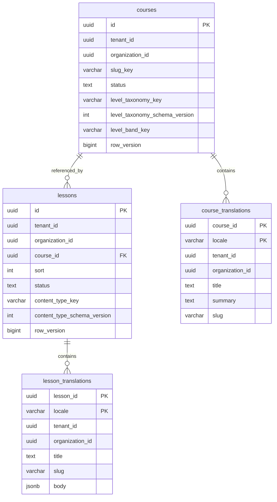
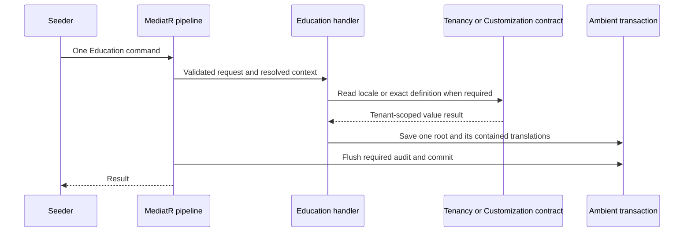
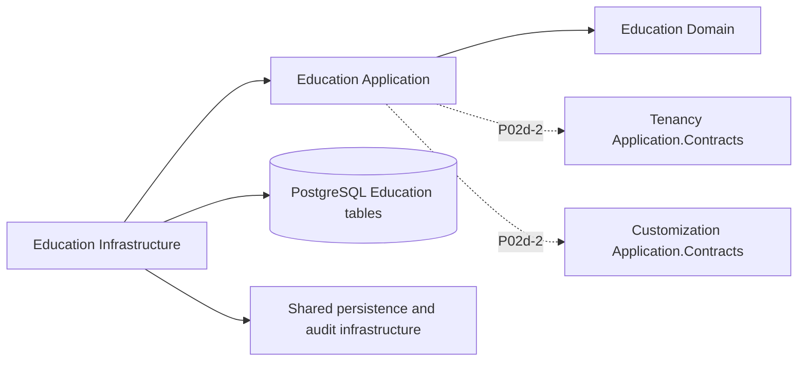

# Education Module

**Status:** Design stable, ready to implement — Accepted 2026-09-14. No Education
domain or persistence implementation exists yet. The
[decision pass](../../roadmap/phase-02d-walking-skeleton.md#p02d-1-decision-pass-2026-09-14)
records the approved scope; acceptance does not mark P02d-1 delivered.

## Overview

Education owns courses, lessons and their translated content. This packet introduces
their database shape and isolation. P02d-2 owns command handlers and seed writes;
P02d-4 owns public reads. [Phase 05](../../roadmap/phase-05-education-learning-content.md)
owns course versions, modules, lesson items and the authenticated authoring surface.

Content shapes and level vocabularies belong to Customization. Tenant and organization
identities belong to Tenancy. Education holds value references to these modules and
never queries their tables or adds a foreign key to their migration chains.

## Entity-relationship diagram

`Course` and `Lesson` are separate aggregate roots. Each contains its translation
entities through an EF navigation. A lesson references its course by typed id; it is
not a child entity in the course aggregate. The diagram omits inherited audit columns;
[Database Standards](../../standards/05-database.md)
owns their storage conventions.

### Data model and invariants

- Both roots derive from `AuditableEntity<TId>`, implement `IAggregateRoot<TId>` and
  `IOrganizationScoped`, and carry `[TenantOwned]` and `[OrganizationScoped]`.
  `CourseId` and `LessonId` use the existing Vogen identifier convention.
- Both satellites are plain contained entities with their natural composite keys.
  They implement `IOrganizationScoped` and carry both isolation markers. They have
  no surrogate `id`, independent `row_version`, audit timestamps or `deleted_at`.
  Changing a translation changes its owning root's concurrency token and is captured
  inside that root's audit row when P02d-2 writes it.
- `courses` and `lessons` retain `UNIQUE (tenant_id, id)` independently of their
  primary keys. Lesson-to-course deletion is `RESTRICT`; satellite-to-parent deletion
  is `CASCADE`. An invoker INSERT/UPDATE trigger independently enforces the parent's
  organization scope under
  [ADR-0003 Amendment 6](../../decisions/0003-tenant-isolation-defense-in-depth.md#amendment-6--insert-scope-and-parent-mirrors-2026-09-14).
  Every foreign key has a supporting index.
- Every lesson has exactly its course's scope, including tenant-wide scope. Every
  translation has exactly its parent's scope. Factories derive child scope from the
  parent; the database independently rejects a mismatch on insertion or reparenting.
- `sort` is a nonnegative integer. Ties are legal; lessons are ordered by
  `(sort ASC, id ASC)`. This avoids requiring a cross-root reorder transaction to
  create a lesson. No reorder command ships in Phase 02d.
- The catalog's default order is `(created_at ASC, id ASC)`, oldest-created first.
  P02d-4 owns the cursor codec and any exposed sort parameter. No publication timestamp
  or mutable ranking column is required by this order.
- `slug_key` is a stable, non-routable course authoring handle, unique per tenant
  among live courses. It uses the Education slug width and grammar below.
- The optional course level reference is all-or-none:
  `(level_taxonomy_key, level_taxonomy_schema_version, level_band_key)`. A present
  version is positive. It pins a taxonomy revision rather than resolving the active
  revision on every read. This explicit course reference is distinct from an
  `x-taxonomy` field's live concept lookup. Phase 05 must preserve the pin when it
  introduces `Level`; it cannot silently substitute the then-active revision.
- A lesson binds exactly one `(content_type_key, content_type_schema_version)`;
  the version is positive. Every translated `body` is a JSON object validated against
  that same revision on the command path under
  [ADR-0043](../../decisions/0043-customization-payload-validation.md).
  All body fields are carried per locale, including any repeated non-translatable
  values. There is no `isLocalized` keyword in the schema profile. Phase 05's lesson
  items own the later decomposition of this inline body.
- Pins are values, not cross-module foreign keys. P02d-2 defines the application
  contracts and validation outcomes; P02d-4 defines unresolved-reference responses.
  A successor definition never implicitly rebinds stored content. A write keeping an
  existing pin must resolve its exact revision even after deprecation; selecting a
  new binding and preserving an existing one are separate eligibility questions.

### Localization and URL identity

- `locale` is `varchar(35)`, validated and canonicalized through the shipped
  `LocaleTag` (`tr-TR`, `zh-Hans`). Tenant locale membership is a P02d-2 command
  concern, enforced through a Tenancy application contract, not a cross-chain key.
- Routable slugs use a separate Education width constant of 160 characters and
  `UrlSlug`'s lowercase ASCII letters, digits and single interior hyphens. Invalid
  case, whitespace and native-script text are refused, with no automatic trim,
  transliteration or lowercasing. Content stays fully Unicode; this constraint is
  on URL segments only. The 63-character tenant-host limit does not change.
- A slug shaped as a UUID in either 32-hex (`N`) or hyphenated (`D`) form is refused
  in application validation and by a named database check. P02d-4 can still choose
  a separate public path; this does not choose its route template in advance.
- Each satellite has a flat `UNIQUE (tenant_id, locale, slug)`, across all courses
  or all lessons respectively, and across organizations. Parent identity and
  organization are excluded from that key. There is no cross-table slug registry.
- A draft translation reserves its slug. Soft-deleting the parent does not release
  the satellite's slug: the satellite has no `deleted_at`. It becomes invisible
  through parent eligibility, not through a second soft-delete lifecycle. Phase 05
  must coordinate any future slug release with Phase 04's redirect/slug registry.

## State diagrams

[ADR-0048](../../decisions/0048-walking-skeleton-publication.md#lifecycle) owns the
publication diagram and its semantics. The two roots use it independently. Neither
satellite has a publication state separate from its parent.

## Primary write sequence

No command exists in P02d-1. The following is the planned P02d-2 path; its decision
pass names the commands and contracts before their implementation.

A command writes one Education root. Cross-module calls are reads through application
contracts, and audit durability is part of the ambient transaction. The seeder has no
second write path.

## Components and primary read flow

The four Education projects are scaffolded today. P02d-1 introduces the domain and
persistence; the dashed contract consumers arrive in P02d-2. No public read flow
exists until P02d-4. No Education code names a Customization or Tenancy table.

## Integration-event catalogue

Empty. Phase 02d introduces no Education integration event. There is no primary
integration-event sequence to draw. Phase 05 decides its versioned publication events
against the durable event infrastructure Phase 02b supplies.

## Permission matrix

[permissions.md](permissions.md) records the boundary before commands and
permissions exist. No authorization claim is inferred from database privileges.

## Audit coverage matrix

[audit.md](audit.md) records the planned publication floor. P02d-2 adds the
remaining operation rows with its command decisions and catalogue source.

## Performance budget

[Performance Standards](../../standards/15-performance.md#initial-budgets) owns the
budgets: Education reads target API p95 below 200 ms and writes below 500 ms; catalog
server response below 300 ms. These are targets, not P02d-1 measurements: no API exists.
The schema indexes foreign keys, scoped catalog order and lesson order for their first
consumers. P02d-4 verifies query shape when it writes those consumers.

## Risks and open questions

- The invoker parent check runs on INSERT and UPDATE. Checking insertion alone would
  leave later parent-id changes unprotected. The migration suite must test both;
  SQL-only success does not substitute for a persisted EF graph test.
- RLS protects each satellite independently. Its plain CLR base is never an isolation
  exemption. Parent soft deletion still requires parent-aware public reads in P02d-4.
- Phase 05 changes the interim hierarchy. Its migration must preserve ids, published
  slugs, order, scope, bodies and exact bindings rather than recreate seed rows.
- Writer, seed, read-response and rendering gates remain with their named packets in
  the [decision register](../../roadmap/phase-02d-walking-skeleton.md#the-decision-register).
  No P02d-1 decision is implicitly delegated to those later passes.
