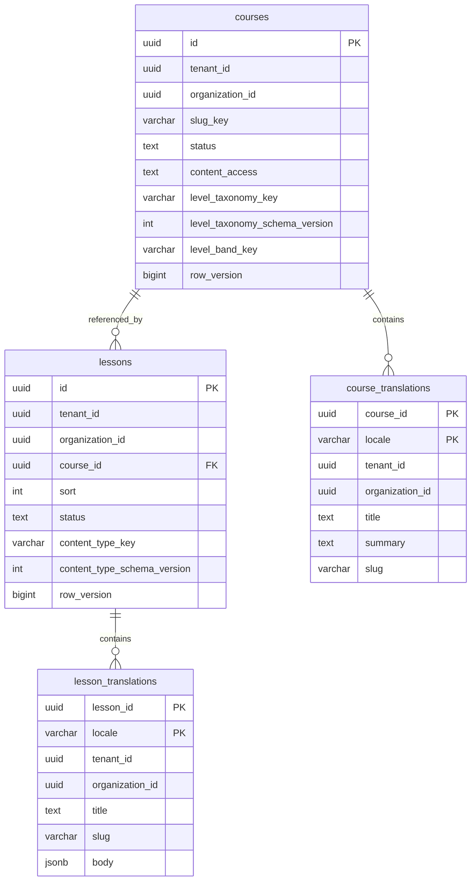
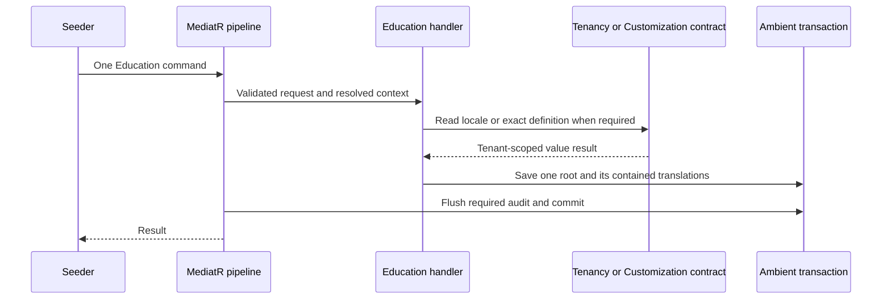
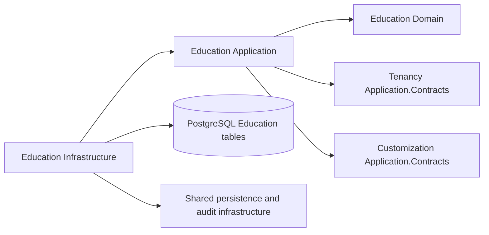

# Education Module

**Status:** P02d-1 complete and merged — 2026-09-14. Domain, persistence, isolation
proofs and both agent review rounds per step are complete. The
[merge closeout](../../roadmap/phase-02d-walking-skeleton.md#merge-and-closeout-2026-09-14)
records all five required checks on the final PR head and merge commit.
The [decision pass](../../roadmap/phase-02d-walking-skeleton.md#p02d-1-decision-pass-2026-09-14)
records the accepted scope. P02d-2 implements unrouted writers and adds seed execution;
public reads remain planned for P02d-4.
The [P02d-2 package](../../roadmap/phase-02d-walking-skeleton.md#p02d-2-decision-package-2026-10-02)
is Accepted on 2026-10-02. Step 1 implements the course access column and contextual
verification queries, explicitly classified Off. Step 3 implements six writers; both
review rounds and a focused fix review passed. Seed execution follows in Step 4. The
diagram includes the access column.

## Overview

Education owns courses, lessons and their translated content. P02d-1 Step 2
implements their domain model, database shape and isolation. P02d-2 owns command
handlers and seed writes;
P02d-4 owns public reads. [Phase 05](../../roadmap/phase-05-education-learning-content.md)
owns course versions, modules, lesson items and the authenticated authoring surface.

Content shapes and level vocabularies belong to Customization. Tenant and organization
identities belong to Tenancy. Education holds value references to these modules and
never queries their tables or adds a foreign key to their migration chains.

## Entity-relationship diagram

```mermaid
erDiagram
    courses ||--o{ lessons : referenced_by
    courses ||--o{ course_translations : contains
    lessons ||--o{ lesson_translations : contains
    courses {
        uuid id PK
        uuid tenant_id
        uuid organization_id
        varchar slug_key
        text status
        text content_access
        varchar level_taxonomy_key
        int level_taxonomy_schema_version
        varchar level_band_key
        bigint row_version
    }
    lessons {
        uuid id PK
        uuid tenant_id
        uuid organization_id
        uuid course_id FK
        int sort
        text status
        varchar content_type_key
        int content_type_schema_version
        bigint row_version
    }
    course_translations {
        uuid course_id PK
        varchar locale PK
        uuid tenant_id
        uuid organization_id
        text title
        text summary
        varchar slug
    }
    lesson_translations {
        uuid lesson_id PK
        varchar locale PK
        uuid tenant_id
        uuid organization_id
        text title
        varchar slug
        jsonb body
    }
```

`Course` and `Lesson` are separate aggregate roots. Each contains its translation
entities through an EF navigation. A lesson references its course by typed id; it is
not a child entity in the course aggregate. The diagram omits inherited audit columns;
[Database Standards](../../standards/05-database.md)
owns their storage conventions.

### Data model and invariants

- Both roots derive from `AuditableEntity<TId>`, implement `IAggregateRoot<TId>` and
  `IOrganizationScoped`, and carry `[TenantOwned]` and `[OrganizationScoped]`.
  `CourseId` and `LessonId` use the existing Vogen identifier convention.
- Both satellites are plain contained entities with their natural composite keys.
  They implement `IOrganizationScoped` and carry both isolation markers. They have
  no surrogate `id`, independent `row_version`, audit timestamps or `deleted_at`.
  Changing a translation changes its owning root's concurrency token and is captured
  inside that root's audit row by P02d-2's writers.
- `courses` and `lessons` retain `UNIQUE (tenant_id, id)` independently of their
  primary keys. Lesson-to-course deletion is `RESTRICT`; satellite-to-parent deletion
  is `CASCADE`. An invoker INSERT/UPDATE trigger independently enforces the parent's
  organization scope under
  [ADR-0003 Amendment 6](../../decisions/0003-tenant-isolation-defense-in-depth.md#amendment-6--insert-scope-and-parent-mirrors-2026-09-14).
  Every foreign key has a supporting index.
- Every lesson and translation carries a
  [parent organization mirror](../../glossary.md#multi-tenancy), including tenant-wide
  scope. Factories derive child scope from the parent; the database independently rejects a mismatch on insertion or reparenting.
- `sort` is a nonnegative integer. Ties are legal; lessons are ordered by
  `(sort ASC, id ASC)`. This avoids requiring a cross-root reorder transaction to
  create a lesson. No reorder command ships in Phase 02d.
- The catalog's default order is `(created_at ASC, id ASC)`, oldest-created first.
  P02d-4 owns the cursor codec and any exposed sort parameter. No publication timestamp
  or mutable ranking column is required by this order.
- `slug_key` is a stable, non-routable course authoring handle, unique per tenant
  among live courses. It uses the Education slug width and grammar below.
- The optional course level reference is all-or-none:
  `(level_taxonomy_key, level_taxonomy_schema_version, level_band_key)`. A present
  version is positive. This [revision pin](../../glossary.md#education--learning)
  identifies the taxonomy used by the course. This explicit course reference is
  distinct from an `x-taxonomy` field's live concept lookup. Phase 05 must preserve the pin when it
  introduces `Level`; it cannot silently substitute the then-active revision.
- A lesson binds exactly one `(content_type_key, content_type_schema_version)`;
  the version is positive. Every translated `body` is a JSON object validated against
  that same revision on P02d-2's command path under
  [ADR-0043](../../decisions/0043-customization-payload-validation.md).
  All body fields are carried per locale, including any repeated non-translatable
  values. There is no `isLocalized` keyword in the schema profile. Phase 05's lesson
  items own the later decomposition of this inline body.
- Pins are values, not cross-module foreign keys. P02d-2 defines the application
  contracts and validation outcomes; P02d-4 defines unresolved-reference responses.
  A successor definition never implicitly rebinds stored content. A write keeping an
  existing pin must resolve its exact revision even after deprecation; selecting a
  new binding and preserving an existing one are separate eligibility questions.

### Localization and URL identity

- `locale` is `varchar(35)`, validated and canonicalized through the shipped
  `LocaleTag` (`tr-TR`, `zh-Hans`). Tenant locale membership is a P02d-2 command
  concern; that packet supplies the Tenancy application contract for enforcement.
  No cross-chain key is introduced.
- Routable slugs and the course authoring handle follow the canonical
  [Education slug grammar](../../standards/08-localization.md#education-slug-grammar).
  `EducationSlug` supplies its separate width and predicate to domain validation;
  named database checks enforce the same storage rule. Public route templates
  and parameter handling remain P02d-4 decisions.
- Each satellite has a flat `UNIQUE (tenant_id, locale, slug)`, across all courses
  or all lessons respectively, and across organizations. Parent identity and
  organization are excluded from that key. There is no cross-table slug registry.
- A draft translation reserves its slug. Soft-deleting the parent does not release
  the satellite's slug: the satellite has no `deleted_at`. It becomes invisible
  through parent eligibility, not through a second soft-delete lifecycle. Phase 05
  must coordinate any future slug release with Phase 04's redirect/slug registry.

## State diagrams

[ADR-0050](../../decisions/0050-publication-and-course-content-access.md#publication-lifecycle)
retains the independent [publication](../../glossary.md#education--learning) lifecycle
shipped under ADR-0048. Publication is separate from content-access policy. Neither
satellite has a publication state separate from its parent.

## Primary write sequence

Step 3 implements the six unrouted commands below. Each passes through the same
composed pipeline; no public endpoint or authoring permission is introduced.

```mermaid
sequenceDiagram
    participant Seed as Seeder
    participant Pipe as MediatR pipeline
    participant Handler as Education handler
    participant Contract as Tenancy or Customization contract
    participant DB as Ambient transaction
    Seed->>Pipe: One Education command
    Pipe->>Handler: Validated request and resolved context
    Handler->>Contract: Read locale or exact definition when required
    Contract-->>Handler: Tenant-scoped value result
    Handler->>DB: Save one root and its contained translations
    Pipe->>DB: Flush required audit and commit
    Pipe-->>Seed: Result
```

A command writes one Education root. Cross-module calls are reads through application
contracts, and audit durability is part of the ambient transaction. The seeder has no
second write path.

## P02d-2 accepted writer contract

**Step 3 complete — 2026-10-02.** The maintainer approved this
contract with [ADR-0050](../../decisions/0050-publication-and-course-content-access.md),
[ADR-0051](../../decisions/0051-ordered-text-card-presentation.md) and the phase package.
This section owns command detail; the phase owns gate disposition and seed inventory.

| Command | Root / inputs | Validation and outcome |
|---|---|---|
| `CreateCourseCommand` | New Course; explicit id, slug key, access policy, optional complete taxonomy revision/band pin | Tenant/organization from context; exact new taxonomy binding must be Active and contain the band; draft creation, no translation or lesson write |
| `AddCourseTranslationCommand` | Existing Course; id, exact expected version, locale, title, summary, translated slug | Root visible and writable, enabled canonical locale, valid text/slug, draft-only insert; no overwrite |
| `PublishCourseCommand` | Existing Course; id and exact expected version | Draft → published only; empty/incomplete translations allowed; no child publication or implicit grant |
| `CreateLessonCommand` | New Lesson; explicit id, parent course id, sort, exact content-type key/version | Parent must be visible and writable in announced scope; derive its tenant/organization; new exact type binding must be Active; draft, no body yet |
| `AddLessonTranslationCommand` | Existing Lesson; id, exact expected version, locale, title, slug, JSON object body | Enabled canonical locale; validate against its immutable pin, including eligible Deprecated revision; draft-only insert |
| `PublishLessonCommand` | Existing Lesson; id and exact expected version | Draft → published only; no Course mutation, grant or readiness requirement beyond the selected lifecycle |

Only a trusted contextual caller invokes these unrouted commands. No command is
`PublicSurface`, grants HTTP access or registers an authoring permission. Exact
expected versions protect existing-root writes; omission/invalidity is validation
failure and stale values are concurrency conflicts. Seed queries obtain current
versions for unfinished acts, not permission to retry failed writes blindly.

Customization is read through its
[exact value contract](../customization/README.md#p02d-2-accepted-exact-write-contract);
locale membership through Tenancy's
[accepted locale contract](../tenancy/README.md#p02d-2-accepted-locale-and-branding-contract).
Both execute uncached inside the caller's ambient frame and announced context.
No cross-chain FK, foreign Domain/Infrastructure reference or independent transaction
is introduced. Revision/locale eligibility is observed at the validation read;
later deprecation/disable does not rewrite stored bodies and is rechecked by readers.

### Failure and transaction contract

| Condition | Result |
|---|---|
| Missing, cross-tenant or hidden sibling parent/root | `not_found`; no name/id disclosure |
| Visible parent/root incompatible with write scope | `resource_scope_violation` before mutation |
| Malformed input, disabled/absent locale, invalid pin/band or body | `validation_failed`, field/JSON Pointer details without foreign data |
| Known root-id/key/locale/slug uniqueness or lifecycle refusal | `business_rule_violation`; insertion reserves the localized slug, not publication |
| Stale expected version or EF optimistic concurrency | `concurrency_conflict` |
| Unknown database fault | Existing infrastructure exception handling; never disguise it as a business collision |

Infrastructure maps only named owned constraints; arbitrary unique/trigger exceptions
are not exposed as caller diagnostics. Translation collision responses carry canonical
locale and slug. A filtered live-parent/satellite read adds `entityId` only when that
root is visible in the caller's read scope; hidden sibling identities remain absent.
Root state, scope and validation guards precede the first mutation/stamp. A failed
nested command cannot leave dirty tracked changes
for a successful outer command to flush. Mark the ambient frame rollback-only if a
failed save or already-applied mutation cannot be safely discarded, and prove both
ordinary failure and an outer handler absorbing that failure.

Each command writes one root and its contained translations. Publishing is MUST
audited; draft creation and translation insertion are SHOULD operations in the
Education catalogue.
Pending audit writes and business changes obey the existing ambient durability rules.
No explicit second transaction or cross-root publication is permitted.

### Seed verification

Contextual module-owned `ISender` read requests return bounded verification DTOs,
including exact ownership/content/state and current root version where needed.
They are explicitly audit Off, unrouted, without unresolved/public admission and
never bypass RLS. The phase's convergence rules govern skip/create/verify behavior;
they are not a weaker alternate write path.

## Components and primary read flow

```mermaid
flowchart LR
    EA[Education Application] --> EC[Education Domain]
    EI[Education Infrastructure] --> EA
    EI --> DB[(PostgreSQL Education tables)]
    EA --> TC[Tenancy Application.Contracts]
    EA --> CC[Customization Application.Contracts]
    EI --> SK[Shared persistence and audit infrastructure]
```

The Domain and Infrastructure projects implement the two roots, their satellites
and a dedicated migration chain. Both API and Seeder register `EducationDbContext`
on the ambient unit of work and register the writer ports/handlers. Step 3 consumes
Tenancy/Customization application contracts. No public read flow exists until P02d-4.
Step 1 also registers filtered `GetCourseSeedStateQuery` and
`GetLessonSeedStateQuery` handlers in both roots, explicitly classified Off. They
return immutable verification DTOs without a public marker or HTTP endpoint.
No Education code names a Customization or Tenancy table.

[EducationPersistenceTests](../../../backend/tests/LearnStack.Tests.Integration/Database/EducationPersistenceTests.cs)
exercises persisted graphs, exact pin and locale round trips, independent root
concurrency and natural-key satellite capture inside the owning root's audit subject.
[EducationIsolationTests](../../../backend/tests/LearnStack.Tests.Integration/Database/EducationIsolationTests.cs)
exercises the policies and parent-scope controls as `learnstack_app`;
[EducationStructureTests](../../../backend/tests/LearnStack.Tests.Integration/Database/EducationStructureTests.cs)
checks the applied parent-mirror and Pattern A structure with planted violations.

## Integration-event catalogue

Empty. Phase 02d introduces no Education integration event. There is no primary
integration-event sequence to draw. Phase 05 decides its versioned publication events
against the durable event infrastructure Phase 02b supplies.

## Permission matrix

[permissions.md](permissions.md) records the unrouted writer boundary; no authoring
permission is registered. No authorization claim is inferred from database privileges.

## Audit coverage matrix

[audit.md](audit.md) records the implemented publication floor. Step 3 supplies the six
writer catalogue registrations. Step 1 registers the two contextual
verification queries Off, without a synthetic write operation.

## Performance budget

[Performance Standards](../../standards/15-performance.md#initial-budgets) owns the
budgets: Education reads target API p95 below 200 ms and writes below 500 ms; catalog
server response below 300 ms. These are targets, not P02d-1 measurements: no API exists.
Full scope and foreign-key indexes include soft-deleted rows. The additional partial
indexes serve live ordered reads: `(tenant_id, organization_id, created_at, id)` on
courses and `(tenant_id, course_id, sort, id)` on lessons. They cannot replace the full
scope/FK indexes because they exclude deleted rows; the shorter full indexes do not
provide those ordering suffixes. P02d-4 verifies query shape when it writes the consumers.

## Risks and open questions

- The invoker parent check runs on INSERT and UPDATE. Checking insertion alone would
  leave later parent-id changes unprotected. The isolation suite exercises both,
  alongside the persisted EF graph tests linked above.
- RLS protects each satellite independently. Its plain CLR base is never an isolation
  exemption. Parent soft deletion still requires parent-aware public reads in P02d-4.
- Phase 05 changes the interim hierarchy. Its migration must preserve ids, published
  slugs, order, scope, bodies and exact bindings rather than recreate seed rows.
- Writer, seed, read-response and rendering gates remain with their named packets in
  the [decision register](../../roadmap/phase-02d-walking-skeleton.md#the-decision-register).
  No P02d-1 decision is implicitly delegated to those later passes.
