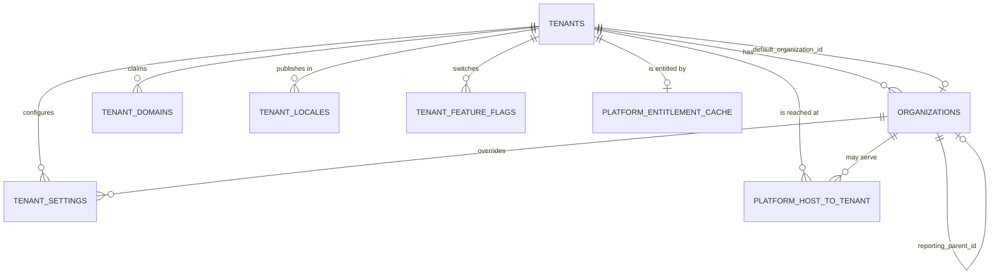
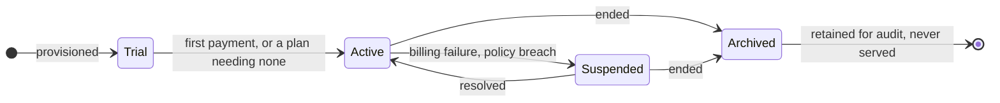
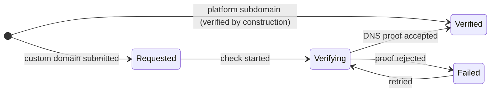
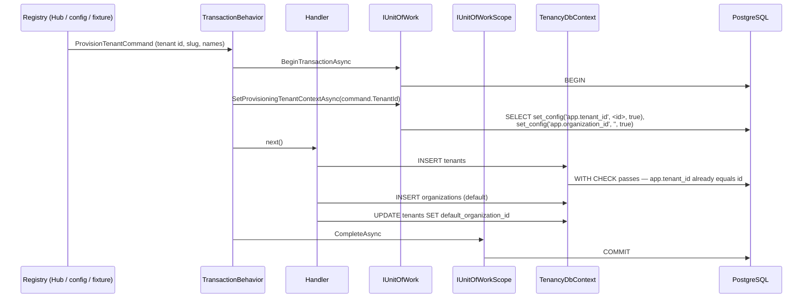
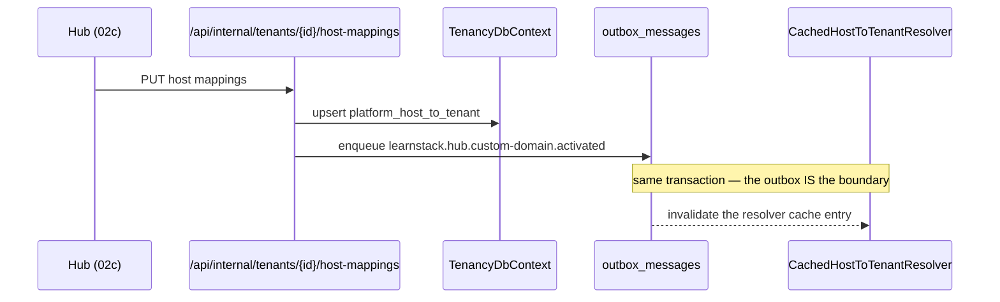
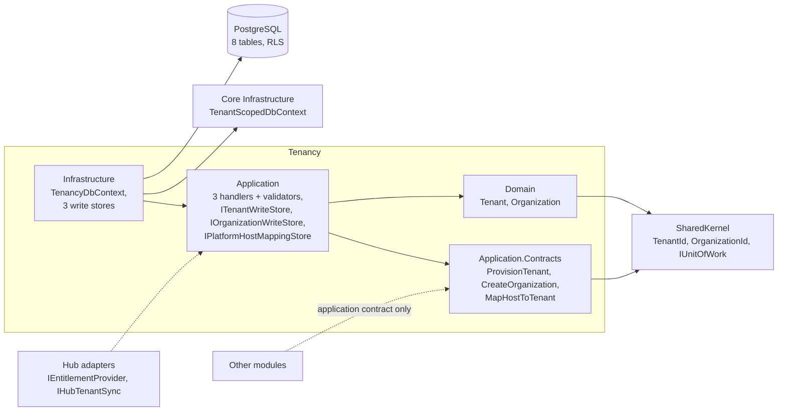

# Module Spec — Tenancy

**Status:** Design stable, partially implemented (Phase 02a Packet 6 shipped the
schema and its schema-level isolation suite; commands, host resolution and the
request-level isolation suite are Packet 7).

The first module spec in the repository, per
[Documentation Standards § Per-Module Specifications](../../standards/13-documentation.md).

## Overview

Tenancy owns **who a request belongs to** and nothing about what they do with it.

**It owns:**

- The `Tenant` aggregate — the root every other tenant-owned row keys on.
- The `Organization` aggregate — a sub-unit within a tenant
  ([ADR-0017](../../decisions/0017-tenant-organization-hierarchy.md)). Declared
  here and nowhere else; ADR-0017's original sample placed it in Identity and
  Amendment 2 moved it.
- `TenantDomain` — a host a tenant claims, and its verification lifecycle.
- `TenantSetting` — non-translated configuration, optionally overridden per
  organization.
- `TenantLocale` — the locales a tenant publishes in
  ([ADR-0008](../../decisions/0008-localization-schema.md)).
- `TenantFeatureFlag` — the tenant's own switches.
- `platform_host_to_tenant` — the host → tenant resolution index, read *before*
  any tenant context exists.
- `platform_entitlement_cache` — the durable projection of a tenant's plan.

**It does not own:**

- **Users, roles or sessions.** Identity does, from
  [Phase 03](../../roadmap/phase-03-identity-admin.md). Tenancy holds
  `UserId` by value in audit columns and never resolves a person.
- **Plan definitions or billing.** The Hub does
  ([ADR-0019](../../decisions/0019-learnstack-hub.md)). Tenancy stores the
  *projection* of an entitlement, written only through
  `IEntitlementProvider.RefreshAsync`, and never calls the Hub to read it.
- **Certificate material.** It moves by secret-store replication and is
  referenced by path; `tenant_domains` carries verification state and no keys.
- **Branding tokens.** `OrganizationBranding` and the token merge are
  [Phase 06](../../roadmap/phase-06-renderer-admin-studio.md); the column arrives with
  them rather than as an unused `jsonb` nobody writes.
- **Any domain-specific shape.** CEFR levels, asana catalogs, kyu/dan ranks and
  every other vertical concept are tenant customization data
  ([ADR-0018](../../decisions/0018-tenant-driven-customization-model.md)), not
  columns here.

## Entity-relationship diagram

Aggregate roots in the shipped code are `Tenant` and `Organization` — the two
that implement `IAggregateRoot<TId>`; the promotion below adds `TenantDomain` and
`TenantSetting`, which carry the shape of a root but which no command writes yet. `PlatformHostMapping` and `PlatformEntitlement` are
projections rather than aggregates: nothing in this module mutates them through
a root.

**The other four resolve two ways, and Packet 7 settles them as promotion.**
`TenantDomain`, `TenantSetting`, `TenantLocale` and `TenantFeatureFlag` each have
a public factory, a top-level `DbSet` on `TenancyDbContext`, and no navigation
from `Tenant` — so there is no path through a root, which
[Standards 01 § Aggregate Ownership](../../standards/01-architecture-standards.md)
requires for state changes inside an aggregate. They also split:
`TenantDomain` and `TenantSetting` are root-shaped already (a surrogate Vogen id,
`AuditableEntity`, `row_version`, their own RLS policy), while `TenantLocale` and
`TenantFeatureFlag` have composite natural keys and no id at all and therefore
cannot be `IAggregateRoot<TId>` under any reading.

So the first pair becomes aggregate roots in their own right and the second
becomes navigations inside `Tenant` — four roots in Tenancy, with a write to
`TenantLocale` or `TenantFeatureFlag` bumping `Tenant.row_version` and the two
promoted roots carrying their own.
[Packet 7](../../roadmap/phase-02a-kernel-tenancy.md) writes the first command
that touches any of them, which is the evidence the boundary had none of and
where the promotion lands; provisioning writing `Tenant` and its default
`Organization` in one transaction is sanctioned by enumeration in
[ADR-0042](../../decisions/0042-tenant-provisioning-cross-aggregate-transaction.md).

Text fallback, for renderers without Mermaid:

- `tenants` is the root. Its `id` **is** the tenant id — there is no `tenant_id`
  column, which is why its RLS policy keys on `id`.
- `organizations.tenant_id → tenants.id`, single-column by the one written
  exception in [Database Standards § Foreign keys](../../standards/05-database.md):
  the composite form is not expressible against a self-keyed parent, and it is
  unnecessary because the referencing column *is* the tenant id.
- `tenants.default_organization_id` → `organizations (tenant_id, id)`,
  **composite**, and nullable only inside the provisioning transaction.
- Every other foreign key into `organizations` is composite on `tenant_id`.
- `organizations.reporting_parent_id` is a self-reference for **reporting only**.
  It is not an isolation boundary: nothing resolves through it and no policy
  reads it. The hierarchy stays two levels.

## State diagrams

Two entities have a non-trivial lifecycle.

Text fallback — **Tenant lifecycle**:

- `Trial` on provisioning; `Active` on first payment, or immediately for a plan
  needing none.
- `Active ⇄ Suspended` — billing failure or policy breach suspends; resolution
  restores.
- `Archived` from either, and it is terminal **for serving**: rows are retained
  for audit and retention obligations, never served.

Text fallback — **TenantDomain lifecycle**:

- A `Subdomain` is created already `Verified`: the platform controls the zone, so
  there is nothing to prove. The aggregate refuses `MarkVerified` /
  `MarkVerificationFailed` on one.
- A `Custom` domain travels the whole path — `Requested → Verifying → Verified`,
  or `Verifying → Failed → Verifying` on retry.
- **A verified row does not serve traffic on its own.** A corresponding
  `platform_host_to_tenant` row that is `is_active` **and** `is_publicly_live`
  does.

## Sequence diagrams

### Primary write: provisioning a tenant

Text fallback — **provisioning a tenant**: the registry (Hub, config or fixture)
sends a `ProvisionTenantCommand`; `TransactionBehavior` opens the ambient
transaction, announces `app.tenant_id` as the tenant being created and blanks
`app.organization_id` in the same statement — the first inside the transaction —
and calls the handler; the handler inserts `tenants`,
inserts the default `organizations` row, updates
`tenants.default_organization_id`, and returns; the behavior completes the scope,
which commits. One transaction, one connection, one commit point.

**The handler opens nothing and announces nothing.** Both belong to
`TransactionBehavior`, and the distinction is not stylistic. A
`BeginTransactionAsync` from inside a handler is a *joiner* — [ADR-0040](../../decisions/0040-ambient-unit-of-work.md)
returns a nested frame on the same transaction, so it would be a no-op that
reads like a boundary. An announcement from inside a handler would be an eighth
setter of `app.tenant_id` against a set two ADRs close at seven, and would hand
every handler in the solution the ability to move the ambient tenant.

Three statements, one transaction. The tenant id is **never minted in the
handler**: the registry assigns it, and the behavior announces it *before* the
insert by reading `IProvisionsTenant` off the request, so the self-keyed policy's
`WITH CHECK` passes. A handler that generated its own could not satisfy its own
policy. Measured against the shipped policies on a throwaway container: with
`app.tenant_id` unset or set to the empty string the `tenants` insert raises
`42501` identically, and only the new tenant's own id lets the sequence commit.
Of the two, the empty-string case is the one a test pins —
`A_request_that_does_not_provision_still_fails_closed_when_unresolved` — because
it is the state this pipeline actually produces; nothing in the request path
leaves the variable unset.

The announcement requires an **unresolved** context, which is what closes the
confused deputy: a caller already authenticated for tenant A who sends a
provisioning command naming tenant B takes the ordinary path, the transaction
carries A, and B's insert is refused by the database rather than by a check
somebody has to remember to write. Nothing verifies that the requested id is
unused, and the guarantee does not need it to be: the only statement the
announcement authorises is an `INSERT` the primary key rejects when the tenant
already exists. Anything later added inside that transaction — the MUST-class
audit write, the outbox flush — inherits that assumption and must not rely on
the announced tenant being new.

The `default_organization_id` update is separate because the composite foreign
key has nothing to reference until the organization exists; `MATCH SIMPLE` skips
the check while the column is null, which is what makes the ordering legal.

### Primary integration-event flow: host mapping changed

Text fallback — **host mapping changed**: the Hub `PUT`s host mappings to
`/api/internal/tenants/{id}/host-mappings`; the endpoint upserts
`platform_host_to_tenant` and enqueues `learnstack.hub.custom-domain.activated`
into `outbox_messages` **on the same transaction** — the outbox row is the
boundary — and the dispatched event invalidates the resolver's cache entry.

`IHostToTenantResolver` **never calls the Hub**: an anonymous page load must not
depend on a control plane being reachable
([ADR-0034](../../decisions/0034-hub-contract-surface-invariant.md)). The
resolver reads `platform_host_to_tenant` and nothing else.

## Component diagram

Text fallback — **components**: Tenancy is four assemblies — `Domain` (the
`Tenant` and `Organization` aggregates), `Application.Contracts` (three commands —
`ProvisionTenant`, `CreateOrganization`, `MapHostToTenant`), `Application` (their
handlers and validators, and the `ITenantWriteStore` / `IOrganizationWriteStore` /
`IPlatformHostMappingStore` ports) and `Infrastructure` (`TenancyDbContext` and the
three write stores). `Domain` depends on `SharedKernel` for `TenantId`,
`OrganizationId` and `IUnitOfWork`; `Application` on `Domain`; `Infrastructure`
on `Application`, on core `LearnStack.Infrastructure` — where
`TenantScopedDbContext`, the base `TenancyDbContext` derives from, applies the
query filters — and on PostgreSQL. The Hub adapters (`IEntitlementProvider`,
`IHubTenantSync`) and every other module reach `Application` and nothing deeper.

Other modules reach Tenancy **only** through an application contract in
`LearnStack.Modules.Tenancy.Application.Contracts` — never a navigation property,
never a cross-module join
([ADR-0010](../../decisions/0010-cross-module-communication.md)). They hold
`TenantId` and `OrganizationId` by value from `LearnStack.SharedKernel`.

## Integration-event catalogue

**Tenancy publishes none yet.** The events below are declared by the phases that
build their producers; listing them here with their owning phase is the
alternative to discovering the topic name twice.

| Topic | Payload | Publisher | Consumers | Phase |
|---|---|---|---|---|
| `learnstack.tenancy.tenant` | tenant created / status changed | Tenancy | Identity, Audit | 02b |
| `learnstack.tenancy.organization` | organization created / archived | Tenancy | Identity, Education | 02b |
| `learnstack.tenancy.settings` | settings changed — the eager cache invalidation | Tenancy | every settings reader | 02b |
| `learnstack.hub.entitlement` | entitlement projection refreshed | Hub adapter | entitlement cache readers | 02c |
| `learnstack.hub.custom-domain.activated` / `.deactivated` | host mapping changed | Hub adapter | `CachedHostToTenantResolver` | 02c |

Topic names follow `learnstack.{module}.{aggregate}`;
`Integration_Event_TopicNames_FollowConvention` is the authority for the pattern
and this table does not restate it.

## Permission matrix

In [permissions.md](permissions.md), the file
[Permission Standards](../../standards/19-permissions.md) names.

## Audit coverage matrix

In [audit.md](audit.md), the file
[Audit Coverage](../../standards/18-audit-coverage.md) names.

## Performance budget

| Path | Budget | Why this number |
|---|---|---|
| Host → tenant resolution (cache hit) | **< 1 ms** | On every anonymous page load, before anything else can start |
| Host → tenant resolution (cache miss) | **< 15 ms** p95 | One indexed single-row read in its own short transaction |
| Entitlement projection read (L1 hit) | **< 1 ms** | Read on every feature check |
| Tenant provisioning (3 statements) | **< 100 ms** p95 | Interactive but rare |
| Settings read for a request | **< 5 ms** p95 | Cached; a miss is one indexed read |

The two resolution numbers are the load-bearing ones: they sit in front of every
request and are the only Tenancy work an anonymous visitor pays for.

## Risks and open questions

- **`app.scope` has no carrier.** `ITenantContext` exposes no scope member
  ([ADR-0040 Amendment 1](../../decisions/0040-ambient-unit-of-work.md)), so
  no application path sets `app.scope = 'tenant'` and the cross-organization read
  hatch on `tenant_settings` is unreachable at runtime. That is the correct
  default, and no carrier ships in
  [Packet 7](../../roadmap/phase-02a-kernel-tenancy.md): the flag derives from the
  actor's role, and roles land with `Membership` / `Role` in
  [Phase 03](../../roadmap/phase-03-identity-admin.md) — after
  [Phase 02b](../../roadmap/phase-02b-events-auth.md)'s authenticated principal, which is
  the prerequisite and not the carrier. The deferral is forced, not chosen
  ([Security Standards § Tenant Context](../../standards/11-security.md)).
  The two `AS RESTRICTIVE` write guards are tested **now** rather than then —
  `TheTenantScopeHatchWidensReadsAndNeitherWrite` sets the flag directly — because
  under any ordinary organization-scoped session the base policy's own
  organization term already refuses a sibling's row, so both guards could be
  deleted with the whole suite green. Measured: with the hatch set and the delete
  guard dropped, a `DELETE` removed another organization's row.
- **The query filters landed in Packet 7 step 3**, ahead of
  `TenantResolverMiddleware`, which supplies the resolved context they read. Every
  entity marked `[TenantOwned]` carries one; the two exceptions are table classes
  rather than omissions — `tenants` is tenant-owned **self-keyed** and its policy
  keys on `id`, and `platform_host_to_tenant` is **platform-scoped** and takes no
  marker at all. Row Level Security remains the isolation boundary: with
  `app.tenant_id` unset every policy predicate is `NULL` and every query returns
  zero rows whether or not a filter exists. The filter is the layer above it, and
  it fails closed the same way — an unresolved context narrows to the all-zero
  tenant, which no row can carry.
- **Two defaults per tenant are possible.** Nothing stops two `tenant_locales`
  rows with `is_default = true` for one tenant.
  [Packet 7](../../roadmap/phase-02a-kernel-tenancy.md) closes it in both places:
  a partial unique index `UNIQUE (tenant_id) WHERE is_default`, because an
  aggregate invariant alone does not hold across concurrent transactions, plus an
  aggregate-level guard for the error message.
- **Nothing stops a tenant claiming a hostname it does not own.**
  `ux_tenant_domains_host` is globally unique — it has to be, or a host would
  resolve to two tenants — so the *first* tenant to insert a `Requested` row for
  `school.example.com` blocks every other tenant from claiming it, verified or
  not. The index is partial on `deleted_at IS NULL`, so releasing a claim frees
  the name; what has no owner yet is the policy that decides how long an
  unverified claim may hold one. The custom-domain lifecycle is
  [Phase 02c](../../roadmap/phase-02c-hub-foundation.md), and this is one of the
  rules it has to write.
- **`tenant_domains.host` and `platform_host_to_tenant.host` can disagree.** They
  are separate tables on purpose — one is read under tenant context, the other
  before any context exists — but nothing enforces that a verified domain has a
  mapping or vice versa. The Hub-side lifecycle that keeps them in step is
  [Phase 02c](../../roadmap/phase-02c-hub-foundation.md).
- **Tenant hard-deprovisioning has no owning phase.** Every foreign key is
  `ON DELETE RESTRICT`, so the absence is loud rather than silent — a delete
  fails instead of cascading through a path nobody designed.
