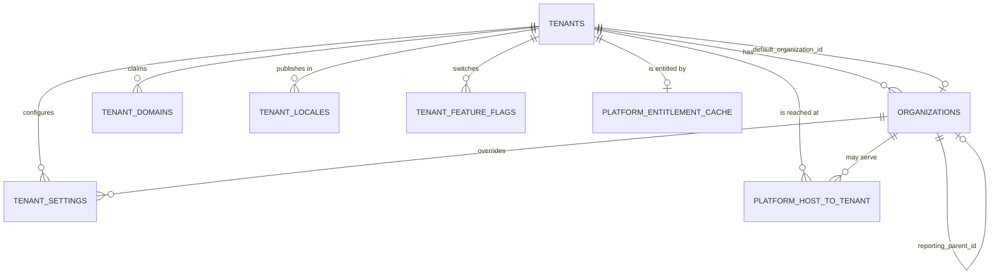
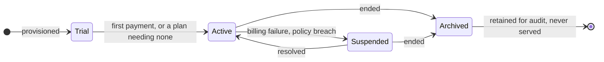
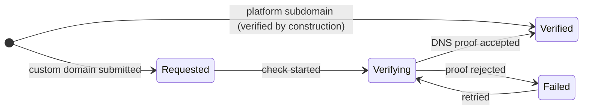
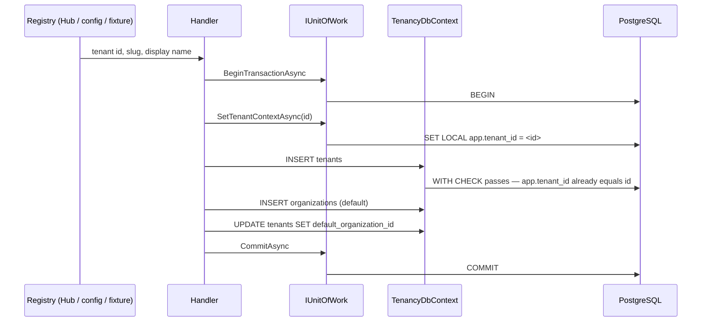
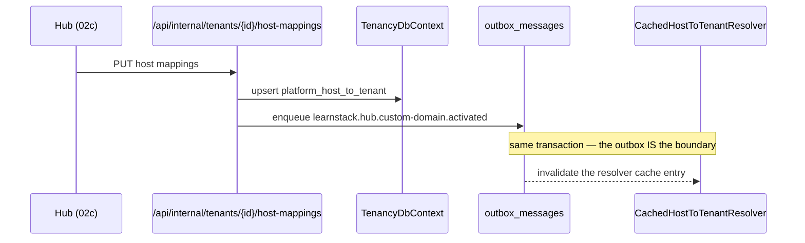
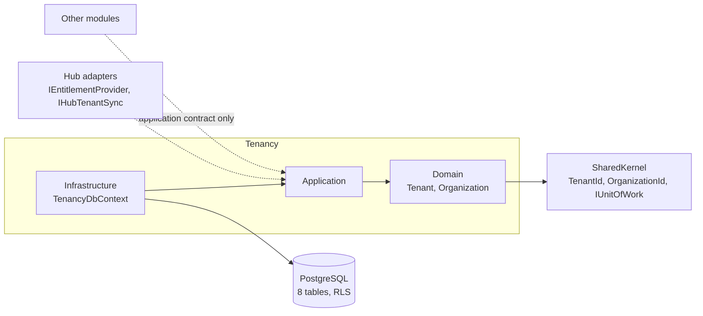

# Module Spec — Tenancy

**Status:** Design stable, partially implemented (Phase 02a Packet 6 shipped the
schema and its schema-level isolation suite; commands, host resolution and the
request-level isolation suite are Packet 7).

The first module spec in the repository, per
[Documentation Standards § Per-Module Specifications](../../standards/13-documentation.md).

## Overview

Tenancy owns **who a request belongs to** and nothing about what they do with it.

**It owns:**

- The `Tenant` aggregate — the root every other tenant-owned row keys on.
- The `Organization` aggregate — a sub-unit within a tenant
  ([ADR-0017](../../decisions/0017-tenant-organization-hierarchy.md)). Declared
  here and nowhere else; ADR-0017's original sample placed it in Identity and
  Amendment 2 moved it.
- `TenantDomain` — a host a tenant claims, and its verification lifecycle.
- `TenantSetting` — non-translated configuration, optionally overridden per
  organization.
- `TenantLocale` — the locales a tenant publishes in
  ([ADR-0008](../../decisions/0008-localization-schema.md)).
- `TenantFeatureFlag` — the tenant's own switches.
- `platform_host_to_tenant` — the host → tenant resolution index, read *before*
  any tenant context exists.
- `platform_entitlement_cache` — the durable projection of a tenant's plan.

**It does not own:**

- **Users, roles or sessions.** Identity does, from
  [Phase 03](../../roadmap/phase-03-identity-admin.md). Tenancy holds
  `UserId` by value in audit columns and never resolves a person.
- **Plan definitions or billing.** The Hub does
  ([ADR-0019](../../decisions/0019-learnstack-hub.md)). Tenancy stores the
  *projection* of an entitlement, written only through
  `IEntitlementProvider.RefreshAsync`, and never calls the Hub to read it.
- **Certificate material.** It moves by secret-store replication and is
  referenced by path; `tenant_domains` carries verification state and no keys.
- **Branding tokens.** `OrganizationBranding` and the token merge are
  [Phase 06](../../roadmap/phase-06-renderer-admin-studio.md); the column arrives with
  them rather than as an unused `jsonb` nobody writes.
- **Any domain-specific shape.** CEFR levels, asana catalogs, kyu/dan ranks and
  every other vertical concept are tenant customization data
  ([ADR-0018](../../decisions/0018-tenant-driven-customization-model.md)), not
  columns here.

## Entity-relationship diagram

Aggregate roots are `Tenant` and `Organization`. `TenantDomain`, `TenantSetting`,
`TenantLocale` and `TenantFeatureFlag` are entities inside the Tenant aggregate.
`PlatformHostMapping` and `PlatformEntitlement` are projections rather than
aggregates — nothing in this module mutates them through a root.

Text fallback, for renderers without Mermaid:

- `tenants` is the root. Its `id` **is** the tenant id — there is no `tenant_id`
  column, which is why its RLS policy keys on `id`.
- `organizations.tenant_id → tenants.id`, single-column by the one written
  exception in [Database Standards § Foreign keys](../../standards/05-database.md):
  the composite form is not expressible against a self-keyed parent, and it is
  unnecessary because the referencing column *is* the tenant id.
- `tenants.default_organization_id` → `organizations (tenant_id, id)`,
  **composite**, and nullable only inside the provisioning transaction.
- Every other foreign key into `organizations` is composite on `tenant_id`.
- `organizations.reporting_parent_id` is a self-reference for **reporting only**.
  It is not an isolation boundary: nothing resolves through it and no policy
  reads it. The hierarchy stays two levels.

## State diagrams

Two entities have a non-trivial lifecycle.

Tenant: `Trial → Active → Suspended ⇄ Active → Archived`. `Archived` is terminal
for serving; rows are retained for audit and retention obligations.

TenantDomain: a `Subdomain` is created already `Verified` because the platform
controls the zone; only a `Custom` domain travels the whole path. **A verified
row does not serve traffic on its own** — a corresponding
`platform_host_to_tenant` row with `is_publicly_live` does.

## Sequence diagrams

### Primary write: provisioning a tenant

Three statements, one transaction. The tenant id is **never minted in the
handler**: the registry assigns it and the transaction sets `app.tenant_id` to
that value *before* the insert, so the self-keyed policy's `WITH CHECK` passes. A
handler that generated its own could not satisfy its own policy. The
`default_organization_id` update is separate because the composite foreign key
has nothing to reference until the organization exists; `MATCH SIMPLE` skips the
check while the column is null, which is what makes the ordering legal.

### Primary integration-event flow: host mapping changed

`IHostToTenantResolver` **never calls the Hub**: an anonymous page load must not
depend on a control plane being reachable
([ADR-0034](../../decisions/0034-hub-contract-surface-invariant.md)). The
resolver reads `platform_host_to_tenant` and nothing else.

## Component diagram

Other modules reach Tenancy **only** through an application contract in
`LearnStack.Modules.Tenancy.Application.Contracts` — never a navigation property,
never a cross-module join
([ADR-0010](../../decisions/0010-cross-module-communication.md)). They hold
`TenantId` and `OrganizationId` by value from `LearnStack.SharedKernel`.

## Integration-event catalogue

**Tenancy publishes none yet.** The events below are declared by the phases that
build their producers; listing them here with their owning phase is the
alternative to discovering the topic name twice.

| Topic | Payload | Publisher | Consumers | Phase |
|---|---|---|---|---|
| `learnstack.tenancy.tenant` | tenant created / status changed | Tenancy | Identity, Audit | 02b |
| `learnstack.tenancy.organization` | organization created / archived | Tenancy | Identity, Education | 02b |
| `learnstack.tenancy.settings` | settings changed — the eager cache invalidation | Tenancy | every settings reader | 02b |
| `learnstack.hub.entitlement` | entitlement projection refreshed | Hub adapter | entitlement cache readers | 02c |
| `learnstack.hub.custom-domain.activated` / `.deactivated` | host mapping changed | Hub adapter | `CachedHostToTenantResolver` | 02c |

Topic names follow `learnstack.{module}.{aggregate}`;
`Integration_Event_TopicNames_FollowConvention` is the authority for the pattern
and this table does not restate it.

## Permission matrix

In [permissions.md](permissions.md), the file
[Permission Standards](../../standards/19-permissions.md) names.

## Audit coverage matrix

In [audit.md](audit.md), the file
[Audit Coverage](../../standards/18-audit-coverage.md) names.

## Performance budget

| Path | Budget | Why this number |
|---|---|---|
| Host → tenant resolution (cache hit) | **< 1 ms** | On every anonymous page load, before anything else can start |
| Host → tenant resolution (cache miss) | **< 15 ms** p95 | One indexed single-row read in its own short transaction |
| Entitlement projection read (L1 hit) | **< 1 ms** | Read on every feature check |
| Tenant provisioning (3 statements) | **< 100 ms** p95 | Interactive but rare |
| Settings read for a request | **< 5 ms** p95 | Cached; a miss is one indexed read |

The two resolution numbers are the load-bearing ones: they sit in front of every
request and are the only Tenancy work an anonymous visitor pays for.

## Risks and open questions

- **`app.scope` has no carrier.** `ITenantContext` exposes no scope member, so
  nothing sets `app.scope = 'tenant'` and the cross-organization read hatch on
  `tenant_settings` is currently unreachable. That is the correct default;
  [Packet 7](../../roadmap/phase-02a-kernel-tenancy.md) decides how the flag
  arrives ([ADR-0040 Amendment 1](../../decisions/0040-ambient-unit-of-work.md)).
- **No query filters yet.** The EF tenant and organization filters land in Packet
  7 with `TenantResolverMiddleware`. Between the packets nothing reads a
  tenant-owned table on a request path, and with `app.tenant_id` unset every
  policy predicate is `NULL` and every query returns zero rows — fail-closed by
  construction rather than by a filter that does not exist.
- **Two defaults per tenant are possible.** Nothing stops two `tenant_locales`
  rows with `is_default = true` for one tenant. A partial unique index would fix
  it; whether the invariant belongs in the database or in the aggregate is
  Packet 7's call, with the first code that reads it.
- **Nothing stops a tenant claiming a hostname it does not own.**
  `ux_tenant_domains_host` is globally unique — it has to be, or a host would
  resolve to two tenants — so the *first* tenant to insert a `Requested` row for
  `school.example.com` blocks every other tenant from claiming it, verified or
  not. The index is partial on `deleted_at IS NULL`, so releasing a claim frees
  the name; what has no owner yet is the policy that decides how long an
  unverified claim may hold one. The custom-domain lifecycle is
  [Phase 02c](../../roadmap/phase-02c-hub-foundation.md), and this is one of the
  rules it has to write.
- **`tenant_domains.host` and `platform_host_to_tenant.host` can disagree.** They
  are separate tables on purpose — one is read under tenant context, the other
  before any context exists — but nothing enforces that a verified domain has a
  mapping or vice versa. The Hub-side lifecycle that keeps them in step is
  [Phase 02c](../../roadmap/phase-02c-hub-foundation.md).
- **Tenant hard-deprovisioning has no owning phase.** Every foreign key is
  `ON DELETE RESTRICT`, so the absence is loud rather than silent — a delete
  fails instead of cascading through a path nobody designed.
