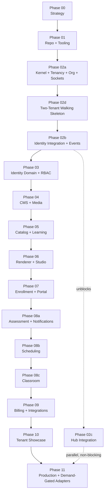

# LearnStack Roadmap

This roadmap describes how LearnStack evolves from an architecture concept into a
white-label platform for multi-branch education businesses that teach live.

LearnStack is not a single LMS implementation. It is an education-aware CMS, learning
engine, and platform foundation that powers multiple brands, landing pages, catalogs,
portals, and education products across domains — language schools, yoga studios, music
schools, coding bootcamps — on the same code paths, differing only in **tenant
customization data** ([ADR-0018](../decisions/0018-tenant-driven-customization-model.md)).
That claim has a stated edge: see
[Platform Vision § Genericity boundary](../architecture/01-platform-vision.md).

The roadmap also references the **`learnstack-hub`** companion (separate repository, see
[ADR-0019](../decisions/0019-learnstack-hub.md)). Hub's own plan lives in **its own
repository** at `../LearnStack-Hub/docs/roadmap/`; the phases here cover only LearnStack's
side of the boundary.

## Sequencing principle

Two kinds of decision, two treatments — the **one-way-door test** from
[ADR-0035](../decisions/0035-demand-gated-infrastructure.md):

> If I add this six months from now, will I have to touch code that is already written?

**Yes → ship it now.** Tenant and organization isolation, the `outbox_messages` table
and its ownership, strongly-typed identifiers, the localization schema. Adding these
later means touching every query, every migration, every job payload.

**No → ship the port now, the adapter on demand.** Dapr, Kafka, APISIX, Vault, the Hub
integration, signed licence keys, custom-domain TLS automation, `audit_log`
partitioning. Each has a port in `LearnStack.SharedKernel`, a working default
implementation, an owning phase, and a written trigger condition. None of them blocks a
user-visible artefact.

The second consequence of that principle is **Phase 02d**: a two-tenant vertical slice
that puts a working education site in a browser immediately after the kernel is sound,
rather than five phases later. Genericity is proven continuously from Phase 02d onward,
not deferred to the showcase phase.

## Phases

- [Phase 00: Product Strategy and Architecture Definition](phase-00-product-architecture.md) — **complete**
- [Phase 01: Repository, Tooling, and Local Infrastructure](phase-01-repository-tooling.md) — **complete**
- [Phase 02a: Platform Kernel, Multi-Tenancy, Organization, and Foundation Sockets](phase-02a-kernel-tenancy.md) — **in progress** (packets 0–3, 3b, 4 and 5 shipped; packet 6 next)
- [Phase 02d: Two-Tenant Walking Skeleton](phase-02d-walking-skeleton.md)
- [Phase 02b: Identity Integration, Session, and Events](phase-02b-events-auth.md)
- [Phase 03: Identity Domain, Authorization, and Admin Foundation](phase-03-identity-admin.md)
- [Phase 04: Headless CMS, Page Builder, and Media Library](phase-04-cms-media-pages.md)
- [Phase 05: Education Catalog and Learning Content](phase-05-education-learning-content.md)
- [Phase 06: Public Site Renderer and Admin Studio](phase-06-renderer-admin-studio.md)
- [Phase 07: Enrollment, Learner Portal, and Progress Tracking](phase-07-enrollment-learner-portal.md)
- [Phase 08a: Assessment, Notifications, and Background Jobs](phase-08a-assessment-notifications.md)
- [Phase 08b: Scheduling and Booking](phase-08b-scheduling.md)
- [Phase 08c: In-App Live Classroom](phase-08c-classroom.md)
- [Phase 09: Billing, Integrations, and Analytics](phase-09-billing-integrations-analytics.md)
- [Phase 10: Tenant Customization Showcase (online English education)](phase-10-english-learning-mvp.md)
- [Phase 11: Production Hardening, Operations, and Scale](phase-11-production-hardening.md)

**Hub-side tracks.** These phases hold LearnStack's side of the boundary and point at
the Hub repository for the rest:

- [Phase 02c: Hub Integration — LearnStack side](phase-02c-hub-foundation.md)
- [Phase 09b: Hub Billing](phase-09b-hub-billing.md) — pointer; the plan lives in the Hub repository
- [Phase 12: Hub Marketplace](phase-12-hub-marketplace.md) — pointer; post-MVP, optional

> **Identifier note.** Phase identifiers are stable and load-bearing: they appear in
> commit messages, branch names, pull requests, architecture-test registrations, and
> across both repositories. `02d` was added after `02b` and `02c` already existed, so it
> sorts last alphabetically while running **before** them in dependency order. The
> dependency map below is authoritative for order; filename order is not.

## Phase Dependency Map

**Reading the map.** The spine is the critical path. Phase 02c hangs off it rather than
sitting in it: LearnStack runs on `NullEntitlementProvider` until a tenant must be
billed or plan-gated, which is the trigger condition
[ADR-0035](../decisions/0035-demand-gated-infrastructure.md) records for it.

## Parallel and Demand-Gated Tracks

| Track | Relationship to the spine | Trigger |
|---|---|---|
| Phase 02c — Hub Integration | Parallel from Phase 02b onward; never blocks | A tenant must be billed or plan-gated |
| Hub repository work (`P02c-*`) | Independent repository, own cadence | See `../LearnStack-Hub/docs/roadmap/` |
| Phase 09b — Hub Billing | Pointer; the plan lives in the Hub repository | Commercial billing needed |
| Phase 12 — Hub Marketplace | Pointer; post-MVP, optional | Product-market evidence |
| Demand-gated adapters (Dapr, Kafka, APISIX, Vault, licence keys, custom-domain TLS, `audit_log` partitioning) | Land in Phase 11 unless their trigger fires earlier | Per the table in [ADR-0035](../decisions/0035-demand-gated-infrastructure.md) |

A demand-gated item is not "deferred". It has a port, a working default implementation,
an owning phase, and a trigger condition — all four written down. If a trigger fires
early, the item moves to the phase where it fired and ADR-0035's table is amended.

## Roadmap Logic

The first goal is a platform core that is **correct where correctness is expensive to
retrofit**, and **thin where it is not**:

- The tenant + organization + domain model is correct from the beginning
  ([ADR-0017](../decisions/0017-tenant-organization-hierarchy.md)), and its Row Level
  Security implementation is the corrected template in
  [ADR-0003 Amendment 3](../decisions/0003-tenant-isolation-defense-in-depth.md) —
  one `AND`-ed policy, `FORCE ROW LEVEL SECURITY`, an explicit `WITH CHECK`, and a
  non-owning application role. Isolation tests run as that role, because a test that
  runs as the owner passes even when every policy is inert.
- MUST-class audit is durable from the first command
  ([ADR-0033](../decisions/0033-audit-durability-model.md)). Audit correctness cannot be
  added later; audit *scale* can, and is.
- Module boundaries stay clear; architecture tests enforce them from Phase 02a,
  including `Core_Modules_HaveNo_DomainSpecific_Names` — the mechanical guarantee behind
  the platform's entire premise.
- CMS and education catalog capabilities work together against tenant-defined content
  types, blocks, lesson items, taxonomies, and scoring / completion rules
  ([ADR-0018](../decisions/0018-tenant-driven-customization-model.md)).
- Public site, admin studio, and learner portal are powered by the same core — and so
  are tenants in unrelated domains, without code changes. **Two tenants exist from
  Phase 02a Packet 7 onward**, so every subsequent phase is tested against the
  genericity claim rather than assuming it.
- Live online classes happen inside the product through a provider-agnostic classroom
  layer.
- **No vertical packs.** The English-learning showcase is not a code module; it is the
  first tenant customization data set, exercised in depth in Phase 10.
- The control plane is a companion, not a prerequisite.

## Phase Structure

Every phase document carries the same six sections, with three declared exceptions
noted below the table:

| Section | What it answers |
|---|---|
| `## Goal` | Why this phase exists, in a few sentences |
| `## Scope` | What is built, grouped by subsystem |
| `## Deliverables` | What exists at the end that did not exist at the start |
| `## Completion Criteria` | Observable statements a reviewer can check |
| `## Risks` | What tends to go wrong here, and the mitigation |
| `## Phase Exit Decision` | The gate: what must be true before the next phase begins |

Three exceptions, all deliberate:

- [Phase 09b](phase-09b-hub-billing.md) and [Phase 12](phase-12-hub-marketplace.md) are
  **pointer documents** into the `learnstack-hub` repository, which owns their plan.
  They carry Goal, Scope on the LearnStack side, Trigger and Phase Exit Decision only;
  Deliverables, Completion Criteria and Risks live in the Hub's own roadmap. Restating
  them here would duplicate a plan this repository does not own.
- [Phase 01](phase-01-repository-tooling.md) predates the `## Phase Exit Decision`
  convention and carries `## Technical Notes` instead. Its annotation block records
  this; it is not a gap to fill.

Phases in progress additionally carry a dated `> **Status**` block at the top, listing
packets and their state. A **packet** is an independently reviewable, independently
mergeable slice with its own pull request; see [Glossary](../glossary.md).

The roadmap deliberately carries **no effort estimates, owners, or timeboxes**. It is a
dependency and scope plan; sequencing decisions belong here, capacity decisions do not.

## Success Criteria

At the end of this roadmap, LearnStack can:

- Provision a tenant with at least one default organization — through the Hub for
  SaaS / Dedicated, through the CLI for Self-Hosted.
- Load tenant customization data (content types, page blocks, lesson item types, level
  taxonomy, scoring rules, completion rules, custom fields, templates) and render the
  tenant's product entirely from that data.
- Publish tenant-specific landing pages, navigation, course catalogs, and course detail
  pages.
- Manage courses, modules, lessons, and learning materials.
- Grant learner access to courses, gated by the tenant's plan entitlement where a plan
  exists.
- Track learner progress, with completion semantics defined by the tenant's
  `TenantCompletionRule`.
- Run quiz and placement-test flows scored by the tenant's `TenantScoringRule`.
- Run in-app live online classes with scheduling, attendance, classroom events,
  recording consent, and recording metadata.
- Extend payment, notifications, search, storage, analytics, and live-classroom
  providers through adapters.
- Run with `NullEntitlementProvider` (no Hub), `HubEntitlementProvider` (SaaS /
  Dedicated), or `SignedLicenseKeyEntitlementProvider` (Self-Hosted, air-gappable)
  without code changes — only `DeploymentMode` configuration. `Development` and `SaaS`
  are wired end to end **today**; `Dedicated`, `SelfHostedOnline` and
  `SelfHostedAirGapped` are **prepared seams, not supported deployments**, until
  [Phase 11](phase-11-production-hardening.md) builds their adapters and integration
  suites ([ADR-0035](../decisions/0035-demand-gated-infrastructure.md)).
