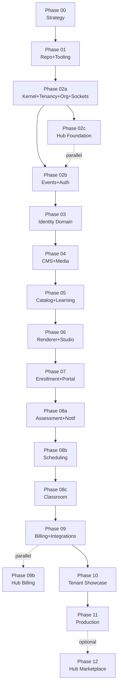

# LearnStack Roadmap

This roadmap describes how LearnStack evolves from an architecture concept into a
multi-tenant core platform for building education products.

LearnStack is not a single LMS implementation. It is an education-aware CMS, learning
engine, and platform foundation that powers multiple brands, landing pages, catalogs,
portals, and **domain-agnostic** education products — yoga studios, coding bootcamps,
music schools, driving schools, and language platforms all run on the same code paths
with different **tenant customization data** ([ADR-0018](../decisions/0018-tenant-driven-customization-model.md)).

The roadmap also includes the **`learnstack-hub`** companion (separate repository, see
[ADR-0019](../decisions/0019-learnstack-hub.md)) that ships in parallel from Phase 02c
onward and provides the SaaS / Dedicated control plane.

## Phases

- [Phase 00: Product Strategy and Architecture Definition](phase-00-product-architecture.md)
- [Phase 01: Repository, Tooling, and Local Infrastructure](phase-01-repository-tooling.md)
- [Phase 02a: Platform Kernel, Multi-Tenancy, Organization, and Foundation Sockets](phase-02a-kernel-tenancy.md)
- [Phase 02b: Events, Outbox, and Identity Integration](phase-02b-events-auth.md)
- [Phase 02c: LearnStack Hub Foundation (parallel track)](phase-02c-hub-foundation.md)
- [Phase 03: Identity, Authorization, and Admin Foundation](phase-03-identity-admin.md)
- [Phase 04: Headless CMS, Page Builder, and Media Library](phase-04-cms-media-pages.md)
- [Phase 05: Education Catalog and Learning Content](phase-05-education-learning-content.md)
- [Phase 06: Public Site Renderer and Admin Studio](phase-06-renderer-admin-studio.md)
- [Phase 07: Enrollment, Learner Portal, and Progress Tracking](phase-07-enrollment-learner-portal.md)
- [Phase 08a: Assessment, Notifications, and Background Jobs](phase-08a-assessment-notifications.md)
- [Phase 08b: Scheduling and Booking](phase-08b-scheduling.md)
- [Phase 08c: In-App Live Classroom](phase-08c-classroom.md)
- [Phase 09: Billing, Integrations, and Analytics](phase-09-billing-integrations-analytics.md)
- [Phase 09b: Hub Billing and Invoicing (parallel track)](phase-09b-hub-billing.md)
- [Phase 10: First Tenant Customization Showcase (online English education)](phase-10-english-learning-mvp.md)
- [Phase 11: Production Hardening, Operations, and Scale](phase-11-production-hardening.md)
- [Phase 12: Hub Marketplace (optional, post-MVP)](phase-12-hub-marketplace.md)

## Phase Dependency Map

## Parallel Tracks

| Track | Runs alongside | Why |
|-------|----------------|-----|
| Phase 02c (Hub Foundation) | Phase 02b | Both depend only on Phase 02a sockets. Splitting reduces calendar time. |
| Phase 09b (Hub Billing) | Phase 09 | Hub-side billing aggregates evolve on their own cadence; LearnStack-side storefront billing is unblocked. |
| Phase 12 (Hub Marketplace) | Post-MVP | Optional; not on the MVP critical path. |

## Roadmap Logic

The first goal is to build a reliable platform core:

- The tenant + organization + domain model must be correct from the beginning
  ([ADR-0017](../decisions/0017-tenant-organization-hierarchy.md)).
- The foundation building blocks (Dapr, APISIX, audit infrastructure, customization
  runtime, entitlement socket, host resolver) ship Day 1, not as Phase-11 cleanup.
- The modular monolith boundaries must remain clear; architecture tests enforce them
  from Phase 02a.
- CMS and education catalog capabilities must work together with tenant-defined
  content types, blocks, lesson items, taxonomies, and scoring/completion rules
  ([ADR-0018](../decisions/0018-tenant-driven-customization-model.md)).
- Public site, admin studio, and learner portal experiences are powered by the same
  core platform — and so are arbitrarily-domained tenants (yoga, coding, music, …)
  without code changes.
- Live online classes happen inside the product experience through a provider-agnostic
  classroom layer.
- **No vertical packs.** The "English learning vertical" is not a code module — it is
  the first tenant customization data set, exercised in Phase 10 to prove the
  substrate is generic.
- The LearnStack Hub ships in parallel as a separate repository, providing SaaS /
  Dedicated control-plane functionality and feeding the entitlement projection.

## Success Criteria

At the end of this roadmap, LearnStack should be able to:

- Provision a new tenant (via Hub for SaaS / Dedicated, CLI for Self-Hosted) with at
  least one default organization.
- Load tenant customization data (content types, page blocks, lesson item types,
  level taxonomy, scoring rules, completion rules, custom fields, templates) and
  render the tenant's product entirely from that data.
- Publish tenant-specific landing pages, navigation, course catalogs, and course
  detail pages.
- Manage courses, modules, lessons, and learning materials.
- Grant learner access to courses (Enrollment-side entitlement) gated by the tenant's
  Hub-side plan entitlement.
- Track learner progress (with completion semantics defined by the tenant's
  `TenantCompletionRule`).
- Run quiz and placement-test flows scored by the tenant's `TenantScoringRule`.
- Run in-app live online classes with scheduling, attendance, classroom events,
  recording consent, and recording metadata.
- Extend payment, notifications, search, storage, analytics, and live classroom
  providers through adapters.
- Run with `NullEntitlementProvider` (no Hub), `HubEntitlementProvider` (SaaS /
  Dedicated), or `SignedLicenseKeyEntitlementProvider` (Self-Hosted, air-gappable)
  without code changes — only `DeploymentMode` configuration.
