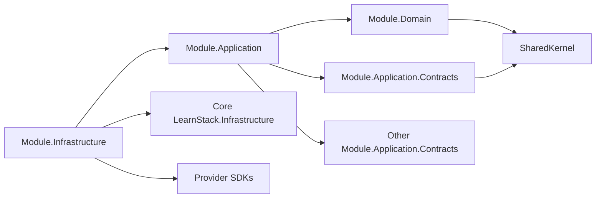

# 01 — Architecture Standards

**Status:** Active
**Derives from:** [ADR-0002 Initial Architecture](../decisions/0002-initial-architecture.md),
[ADR-0010 Cross-Module Communication](../decisions/0010-cross-module-communication.md)
(Amendment 1: outbox dispatch via Dapr pub/sub),
[ADR-0038 Cross-Cutting Port and Event Contracts](../decisions/0038-cross-cutting-port-and-event-contracts.md)
(scheduled by [ADR-0035 Demand-Gated Infrastructure](../decisions/0035-demand-gated-infrastructure.md)),
[ADR-0042 Tenant Provisioning as a Bounded Cross-Aggregate Transaction](../decisions/0042-tenant-provisioning-cross-aggregate-transaction.md)
(§ Aggregate Ownership's carve-out),
[ADR-0033 Audit Durability Model](../decisions/0033-audit-durability-model.md)
(supersedes [ADR-0016 Audit Log Subsystem](../decisions/0016-audit-log-subsystem.md)),
[ADR-0017 Tenant + Organization Hierarchy](../decisions/0017-tenant-organization-hierarchy.md),
[ADR-0018 Tenant-Driven Customization Model](../decisions/0018-tenant-driven-customization-model.md)
(supersedes ADR-0011 Vertical Extension Points).

These rules turn the architecture docs into enforceable code conventions. They are checked by architecture tests where possible.

## Module Layout

Every backend module has the same internal shape:

```
LearnStack.Modules.<Name>.Application.Contracts/   public contracts (referenced by other modules)
LearnStack.Modules.<Name>.Application/             use cases, MediatR handlers, validators
LearnStack.Modules.<Name>.Domain/                  entities, aggregates, value objects, domain events
LearnStack.Modules.<Name>.Infrastructure/          EF configurations, adapters, external clients
```

Rules:
- A module's `Domain` references only the shared kernel.
- A module's `Application` references its own `Domain` plus other modules'
  `Application.Contracts`.
- A module's `Infrastructure` references its own `Application` and `Domain`, plus
  provider SDKs.
- Other modules reference only `<Name>.Application.Contracts`. Never `<Name>.Domain`
  or `<Name>.Infrastructure`.
- **There is no `LearnStack.Verticals.*` namespace.** Domain-specific shapes
  (CEFR levels, asana catalogs, kyu/dan ranks, code-challenge runners, …) live as
  **tenant customization data** ([ADR-0018](../decisions/0018-tenant-driven-customization-model.md)),
  not as compiled code. The architecture test `No_Source_Folder_Named_Verticals`
  enforces this.

## Dependency Direction



Text fallback — a module's `Domain` depends on `SharedKernel`; its `Application` on its
own `Domain`, its own `Application.Contracts` and other modules' contracts; its
`Infrastructure` on its own `Application`, on **core `LearnStack.Infrastructure`**, and
on provider SDKs; and `Application.Contracts` on `SharedKernel`.

**`Module.Infrastructure → LearnStack.Infrastructure` is permitted, and narrowly.** It
carries the shared persistence seams every tenant-owned module derives from rather than
restates — `TenantScopedDbContext` and the query-filter mechanism it applies
([ADR-0040](../decisions/0040-ambient-unit-of-work.md);
[ADR-0003 Amendment 3](../decisions/0003-tenant-isolation-defense-in-depth.md)). Those
call EF model-building APIs, which `SharedKernel` is not sanctioned to do — its EF
reference is scoped to Vogen-emitted converters
([ADR-0023](../decisions/0023-strongly-typed-id-source-generator.md), and § Build-time-only
exceptions below) — so the seam has nowhere else to live. The edge is one-way: core
`LearnStack.Infrastructure` references no module, which is what keeps it acyclic, and
`CoreInfrastructure_DoesNotDependOn_AnyModule` holds that. A module reaching into core
Infrastructure for a **capability of its own** rather than for a shared seam is the
misuse this sentence exists to name.

Forbidden edges:
- Domain → Application
- Domain → Infrastructure
- Application → Infrastructure (composition root wires the implementation in)
- Module A → Module B.Domain
- Module A → Module B.Infrastructure

### Build-time-only exceptions

`SharedKernel` and every `Modules.<X>.Domain` project carries two sanctioned
external NuGet references that the rules above would otherwise forbid:

| Reference | Why | Used at | Sanctioning ADR |
|-----------|-----|---------|-----------------|
| `Microsoft.EntityFrameworkCore` | The Vogen-emitted `<Id>.EfCoreValueConverter` type per strongly-typed ID lives in the project that declares `[ValueObject<Guid>]`. The emitted IL carries TypeRefs to EF Core; the consuming project must reference EF Core at compile time for the converter to load. Hand-written Domain code does **not** import EF Core types. | Compile-time only | [ADR-0023](../decisions/0023-strongly-typed-id-source-generator.md) |
| `MediatR` | `IDomainEvent : INotification` so in-process aggregate events dispatch via MediatR's publisher (the canonical pipeline per [ADR-0010](../decisions/0010-cross-module-communication.md)). | Build-time + runtime (marker only) | [ADR-0010](../decisions/0010-cross-module-communication.md) |

Both references are scoped to **build-time / IL-level dependencies for
generated or marker shapes**, not to hand-written Domain code calling EF
Core or MediatR APIs. The follow-up architecture test
`Domain_Does_Not_Depend_On_Microsoft_EntityFrameworkCore_Except_Vogen_Emitted_Converters`
catalogued under
[21-architecture-tests-catalogue.md](21-architecture-tests-catalogue.md)
encodes the exception (lands with the first Module.Domain aggregate in
[Phase 02a Packet 6](../roadmap/phase-02a-kernel-tenancy.md)). Adding a
third build-time reference to Domain or SharedKernel requires an ADR.

## Aggregate Ownership

- Every entity belongs to exactly one aggregate; aggregate is owned by exactly one module.
- The aggregate root is the only entry point for state changes inside the aggregate.
- Repositories return aggregates, not raw entities.
- Cross-aggregate writes inside a single transaction are forbidden. Use an integration event.
  **One standing exception, bounded by enumeration:** tenant provisioning writes `Tenant`
  and its default `Organization` in one transaction, because
  `tenants.default_organization_id` carries an invariant no eventual-consistency
  mechanism can deliver
  ([ADR-0042](../decisions/0042-tenant-provisioning-cross-aggregate-transaction.md)).
  It covers those two roots and that one operation; the allow-list is literal, and
  `Cross_Aggregate_Writes_Are_Confined_To_Tenant_Provisioning` holds it at one entry.
  Cross-**module** writes remain forbidden with no exception at all.

## Cross-Module Communication

Allowed patterns (see [Cross-Module Contracts](../architecture/10-cross-module-contracts.md)):

1. Application service contract — interface in `<Module>.Application.Contracts`.
2. Domain event — internal only; never crosses module boundaries.
3. Integration event — written to the outbox in the same transaction; consumed asynchronously.
4. Read-model projection — public read-only table owned by one module.

Forbidden patterns:
- Cross-module EF navigation properties.
- Cross-module raw SQL joining tables owned by different modules.
- Static service locators that hide cross-module dependencies.
- Implicit ambient state used for cross-module coordination.

## Provider Adapters

Every external dependency that crosses the LearnStack boundary lives behind an interface:

| Concern | Interface |
|---------|-----------|
| Payment | `IPaymentProvider` |
| Email | `IEmailProvider` |
| SMS | `ISmsProvider` |
| Storage | `IStorageProvider` |
| Search | `ISearchProvider` |
| Live classroom | `ILiveClassProvider` |
| Recording egress | `IRecordingEgressProvider` |
| Identity | `IIdentityProvider` |

Rules:
- Interfaces live in `LearnStack.Application.Contracts` (or the appropriate module's contracts package).
- Implementations live in `LearnStack.Infrastructure.<Concern>.<Provider>` projects.
- Domain and application code never references a provider's SDK types.
- Composition root wires the chosen adapter via DI registration.

## Tenant-Scoped Code

- Every entity backed by a table in one of the **tenant-owned** table classes carries
  `[TenantOwned]`. Both exceptions are decided by **table class**, not by oversight, and
  they except different things. `tenants` is tenant-owned **self-keyed**: it **carries
  the marker**, and is excepted only from the `TenantId` *property* — its `id` *is* the
  tenant id, so both the query filter and the policy key on `id`.
  `platform_host_to_tenant` is **platform-scoped**, read in order to determine the
  tenant — a tenant-keyed predicate on it would make host resolution return zero rows
  forever — so it takes **no marker at all**. See
  [Database Standards § Table classes](05-database.md) and
  [ADR-0003 Amendment 3](../decisions/0003-tenant-isolation-defense-in-depth.md).
  The presence of a `TenantId` property is **not** the test: `PlatformHostMapping` has
  one and takes no marker.
- `[TenantOwned]` entities must have a configured EF global query filter and a PostgreSQL RLS policy (see [Database Standards](05-database.md)).
- Application services must never expose `IgnoreQueryFilters()` directly to callers.
- Background jobs and integration event handlers must accept `TenantId` as part of their payload and set it as the ambient context before doing work.

## Composition Root

A single composition project wires modules together:

- `LearnStack.Api/Composition/` is the composition root: it wires the cross-cutting
  foundation and, from Packet 6, each module's registration.
  `LearnStack.Application/Pipeline/` owns only the MediatR pipeline registration, which
  the composition root calls.
- Each module exposes a single extension method (`services.AddXxxModule()`).
- Provider adapters are registered explicitly with configuration-bound options.

## Architecture Tests

Architecture tests live in `LearnStack.Tests.Architecture`. They enforce:

| Rule | Check |
|------|-------|
| Module dependency direction | NetArchTest / ArchUnitNET ruleset. |
| No cross-module Domain references | Project graph inspection. |
| Every `[TenantOwned]` has filter and policy | Reflection + migration scan. |
| No `IgnoreQueryFilters()` in non-platform code | Roslyn analyzer. |
| Public read models follow `public_<module>_<concept>` naming | Migration scan. |
| Provider SDK types not imported in Domain/Application | Reflection. |
| Hangfire job payloads include `TenantId` | Reflection. |

Tests run on every CI build and are not skippable.

## Tenant Customization (no Vertical Modules)

Per [ADR-0018](../decisions/0018-tenant-driven-customization-model.md), LearnStack
does **not** ship per-domain vertical modules. Tenant-specific shapes are expressed as
**data** in the customization aggregates owned by `LearnStack.Modules.Customization`:

- `TenantContentType` — JSON Schema definitions for tenant-defined content types.
- `TenantPageBlock` — schema + composite-renderer key for tenant-defined page blocks.
- `TenantLessonItemType` — schema + player key for tenant-defined lesson items.
- `TenantLevelTaxonomy` — items declared by a tenant's taxonomy (CEFR, yoga
  difficulty, kyu/dan, …).
- `TenantScoringRule` — sandboxed DSL expression for assessment scoring.
- `TenantCompletionRule` — boolean DSL expression for lesson/module/course completion.
- `TenantCustomFieldDef` — custom fields on built-in entities (`User`, `Course`,
  `Enrollment`, …), stored in the entity's `custom_fields jsonb` column.
- `TenantTemplateLibrary` — notification templates (email/SMS/WhatsApp/in-app) per
  locale, optionally per organization.

The runtime composes per-tenant content shapes by reading these records — schemas are
JSON, expressions are DSL strings (engine choice pending its own ADR). No tenant ships
a C# project; no `Verticals/` folder exists; an architecture test
(`No_Source_Folder_Named_Verticals`) keeps it that way.

Full data model and worked tenant examples:
[32-tenant-customization-model.md](../architecture/32-tenant-customization-model.md).

## Distributed-Consistency Tiers

When a use case writes to PostgreSQL and also calls an external system (LiveKit, Keycloak, Stripe/iyzico, an outbound webhook), the order of the two writes determines the failure model. Pick a tier per command instead of inventing a pattern.

| Tier | Pattern | When to use | Failure model |
|------|---------|-------------|---------------|
| **1** | DB-only. No external call inside the transaction. | The change does not require a side effect at commit time. | Standard EF Core transaction; nothing more. |
| **2A** | DB-first, then external. External is a *mirror* of DB state. | Search indexing, analytics fan-out, "send a notification after success." | If the external call fails, retry via outbox; the DB state is still correct. Never roll back the DB because the side effect failed. |
| **2B** | External-first, then DB. The external system returns an id the DB must store. | Provisioning a LiveKit room, creating a Keycloak user, opening a Stripe customer. | If the DB write fails, run a **compensating delete** against the external system. Idempotency keys on the external call are mandatory. |
| **3** | Idempotency-key + pending state + webhook confirmation. | Payments, recordings, anything where the external system needs minutes to confirm and may call back. | Insert a `pending` row protected by the idempotency key. Confirm via webhook. Never assume sync success means the side effect completed. |

Rules:

- Every cross-boundary command states its tier in code (`// consistency-tier: 2B`) or in the handler XML doc when the tier is non-obvious.
- Outbox dispatch handles tier 2A reliably; tier 2B requires the compensating delete to be testable end to end.
- Tier 3 commands must have a webhook-side handler that closes the pending state idempotently.
- Provider SDK calls inside an EF transaction are forbidden (already a rule under [Database Standards](05-database.md) § Forbidden) — the tier framing makes the reason explicit.

This is the decision rule every PR author runs before writing a handler that talks to an external system.

## Service Extraction Readiness

The modular monolith must remain extractable. When a module is later promoted to a
separate service, only the **adapter** and **transport** layer should change, not the
domain model.

To stay extractable:
- Public contracts in `Application.Contracts` must use only primitives and ids.
- Integration events must be serializable to JSON without loss.
- Cross-module reads happen through contracts, never through shared DbContexts.
- The outbox boundary is identical between **`InProcessEventBus`** (dev) and
  **`DaprEventBus` → Kafka** (production) — both implement the same `IEventBus`
  interface, so a module promoted to a separate service inherits at-least-once
  delivery with no code change. See
  [20-infrastructure-stack.md](20-infrastructure-stack.md) and
  [15-event-and-outbox.md](../architecture/15-event-and-outbox.md).
