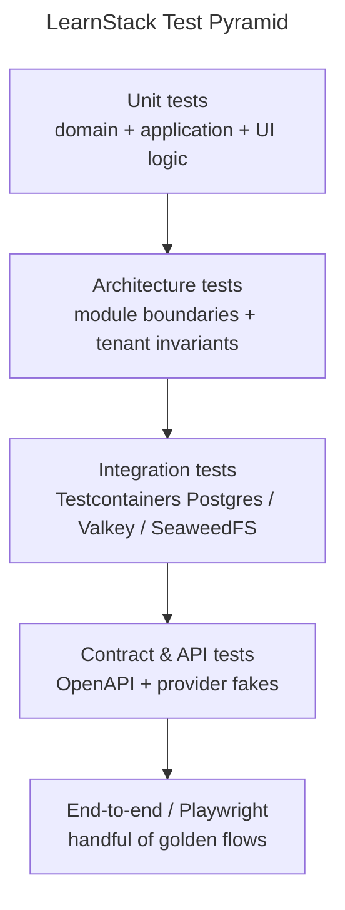

# 06 — Testing Standards

**Status:** Active
**Derives from:** [ADR 0003 — Tenant Isolation Defense in Depth](../decisions/0003-tenant-isolation-defense-in-depth.md), [ADR 0010 — Cross-Module Communication](../decisions/0010-cross-module-communication.md).

Test pyramid, conventions, and what every change must cover.

## Test Pyramid



Text fallback (for renderers without Mermaid support — pyramid base → top):

- **Unit tests** (base layer, widest) — domain + application + UI logic.
- **Architecture tests** — module boundaries + tenant invariants.
- **Integration tests** — Testcontainers Postgres / Valkey / SeaweedFS.
- **Contract & API tests** — OpenAPI + provider fakes.
- **End-to-end / Playwright** (top, narrowest) — handful of golden flows.

We invest most at **unit + integration**. Architecture tests are zero-flake. E2E covers only what cannot be proven below.

## Backend Test Types

| Type | Project | Tool |
|------|---------|------|
| Unit | `LearnStack.Tests.Unit` | xUnit, FluentAssertions |
| Integration | `LearnStack.Tests.Integration` | xUnit + `WebApplicationFactory` (Docker-free host tests) and, from Packet 7, Testcontainers + Respawn |
| Architecture | `LearnStack.Tests.Architecture` | NetArchTest / ArchUnitNET |
| API contract | `LearnStack.Tests.Contract` | OpenAPI snapshot, Pact-style consumer tests |
| End-to-end | none yet | Playwright, per § End-to-End Tests below. No project exists; the owning phase is named there |

### Unit Tests

- Cover domain aggregates, use cases (with mocked repos), value objects, pure helpers.
- No I/O. No `HttpClient`. No database.
- One scenario per test. Arrange / Act / Assert.
- Naming: `MethodName_Scenario_ExpectedOutcome`.

### Integration Tests

`LearnStack.Tests.Integration` holds **two populations**, and which one a test
belongs to is decided by what it needs, not by what it is about:

- **Host tests** — a real HTTP pipeline through `WebApplicationFactory`, no
  Docker. Everything that is a property of the API surface lives here: routing,
  the error shape, idempotency, limits, the tenancy edge. These run in the
  required `backend` CI job alongside the unit suite.
- **Data tests** — real Postgres + Valkey + SeaweedFS via Testcontainers, one
  database per test class (or Respawn between tests). Everything that is a
  property of the schema lives here, and **every tenant-isolation invariant**
  does. These arrive with the schema in Packet 7 and run in the separate
  `backend-integration` job.

Both: real module configuration, no mocked repositories, and coverage of the
happy path and the edges.

**An isolation test connects as `learnstack_app`.** One that runs as
`learnstack_migration`, `learnstack_platform` or `learnstack_outbox_admin`
passes even when every policy is inert, and therefore proves nothing.

### Architecture Tests

Non-skippable. Enforced on every PR.

| Rule | Failure mode |
|------|--------------|
| Module dependency direction | Domain references infrastructure → fail |
| No cross-module Domain imports | Module B → Module A.Domain → fail |
| Every `[TenantOwned]` has a query filter | Missing filter → fail |
| Every tenant-owned table has an RLS policy | Migration scan fails → fail |
| No `IgnoreQueryFilters()` outside platform scope | Analyzer → fail |
| Provider SDK types not in Domain/Application | Reflection → fail |
| Hangfire job payloads carry `TenantId` | Reflection → fail |

### API Contract Tests

- Validate every endpoint against the published OpenAPI.
- OpenAPI snapshot in the repo; CI fails on drift.
- Breaking changes require a version bump.

### End-to-End Tests

**None exist, and the project this section used to name never did.** Driving the
API through `WebApplicationFactory` is what the *host tests* above do; that is
not end-to-end, and listing it as a separate suite made a phantom look shipped.

End-to-end here means a browser: Playwright over a running stack, per the
frontend tooling table below.

- Cover the MVP vertical slice (tenant → page → course → enrollment → live
  session).
- ~10 high-signal scenarios.
- **Owner:** the first flow arrives with the first rendered surface, in
  [Phase 06](../roadmap/phase-06-renderer-admin-studio.md), which also wires the
  axe accessibility checks that run through the same harness.
  [Phase 02d](../roadmap/phase-02d-walking-skeleton.md) puts two tenants in a
  browser but gates on a human opening them, not on a Playwright run.

## Frontend Test Types

| Type | Tool |
|------|------|
| Unit (logic) | Vitest |
| Component | Testing Library + Vitest |
| Server actions | Vitest + Next.js test helpers |
| E2E | Playwright |
| Visual regression | Chromatic / Playwright snapshot |
| Accessibility | axe-core via Playwright |

Rules:
- Components with non-trivial state have unit tests.
- Snapshot tests only for stable visual primitives.
- Playwright covers the same golden flows the backend E2E covers, from the user's perspective.
- Visual regression covers the public renderer and page-builder block output.

## Tenant Isolation Tests

**Mandatory** for every PR touching tenant-owned data:

```csharp
public sealed class CourseTenantIsolationTests : IntegrationTestBase
{
    [Fact]
    public async Task User_in_tenant_A_cannot_see_courses_in_tenant_B()
    {
        var (tenantA, tenantB) = await SeedTwoTenantsAsync();
        var courseInB = await CreateCourseAsync(tenantB);

        var response = await Client.As(tenantA.AdminUser)
            .GetAsync($"/api/v1/courses/{courseInB.Id}");

        response.StatusCode.Should().Be(HttpStatusCode.NotFound);
    }
}
```

Rules:
- Every module owning tenant-scoped data has at least one such test.
- Failures block PRs.
- Regression tests are kept indefinitely.

## Test Data

- Builders / factories for entity construction.
- No global mutable fixtures.
- Seed only what a test needs.
- Factories live in `LearnStack.Tests.TestKit`.

## Coverage Targets

- **Domain code:** ≥ 90% line, ≥ 80% branch.
- **Application code:** ≥ 80% line.
- **Infrastructure adapters:** ≥ 70% line.
- **UI components:** behavior coverage, not lines.

Coverage is reported in CI but does not block PRs by itself. The architecture + isolation + contract tests are the hard gates.

## Test Speed

- Unit suite < 30 s locally.
- Single-module integration suite < 2 min locally.
- Full CI < 15 min.

If a test gets slow, fix the test before the suite.

## Flaky Tests

- A flaky test is a bug. Triage immediately.
- Quarantined tests re-enabled within one sprint or deleted.
- `Skip = "..."` requires a linked issue and a date.

## Live Classroom Testing

- **Token issuance** — correct identity, role, TTL, grants.
- **Authorization** — only authorized users can join.
- **Provider abstraction contract** — fake provider validates the interface.
- **Webhook handling** — signature verification, idempotency, tenant scope.
- **Attendance computation** — synthetic event streams.
- **Recording policy** — consent flow asserted; recording does not start without consent.

Real LiveKit is **not** required in CI; a fake provider satisfies the contract.

## Background Jobs

- Hangfire jobs are unit-tested by invoking the job class directly.
- Tenant context propagation asserted in integration test for every job.
- Idempotency: same job invoked twice produces the same effect.

## CI Pipeline

1. Restore + build.
2. Static analysis (Roslyn analyzers, ESLint, TypeScript).
3. Unit tests.
4. Architecture tests.
5. Integration tests.
6. Contract tests.
7. Frontend unit + component tests.
8. E2E tests.
9. Coverage report.

Any failure in 1–6 blocks merge. Step 8 is required for main; allowed to retry on infra flake (with logged justification).

## Forbidden

- Tests depending on real external services (Stripe, LiveKit Cloud, Postmark) without sandbox + recorded interactions.
- Tests sharing mutable state.
- Tests depending on execution order.
- Tests sleeping > 1 s without a polling assertion.
- Tests asserting on log output strings.
- Tests catching and ignoring exceptions.

## Test Names Read Like Specs

Good:
- `PublishCourse_WhenDraftHasNoLessons_ReturnsValidationError`
- `JoinSession_WhenLearnerNotEnrolled_Returns403`

Bad:
- `Test1`, `ShouldWork`, `CourseTests_Publish`
