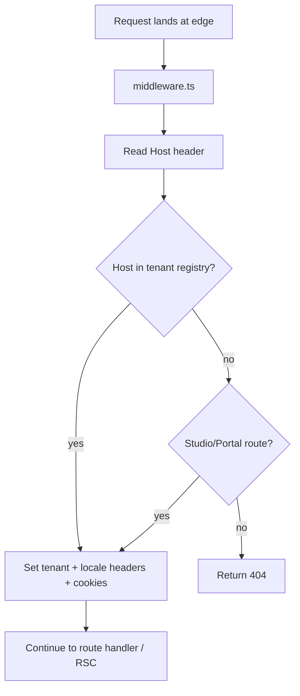

# 07 — Frontend Architecture Standards

**Status:** Active
**Derives from:** [ADR-0009 Frontend Single App First](../decisions/0009-frontend-single-app-first.md),
[ADR-0004 Authentication Strategy](../decisions/0004-authentication-strategy.md)
(Amendment 1: `learnstack-hub` realm for the separate operator portal),
[ADR-0019 LearnStack Hub](../decisions/0019-learnstack-hub.md) (the operator portal
`operator-portal` lives in the separate `learnstack-hub` repository).

Next.js App Router layout, tenant resolution, SDK shape, and runtime concerns for the
tenant-facing `apps/web` application in *this* repository. See
[03-frontend-coding.md](03-frontend-coding.md) for code-level style. The operator
portal (`operator-portal`) lives in the separate `learnstack-hub` repo and follows
its own standards.

## Apps and Packages

LearnStack's tenant-facing surface ships as a **single** Next.js app under
`frontend/apps/web` using route groups (`(public)`, `(studio)`, `(portal)`). Splitting
into separate apps within this repo is deferred until coordination cost demands it.

```
frontend/
  apps/
    web/                       # the only tenant-facing Next.js app
      src/
        app/
          (public)/            # tenant public site
            [...slug]/
            layout.tsx
          (studio)/            # admin studio
            layout.tsx
          (portal)/            # learner + instructor
            layout.tsx
          api/                 # thin BFF route handlers
          layout.tsx           # root layout
        middleware.ts          # tenant + organization resolution edge middleware
        components/
        lib/

  packages/
    ui/                        # design system primitives (extracted only when duplication is real)
    sdk/                       # generated API client + types
    config/                    # eslint, tsconfig, tailwind shared configs
    i18n/                      # locale messages + helpers
    auth/                      # OIDC client config + BFF helpers
```

The operator portal `operator-portal` is a **separate Next.js application in the
separate `learnstack-hub` repository** — not under this `frontend/` directory. The two
apps do not share runtime code; if `packages/ui` is later extracted as a build-time
dependency, it can be referenced by both repos. See
[14-frontend-architecture.md § Apps and Packages](../architecture/14-frontend-architecture.md)
for the architecture-side view.

Migration to multiple apps within this repo (e.g. extracting `(studio)` into
`apps/studio`) is feasible because route groups isolate concerns at the layout level.

## Server Components by Default

- **Server Components (RSC)** are the default for every page and component.
- Add `"use client"` only for interactivity, hooks, browser APIs, third-party client-only libraries.
- RSCs fetch through the SDK directly; they access server env vars and cookies.
- Pass typed primitives across the RSC → Client boundary; never pass class instances or closures.

## Tenant Resolution



Rules:
- Edge middleware is the only place **in the frontend** that resolves a tenant from a
  host. The API resolves the host independently and authoritatively; the edge's answer
  is a render-time convenience, not the security boundary
  ([ADR-0036](../decisions/0036-tenant-resolution-trusted-inputs.md)).
- The server-side SDK states the **visitor's host** to the API over the trusted hop
  (`X-LearnStack-Host` + `X-LearnStack-Hop-Secret`). It may also attach `X-Tenant-Id`,
  but only as an assertion the API compares against its own resolution — a mismatch is
  a 404, and the header never selects the tenant.
- SDK reads tenant from request headers (server) or request-scoped context (client). Client never invents the tenant.
- Studio and Portal users pick a tenant via a switcher; choice persisted in JWT claim and validated cookie.
- Public-site URLs do **not** carry the tenant in the path; locale yes, tenant no.

## Locale Resolution

- Public-site URL: `/{locale}/...`.
- Default locale from tenant settings.
- Locale propagated as `X-Locale` to downstream API calls.
- Client-side locale switching triggers `router.push` to the new locale path.

## SDK

The SDK is the only allowed way to talk to the API from frontend code.

- **Generated** from the backend's `/openapi/v{N}.json` by `openapi-typescript`
  into `src/generated/schema.d.ts`, which is **checked in** so a reviewer sees the
  contract the app compiles against. `pnpm --filter @learnstack/sdk generate`
  runs it against a local API; `LEARNSTACK_OPENAPI` overrides the source.
  Regeneration is byte-stable — the generated directory is in `.prettierignore`,
  because reformatting the generator's output makes every run dirty the tree.
  That is what makes `generate && git diff --exit-code` a usable gate;
  [Phase 02d](../roadmap/phase-02d-walking-skeleton.md) wires it into CI, when
  the document has an operation for a diff to catch. Today it has none, so the
  pipeline is wired and its output is empty.
- Typed end to end.
- Reads tenant + locale from request headers (server) or context (client).
- Maps Problem Details → typed `AppError`.
- Handles auth tokens (refresh, expiry) transparently via Auth.js.

```ts
import { sdk } from "@learnstack/sdk/server";

export default async function CourseListPage() {
  const courses = await sdk.education.listPublishedCourses({ limit: 20 });
  return <CourseList courses={courses.items} />;
}
```

## Auth

- Auth.js for session management.
- OIDC provider: Keycloak.
- Sessions in `HttpOnly`, `Secure`, `SameSite=Lax` cookies.
- Server Components and Server Actions read the session via `auth()`; never read tokens in Client Components.

## Routing

- File-based App Router.
- Route groups: `(public)`, `(studio)`, `(portal)`.
- Dynamic segments use `[slug]`, catch-all `[...slug]`.
- `params` and `searchParams` server-side; thread through carefully.
- Each route group has its own `layout.tsx`, `loading.tsx`, `error.tsx`.

## Public Site Renderer

- Renders **published** pages, courses, blog content.
- Server-side rendering with `revalidate` based on tenant + content type.
- Block rendering pulls from a block registry (`packages/blocks`); blocks register a React component plus a JSON schema.
- Preview tokens enable draft rendering for editors.

## Admin Studio

- Server-rendered shell; data-heavy screens use Client Components with optimistic UI.
- Tenant switcher in the top bar (platform admin sees all tenants; tenant admin sees only their tenants).
- Permission-aware UI hides unavailable actions but never replaces server-side authorization.
- Drafts and publishing flows explicit; published state visible.

## Portal (Learner + Instructor)

- Membership-gated routes.
- Lesson player: Server Component shell + Client Component for media playback.
- Classroom join: client requests a join token from the backend, then connects via the LiveKit web SDK.
- Reconnection states visible to the user.

## Tenant Branding

- Tenant theme tokens loaded at the layout level via RSC.
- Tokens map to CSS variables; Tailwind reads them via `--ls-primary`, `--ls-bg`, etc.
- Theme JSON shape part of tenant settings; tenant-admin editor surfaces it.

## Live Classroom UI

- Join token requested **only when entering the session**, never on page load.
- Token TTL ≤ 1 hour; refresh requires server-side re-authorization.
- Device permission prompts explicit: separate screens for "allow microphone", "allow camera".
- Reconnect indicator visible.
- Recording indicator visible **whenever** recording is active, regardless of who started it.

## State

- Local state for view-only.
- Server state cached via TanStack Query in Client Components.
- URL state (search params) for filterable lists.
- Avoid global Zustand/Redux stores unless multiple unrelated routes share the same mutable client state.

## Error UI

- Route-level `error.tsx` shows a graceful boundary.
- Inline form errors at field level.
- Toasts for transient feedback; modals for action-required errors.
- 404 page renders the tenant's brand if a tenant is resolved.

## Loading UI

- Route-level `loading.tsx` provides a skeleton shell, not a blank page.
- Suspense boundaries scope streaming to meaningful units.
- No "loading…" spinners for resources expected to take < 250 ms.

## Performance

- Image: `next/image` with `priority` for above-the-fold heroes.
- Font: `next/font` self-hosted.
- Streaming with `<Suspense>` to ship hero content first.
- Lazy load below-the-fold blocks.
- Lighthouse budgets: see [15-performance.md](15-performance.md).

## Security

- Strict CSP with nonces.
- No `dangerouslySetInnerHTML` outside a sanitization wrapper.
- Form CSRF: Server Actions verify the Auth.js session; explicit CSRF tokens for non-Action mutating routes.
- Outbound URLs validated against an allow-list before rendering.

## Tooling

- ESLint with `@learnstack/config/eslint`.
- TypeScript strict mode.
- Prettier formatted on commit.
- Storybook for the design system in `packages/ui`.
- Visual regression for the public renderer.

## Future

- Mobile-native portal out of scope until web is stable.
- Offline support out of scope.
- Splitting into multiple Next.js apps is a Phase-9+ consideration.
