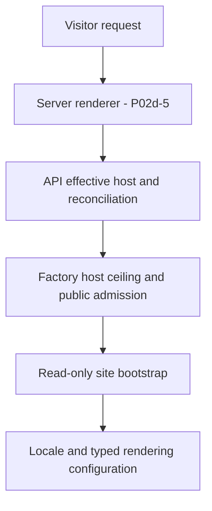

# 07 — Frontend Architecture Standards

**Status:** Active
**Derives from:** [ADR-0009 Frontend Single App First](../decisions/0009-frontend-single-app-first.md),
[ADR-0004 Authentication Strategy](../decisions/0004-authentication-strategy.md)
(Amendment 1: `learnstack-hub` realm for the separate operator portal),
[ADR-0019 LearnStack Hub](../decisions/0019-learnstack-hub.md) (the operator portal
`operator-portal` lives in the separate `learnstack-hub` repository).
Public-read additions derive from
[ADR-0052](../decisions/0052-anonymous-public-read-boundary.md); private ingress,
configured caller and dynamic rendering derive from
[ADR-0053](../decisions/0053-trusted-public-server-rendering.md); native admission and
redirect/query rules derive from [ADR-0054](../decisions/0054-bounded-public-renderer-admission.md).
Public UI localization derives from [ADR-0027](../decisions/0027-frontend-i18n.md);
single-bootstrap ownership derives from
[ADR-0055](../decisions/0055-public-renderer-bootstrap-failures.md);
page composition follows the
[Accepted P02d-6 package](../roadmap/phase-02d-walking-skeleton.md#p02d-6-decision-package-2026-10-09).

Next.js App Router layout, tenant resolution, SDK shape, and runtime concerns for the
tenant-facing `apps/web` application in *this* repository. See
[03-frontend-coding.md](03-frontend-coding.md) for code-level style. The operator
portal (`operator-portal`) lives in the separate `learnstack-hub` repo and follows
its own standards.

## Apps and Packages

LearnStack's tenant-facing surface ships as a **single** Next.js app under
`frontend/apps/web` using route groups (`(public)`, `(studio)`, `(portal)`). Splitting
into separate apps within this repo is deferred until coordination cost demands it.

```
frontend/
  apps/
    web/                       # the only tenant-facing Next.js app
      src/
        app/
          (public)/            # tenant public site
            [...slug]/
            layout.tsx
          (studio)/            # admin studio
            layout.tsx
          (portal)/            # learner + instructor
            layout.tsx
          api/                 # thin BFF route handlers
          layout.tsx           # root layout
        middleware.ts          # ingress verification and live locale/path admission
        components/
          public/              # P6 chrome/states and catalog/course/lesson views
        i18n/                  # ADR-0027 foundation implemented in P6 Step 1
          request.ts
          messages/
            en/public.json
            tr/public.json
        lib/

  packages/
    ui/                        # design system primitives (extracted only when duplication is real)
    sdk/                       # generated API client + types
    config/                    # eslint, tsconfig, tailwind shared configs
    auth/                      # OIDC client config + BFF helpers
```

The operator portal `operator-portal` is a **separate Next.js application in the
separate `learnstack-hub` repository** — not under this `frontend/` directory. The two
apps do not share runtime code; if `packages/ui` is later extracted as a build-time
dependency, it can be referenced by both repos. See
[14-frontend-architecture.md § Apps and Packages](../architecture/14-frontend-architecture.md)
for the architecture-side view.

Migration to multiple apps within this repo (e.g. extracting `(studio)` into
`apps/studio`) is feasible because route groups isolate concerns at the layout level.

## Server Components by Default

- **Server Components (RSC)** are the default for every page and component.
- Add `"use client"` only for interactivity, hooks, browser APIs, third-party client-only libraries.
- RSCs fetch through the SDK directly; they access server env vars and cookies.
- Pass typed primitives across the RSC → Client boundary; never pass class instances or closures.

## Tenant Resolution

**P02d-4 Accepted design — 2026-10-03.** Step 2 delivers site bootstrap;
Steps 3–4 deliver Education reads and the typed SDK; P02d-5 owns the trusted server
transport.
[ADR-0052](../decisions/0052-anonymous-public-read-boundary.md) replaces public edge
ID lookup with host-resolved `/api/v1/public/site` bootstrap. The API owns effective
host resolution under ADR-0036; bootstrap exposes rendering configuration without
tenant/organization IDs or route/query/body tenancy selectors.


```mermaid
flowchart TD
  request[Visitor request] --> server[Server renderer - P02d-5]
  server --> api[API effective host and reconciliation]
  api --> scope[Factory host ceiling and public admission]
  scope --> bootstrap[Read-only site bootstrap]
  bootstrap --> render[Locale and typed rendering configuration]
```

- The server states the visitor host over ADR-0036's authenticated trusted hop;
  origin, headers and transport configuration are P02d-5/G35, not client authority.
- Public URLs carry locale and content slugs, never tenant identifiers.
- The approved bootstrap creates no edge tenant registry or resolver endpoint.
- ADR-0053 accepts native ingress provenance, Node middleware bootstrap and the
  server-only configured caller in P02d-5. The
  [accepted entry matrix](../roadmap/phase-02d-walking-skeleton.md#public-entry-matrix)
  owns membership-first redirects. Anonymous entry neither sets nor uses cookies.
  P02d-5 Steps 1–3 deliver native ingress, visitor budgets, Node bootstrap/entry
  and the configured caller; Step 4 implements frontend fences and real-API
  production HTML/RSC proofs. Public page composition remains P02d-6.
- Studio/Portal tenant switching is separate authenticated functionality; its
  validated claim/cookie contract does not select institution public content.

## Native Admission and URL Identity

**ADR-0054 native/URL controls complete — 2026-10-09; both reviews passed.**
Remediation Step 2 implements these controls. Concrete execution and review
evidence belongs to the [delivery record](../roadmap/phase-02d-walking-skeleton.md#remediation-step-2--native-ingress-and-url-boundary).

- Admit GET/HEAD on every HTTP path reaching the native listener callback before
  Next dispatch, including matcher-exempt health/assets and exact scaffolds.
  Other methods receive masked `404`, `Cache-Control: no-store`, without bootstrap
  or Next method conversion. HEAD is bodyless; Node owns malformed protocol input.
- Close every production WebSocket upgrade. Development admits only the validated
  GET HMR upgrade path and closes failed/unhandled delegation. Health/asset
  exemptions grant no method, provenance or tenant authority.
- Future Server Actions/write routes and WebSocket consumers require an explicit
  admission decision in their owning Phase 02b BFF/auth or Phase 06 admin work.
  Disable `poweredByHeader` independently, including framework fallback responses.
- Signed raw targets select route/locale identity. Match observed middleware URLs
  only against pinned Next 15.5.27's explicit full-URL RSC/`_rsc` projection; do
  not introduce suffix aliases or select another lesson after normalization.
- Redirects retain inert query values, duplicates and ordering; equivalent percent
  encoding is allowed. Only the verified live host, accepted HTTPS port and local
  path select the destination. Membership-first precedence and redirect statuses
  remain those of the [entry matrix](../roadmap/phase-02d-walking-skeleton.md#public-entry-matrix).

## Request-Local Bootstrap Admission

**ADR-0055 implementation delivered — 2026-10-10; production replacement proofs
pass.** Steps 1–2 completed both independent review rounds; Step 3 reviews remain
pending.
Middleware owns one live site bootstrap and its exact neutral 404/429/503 before
rendering. A native-created context binds the captured host/peer/method/signed
target and request lifetime. Successful entry publishes one bounded, deeply
immutable validated Site DTO; RSC re-verifies provenance and consumes that exact
request's snapshot without another site call. No header DTO, context lookup,
alternate holder or cross-request representation is permitted.

Native finish/close/shutdown disposes the store once and cancels transport. Late
work cannot publish or begin downstream reads; response finish does not prove all
React work ended. Active-request context defects fail closed as internal lifecycle
failures, not API 404. Actual pinned-Next security/lifecycle proofs are mandatory.
Content eligibility remains a live API decision; changes after the sole bootstrap
appear in the next request's site snapshot.

The accepted replacement costs two API calls for a completed product document,
one for a completed fixed status/scaffold document and three for a followed
missing-detail chain. HEAD/RSC/prefetch and Flight fallback require separately
proven counts. Metadata/layout/page/UI reuse adds no bootstrap. Visitor/peer limits
remain API-call budgets. The
[Step 3 record](../roadmap/phase-02d-walking-skeleton.md#adr-0055-step-3--production-admission-proof-and-closeout)
owns passing production replacement proof and pending Step 3 review evidence;
the five new catalogue rules are Implemented.
[Standards 09](09-error-handling.md#public-page-status-and-recovery) owns refusal
and bounded renderer Retry-After rules.

## Locale Resolution

P02d-4 accepts one required query `locale` for Education reads. Canonicalize the
bounded LocaleTag grammar without trimming before enabled membership, lookup or
cursor binding. `X-Locale` and `Accept-Language` never select public content.
[Localization Standards](08-localization.md#locale-codes) owns admission/errors;
public-site URL canonicalization and header transport remain P02d-5.

- Public-site URL: `/{locale}/...`.
- A successful site bootstrap supplies the configured default and enabled locales.
  An unavailable/no-locale site supplies no synthesized `en` default.
- Client-side locale switching navigates to the new locale path.

**P02d-6 Step 1 foundation implemented — 2026-10-10.** `next-intl`
request configuration uses the same server-only request-local admission loader
as document/layout/page consumers. That loader re-verifies the ingress envelope,
takes the canonical locale from its signed target and checks live enabled
membership before selecting messages. It imports neither next-intl nor messages;
configuration adds no bootstrap call or cycle. No i18n routing middleware,
`requestLocale`, callsite locale override, cookie or `Accept-Language` replaces
this authority. The private identity memo keys admission/content work only by
Next's exact request-store headers object, retaining same-request work across
framework error rendering. It never keys a cache by header values, host or
envelope. `getPublicUi` uses React cache for selected messages/translators inside
an RSC render; it does not deduplicate admission/content reads.
[Standards 08](08-localization.md#strings-in-code) owns catalogue fallback and
language attributes.

## SDK

The SDK is the frontend API boundary. **P02d-4 Step 4 delivers** generated
types and an injected public GET transport. P02d-5 Step 3 delivers the configured
server caller in `apps/web/src/server/configured-public-client.ts`.

- Generate from committed `backend/openapi/v1.json` through `LEARNSTACK_OPENAPI`
  using locked `openapi-typescript` 7.13.0 into checked-in `schema.d.ts`.
  Production served/snapshot equality and required frontend regeneration/drift
  checks are part of P02d-4; generator output remains outside formatter rewriting.
- The root exports generated types only. `/server` supplies four thin public GET
  wrappers using generated operation types and an injected Fetch-compatible
  transport that resolves relative URLs; no global-fetch default.
- The unused client factory/export is removed. No tenant-ID option, authority-header
  option, hop secret or request-header lookup enters this package contract.
- Parse Problem Details as unknown, validate it and map to the existing closed
  AppError union, including unknown codes. Localization parameter values are
  strings, matching Standards 09's carrier. Transport failure, malformed JSON,
  invalid local path input and caller cancellation remain distinct from a valid
  API error; cancellation precedes URL construction.
- P02d-5/G35 delivers the configured trusted server caller. P02d-6 supplies all
  public page consumers. HEAD is the HTTP companion, not a browser JSON wrapper.

The `server-only` marker is pinned to **0.0.1**, MIT (compatible with the project's
permissive dependency policy); the installed package metadata and lockfile are
the version/license evidence. [Next's server/client guidance](https://nextjs.org/docs/app/getting-started/server-and-client-components#preventing-environment-poisoning)
explains the import guard. Vitest aliases the marker only in server tests. The
P5 production fixture proves a real client import fails with the marker diagnostic
before rebuilding a clean server route against the real API.

The [accepted contract/CI plan](../roadmap/phase-02d-walking-skeleton.md#openapi-sdk-and-required-check-plan)
owns the source, pin, diff policy, bootstrap exception and required-check rollout.

## Auth

- Auth.js for session management.
- OIDC provider: Keycloak.
- Sessions in `HttpOnly`, `Secure`, `SameSite=Lax` cookies.
- Server Components and Server Actions read the session via `auth()`; never read tokens in Client Components.

## Routing

- File-based App Router.
- Route groups: `(public)`, `(studio)`, `(portal)`.
- Dynamic segments use `[slug]`, catch-all `[...slug]`.
- Public route and owned pagination identity come from the verified signed raw
  target; observed `params`/`searchParams` do not replace it.
- Each route group has its own `layout.tsx`, `loading.tsx`, `error.tsx`.

**Accepted P02d-6 G40 — 2026-10-09.** Step 1 implements shared resource admission,
controlled state views and the fixed status page. Step 2 implements catalog/course
pages and their pagination/metadata; Step 3 adds lesson presentation/metadata.
Keep the three
`/{locale}/courses` list/course/lesson routes and minimal tenant chrome. Use plain
same-host relative anchors, including opaque catalog and outline pagination;
disable automatic prefetch. A new document request re-reads API state.

Await request-local resource admission before a loading boundary can flush the
document. A missing/hidden resource returns local **307**, followed by the same
host's fixed `/{locale}/status/not-found` page with **404**; the browser URL changes.
Live host/locale admission applies again. The status page uses safe theme/chrome,
localized title and noindex, has a catalog recovery link, echoes no original
slug/query/cursor and never queries Education. This does not promise a direct
branded 404 at the original URL. Unknown-host/provenance refusals remain neutral.

Keep `loading.tsx`/`error.tsx`; initial pre-admission loading UI is not promised.
Known content-call failures render translated **HTTP 200 noindex** states for
invalid cursors, rate limiting and unavailable/invalid API responses. Bootstrap
refusals retain real 404/429/503. Unexpected framework errors retain pre-stream
500/post-stream 200 semantics; `error.tsx` cannot set arbitrary status.

## Public Site Renderer

**Accepted P02d-5 policy — 2026-10-08. Derives from:**
[ADR-0053](../decisions/0053-trusted-public-server-rendering.md). Public institution
routes render dynamically with no-store API transport. No ISR, positive
`revalidate`, `generateStaticParams`, `unstable_cache` or shared bootstrap/data/route
cache is permitted. Request-local reuse is isolated to one incoming request.
Freshness is the next new server/document request, not client Router Cache history.
Disable local Server Component HMR caching. P02d-6 Step 1 implements document
loaders, chrome, state views and atomic theme injection. Step 2 adds catalog/course
views; Step 3 adds ordered lesson views. Step 4 adds concurrent host/locale, theme,
freshness and failure-state product proofs. The
[delivery record](../roadmap/phase-02d-walking-skeleton.md#p02d-6-step-4-product-proof-and-accessibility-closeout)
owns verification, completed reviews and passing manual accessibility evidence.
P5 delivers the dynamic layout, transport and source/runtime proofs. Test-owned
production routes exercise the real API. P6 product modes copy the actual public
routes separately; the synthetic transport mode cannot shadow those pages.

- Renders **published** pages, courses, blog content.
- Institution public SSR uses ADR-0053's dynamic/no-store policy.
- Block rendering pulls from a block registry (`packages/blocks`); blocks register a React component plus a JSON schema.
- Preview tokens enable draft rendering for editors.

P02d-6 narrows this broader renderer target to API-ordered plain-string
`default-card` fields, through app-local synchronous views. No HTML, Markdown,
linkification, authored URL sink or new primitive is admitted. Unknown renderers
and unavailable presentation use bounded fallbacks. Metadata shares the page's
request-local content read: verified live host/local segments only, actual eligible
alternate slugs, noindex pagination with a first-page canonical and no misleading
resource alternates on errors. Full menus, media, preview and Studio remain
Phase 06. The accepted replacement and current delivery boundary live in
[Request-Local Bootstrap Admission](#request-local-bootstrap-admission); no retry
or shared DTO cache is added.

### Public source fence scope

P02d-5 remediation Step 4 follows header constructors and converted records through
bounded declaration aliases. Inherited tsconfig paths and workspace exports must
match the resolver census; unsupported production `.js`/`.jsx`/`.mjs`/`.cjs`/
`.mts`/`.cts` extensions fail until the census/resolver supports them. Admitted
Studio/portal scaffolds join the render-root census. Public navigation uses
document anchors; runtime Next Link/router imports are refused, including
transitive barrels.
The retention fence covers module mutable bindings, local factories/IIFEs,
collections, class-static and global writes. It is bounded source analysis,
not an interpreter for reflection, arbitrary evaluation or external packages.
Declaration-level `import type` and
`export type` edges are erased. Inline type-only specifiers remain conservative
source edges: TypeScript verbatim emission retains them; pinned Next 15.5.27 SWC
erases them. Separate real compiler controls establish that distinction.
An empty production Client Component census is source information; the configured
production-build canary supplies independent asset containment evidence.
[The catalogue](21-architecture-tests-catalogue.md#p02d-5-public-server-rendering-controls)
names the controls; the remediation record owns execution evidence.

## Admin Studio

- Server-rendered shell; data-heavy screens use Client Components with optimistic UI.
- Tenant switcher in the top bar (platform admin sees all tenants; tenant admin sees only their tenants).
- Permission-aware UI hides unavailable actions but never replaces server-side authorization.
- Drafts and publishing flows explicit; published state visible.

## Portal (Learner + Instructor)

- Membership-gated routes.
- Lesson player: Server Component shell + Client Component for media playback.
- Classroom join: client requests a join token from the backend, then connects via the LiveKit web SDK.
- Reconnection states visible to the user.

## Tenant Branding

**G16(a–e)/G21 writer contract delivered in P02d-2 — 2026-10-02.** The
[Tenancy contract](../modules/tenancy/README.md#whole-theme-setting-and-public-boundary)
selects one whole-theme color document, contrast refusal, no organization override
and no font/logo/URL/layout value. P02d-6 Step 1 implements the accepted G42
atomic document injection below.
P02d-4 accepts complete typed theme or null and attribution-only entitlement;
Step 2 delivers that public projection.

P02d-4's public theme is exactly four validated colors or null; frontend safe
CSS defaults remain the fallback, with no backend palette copy. Baseline colors
are independent of plan. Effective WhiteLabelBranding removes LearnStack
attribution only. Accepted G42/P02d-6 requires atomic validation of all four
`#rrggbb` values before emitting a server-generated style element with only
`--ls-primary`, `--ls-bg`, `--ls-fg` and `--ls-muted`. Null or any malformed value
retains the entire existing CSS default palette; no per-token merge or style
attribute. No URL, font or organization override is admitted. Output is safe
without CSP, whose delivery remains Phase 11.

- Tenant theme tokens loaded at the layout level via RSC.
- Tailwind reads the four fixed color variables above; the font token stays local.
- Theme JSON shape part of tenant settings; tenant-admin editor surfaces it.

## Live Classroom UI

- Join token requested **only when entering the session**, never on page load.
- Token TTL ≤ 1 hour; refresh requires server-side re-authorization.
- Device permission prompts explicit: separate screens for "allow microphone", "allow camera".
- Reconnect indicator visible.
- Recording indicator visible **whenever** recording is active, regardless of who started it.

## State

- Local state for view-only.
- Server state cached via TanStack Query in Client Components.
- URL state (search params) for filterable lists.
- Avoid global Zustand/Redux stores unless multiple unrelated routes share the same mutable client state.

## Error UI

- Route-level `error.tsx` shows a graceful boundary.
- Inline form errors at field level.
- Toasts for transient feedback; modals for action-required errors.
- P02d-6's accepted branded missing-resource path is the admitted 307→404 chain
  in [Routing](#routing); a fresh bootstrap refusal stays neutral.

## Loading UI

- Route-level `loading.tsx` provides a skeleton shell, not a blank page.
- Suspense boundaries scope streaming to meaningful units.
- No "loading…" spinners for resources expected to take < 250 ms.

P02d-6 admission must complete before the initial shell flushes, per
[Routing](#routing); the general streaming rule does not bypass redirect admission.

## Performance

- Image: `next/image` with `priority` for above-the-fold heroes.
- Font: `next/font` self-hosted.
- Streaming with `<Suspense>` to ship hero content first.
- Lazy load below-the-fold blocks.
- Lighthouse budgets: see [15-performance.md](15-performance.md).

## Security

- Strict CSP with nonces.
- No `dangerouslySetInnerHTML` outside a sanitization wrapper.
- Form CSRF: Server Actions verify the Auth.js session; explicit CSRF tokens for non-Action mutating routes.
- Outbound URLs validated against an allow-list before rendering.

## Tooling

- ESLint with `@learnstack/config/eslint`.
- TypeScript strict mode.
- Prettier formatted on commit.
- Storybook for the design system in `packages/ui`.
- Visual regression for the public renderer.

## Future

- Mobile-native portal out of scope until web is stable.
- Offline support out of scope.
- Splitting into multiple Next.js apps is a Phase-9+ consideration.
