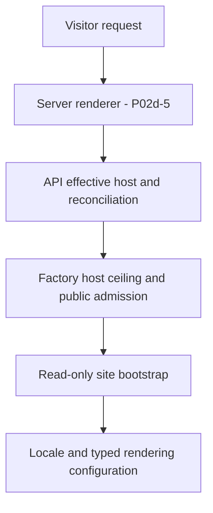

# 07 — Frontend Architecture Standards

**Status:** Active
**Derives from:** [ADR-0009 Frontend Single App First](../decisions/0009-frontend-single-app-first.md),
[ADR-0004 Authentication Strategy](../decisions/0004-authentication-strategy.md)
(Amendment 1: `learnstack-hub` realm for the separate operator portal),
[ADR-0019 LearnStack Hub](../decisions/0019-learnstack-hub.md) (the operator portal
`operator-portal` lives in the separate `learnstack-hub` repository).
Public-read additions derive from
[ADR-0052](../decisions/0052-anonymous-public-read-boundary.md); private ingress,
configured caller and dynamic rendering derive from
[ADR-0053](../decisions/0053-trusted-public-server-rendering.md); native admission and
redirect/query rules derive from [ADR-0054](../decisions/0054-bounded-public-renderer-admission.md).

Next.js App Router layout, tenant resolution, SDK shape, and runtime concerns for the
tenant-facing `apps/web` application in *this* repository. See
[03-frontend-coding.md](03-frontend-coding.md) for code-level style. The operator
portal (`operator-portal`) lives in the separate `learnstack-hub` repo and follows
its own standards.

## Apps and Packages

LearnStack's tenant-facing surface ships as a **single** Next.js app under
`frontend/apps/web` using route groups (`(public)`, `(studio)`, `(portal)`). Splitting
into separate apps within this repo is deferred until coordination cost demands it.

```
frontend/
  apps/
    web/                       # the only tenant-facing Next.js app
      src/
        app/
          (public)/            # tenant public site
            [...slug]/
            layout.tsx
          (studio)/            # admin studio
            layout.tsx
          (portal)/            # learner + instructor
            layout.tsx
          api/                 # thin BFF route handlers
          layout.tsx           # root layout
        middleware.ts          # ingress verification and live locale/path admission
        components/
        lib/

  packages/
    ui/                        # design system primitives (extracted only when duplication is real)
    sdk/                       # generated API client + types
    config/                    # eslint, tsconfig, tailwind shared configs
    i18n/                      # locale messages + helpers
    auth/                      # OIDC client config + BFF helpers
```

The operator portal `operator-portal` is a **separate Next.js application in the
separate `learnstack-hub` repository** — not under this `frontend/` directory. The two
apps do not share runtime code; if `packages/ui` is later extracted as a build-time
dependency, it can be referenced by both repos. See
[14-frontend-architecture.md § Apps and Packages](../architecture/14-frontend-architecture.md)
for the architecture-side view.

Migration to multiple apps within this repo (e.g. extracting `(studio)` into
`apps/studio`) is feasible because route groups isolate concerns at the layout level.

## Server Components by Default

- **Server Components (RSC)** are the default for every page and component.
- Add `"use client"` only for interactivity, hooks, browser APIs, third-party client-only libraries.
- RSCs fetch through the SDK directly; they access server env vars and cookies.
- Pass typed primitives across the RSC → Client boundary; never pass class instances or closures.

## Tenant Resolution

**P02d-4 Accepted design — 2026-10-03.** Step 2 delivers site bootstrap;
Steps 3–4 deliver Education reads and the typed SDK; P02d-5 owns the trusted server
transport.
[ADR-0052](../decisions/0052-anonymous-public-read-boundary.md) replaces public edge
ID lookup with host-resolved `/api/v1/public/site` bootstrap. The API owns effective
host resolution under ADR-0036; bootstrap exposes rendering configuration without
tenant/organization IDs or route/query/body tenancy selectors.


```mermaid
flowchart TD
  request[Visitor request] --> server[Server renderer - P02d-5]
  server --> api[API effective host and reconciliation]
  api --> scope[Factory host ceiling and public admission]
  scope --> bootstrap[Read-only site bootstrap]
  bootstrap --> render[Locale and typed rendering configuration]
```

- The server states the visitor host over ADR-0036's authenticated trusted hop;
  origin, headers and transport configuration are P02d-5/G35, not client authority.
- Public URLs carry locale and content slugs, never tenant identifiers.
- The approved bootstrap creates no edge tenant registry or resolver endpoint.
- ADR-0053 accepts native ingress provenance, Node middleware bootstrap and the
  server-only configured caller in P02d-5. The
  [accepted entry matrix](../roadmap/phase-02d-walking-skeleton.md#public-entry-matrix)
  owns membership-first redirects. Anonymous entry neither sets nor uses cookies.
  P02d-5 Steps 1–3 deliver native ingress, visitor budgets, Node bootstrap/entry
  and the configured caller; Step 4 implements frontend fences and real-API
  production HTML/RSC proofs. Public page composition remains P02d-6.
- Studio/Portal tenant switching is separate authenticated functionality; its
  validated claim/cookie contract does not select institution public content.

## Native Admission and URL Identity

**ADR-0054 Accepted, not implemented — 2026-10-09.** Remediation Step 2
implements these native/URL controls; the existing launcher and middleware remain
current behavior until that step is verified.

- Admit GET/HEAD on every HTTP path reaching the native listener callback before
  Next dispatch, including matcher-exempt health/assets and exact scaffolds.
  Other methods receive masked `404`, `Cache-Control: no-store`, without bootstrap
  or Next method conversion. HEAD is bodyless; Node owns malformed protocol input.
- Close every production WebSocket upgrade. Development admits only the validated
  GET HMR upgrade path and closes failed/unhandled delegation. Health/asset
  exemptions grant no method, provenance or tenant authority.
- Future Server Actions/write routes and WebSocket consumers require an explicit
  admission decision in their owning Phase 02b BFF/auth or Phase 06 admin work.
  Disable `poweredByHeader` independently, including framework fallback responses.
- Signed raw targets select route/locale identity. Match observed middleware URLs
  only against pinned Next 15.5.18's explicit full-URL RSC/`_rsc` projection; do
  not introduce suffix aliases or select another lesson after normalization.
- Redirects retain inert query values, duplicates and ordering; equivalent percent
  encoding is allowed. Only the verified live host, accepted HTTPS port and local
  path select the destination. Membership-first precedence and redirect statuses
  remain those of the [entry matrix](../roadmap/phase-02d-walking-skeleton.md#public-entry-matrix).

## Locale Resolution

P02d-4 accepts one required query `locale` for Education reads. Canonicalize the
bounded LocaleTag grammar without trimming before enabled membership, lookup or
cursor binding. `X-Locale` and `Accept-Language` never select public content.
[Localization Standards](08-localization.md#locale-codes) owns admission/errors;
public-site URL canonicalization and header transport remain P02d-5.

- Public-site URL: `/{locale}/...`.
- A successful site bootstrap supplies the configured default and enabled locales.
  An unavailable/no-locale site supplies no synthesized `en` default.
- Client-side locale switching navigates to the new locale path.

## SDK

The SDK is the frontend API boundary. **P02d-4 Step 4 delivers** generated
types and an injected public GET transport. P02d-5 Step 3 delivers the configured
server caller in `apps/web/src/server/configured-public-client.ts`.

- Generate from committed `backend/openapi/v1.json` through `LEARNSTACK_OPENAPI`
  using locked `openapi-typescript` 7.13.0 into checked-in `schema.d.ts`.
  Production served/snapshot equality and required frontend regeneration/drift
  checks are part of P02d-4; generator output remains outside formatter rewriting.
- The root exports generated types only. `/server` supplies four thin public GET
  wrappers using generated operation types and an injected Fetch-compatible
  transport that resolves relative URLs; no global-fetch default.
- The unused client factory/export is removed. No tenant-ID option, authority-header
  option, hop secret or request-header lookup enters this package contract.
- Parse Problem Details as unknown, validate it and map to the existing closed
  AppError union, including unknown codes. Localization parameter values are
  strings, matching Standards 09's carrier. Transport failure, malformed JSON,
  invalid local path input and caller cancellation remain distinct from a valid
  API error; cancellation precedes URL construction.
- P02d-5/G35 delivers the configured trusted server caller. P02d-6 supplies all
  public page consumers. HEAD is the HTTP companion, not a browser JSON wrapper.

The `server-only` marker is pinned to **0.0.1**, MIT (compatible with the project's
permissive dependency policy); the installed package metadata and lockfile are
the version/license evidence. [Next's server/client guidance](https://nextjs.org/docs/app/getting-started/server-and-client-components#preventing-environment-poisoning)
explains the import guard. Vitest aliases the marker only in server tests. The
P5 production fixture proves a real client import fails with the marker diagnostic
before rebuilding a clean server route against the real API.

The [accepted contract/CI plan](../roadmap/phase-02d-walking-skeleton.md#openapi-sdk-and-required-check-plan)
owns the source, pin, diff policy, bootstrap exception and required-check rollout.

## Auth

- Auth.js for session management.
- OIDC provider: Keycloak.
- Sessions in `HttpOnly`, `Secure`, `SameSite=Lax` cookies.
- Server Components and Server Actions read the session via `auth()`; never read tokens in Client Components.

## Routing

- File-based App Router.
- Route groups: `(public)`, `(studio)`, `(portal)`.
- Dynamic segments use `[slug]`, catch-all `[...slug]`.
- `params` and `searchParams` server-side; thread through carefully.
- Each route group has its own `layout.tsx`, `loading.tsx`, `error.tsx`.

> **Open in Phase 02d.** Which of these files the `(public)` group ships in Phase 02d,
> and any dated carve-out that needs, is G40 in
> [Phase 02d's decision register](../roadmap/phase-02d-walking-skeleton.md#the-decision-register).

## Public Site Renderer

**Accepted P02d-5 policy — 2026-10-08. Derives from:**
[ADR-0053](../decisions/0053-trusted-public-server-rendering.md). Public institution
routes render dynamically with no-store API transport. No ISR, positive
`revalidate`, `generateStaticParams`, `unstable_cache` or shared bootstrap/data/route
cache is permitted. Request-local reuse is isolated to one incoming request.
Freshness is the next new server/document request, not client Router Cache history.
Disable local Server Component HMR caching. P02d-6/G41 still owns components.
P5 delivers the dynamic layout, transport and source/runtime proofs. Test-owned
production routes exercise the real API; P6 public pages are not delivered by them.

- Renders **published** pages, courses, blog content.
- Institution public SSR uses ADR-0053's dynamic/no-store policy.
- Block rendering pulls from a block registry (`packages/blocks`); blocks register a React component plus a JSON schema.
- Preview tokens enable draft rendering for editors.

## Admin Studio

- Server-rendered shell; data-heavy screens use Client Components with optimistic UI.
- Tenant switcher in the top bar (platform admin sees all tenants; tenant admin sees only their tenants).
- Permission-aware UI hides unavailable actions but never replaces server-side authorization.
- Drafts and publishing flows explicit; published state visible.

## Portal (Learner + Instructor)

- Membership-gated routes.
- Lesson player: Server Component shell + Client Component for media playback.
- Classroom join: client requests a join token from the backend, then connects via the LiveKit web SDK.
- Reconnection states visible to the user.

## Tenant Branding

**G16(a–e)/G21 writer contract delivered in P02d-2 — 2026-10-02.** The
[Tenancy contract](../modules/tenancy/README.md#whole-theme-setting-and-public-boundary)
selects one whole-theme color document, contrast refusal, no organization override
and no font/logo/URL/layout value. Document injection remains G42.
P02d-4 accepts complete typed theme or null and attribution-only entitlement;
Step 2 delivers that public projection.

P02d-4's public theme is exactly four validated colors or null; frontend safe
CSS defaults remain the fallback, with no backend palette copy. Baseline colors
are independent of plan. Effective WhiteLabelBranding removes LearnStack
attribution only. Document injection remains G42/P02d-6.

- Tenant theme tokens loaded at the layout level via RSC.
- Tokens map to CSS variables; Tailwind reads them via `--ls-primary`, `--ls-bg`, etc.
- Theme JSON shape part of tenant settings; tenant-admin editor surfaces it.

## Live Classroom UI

- Join token requested **only when entering the session**, never on page load.
- Token TTL ≤ 1 hour; refresh requires server-side re-authorization.
- Device permission prompts explicit: separate screens for "allow microphone", "allow camera".
- Reconnect indicator visible.
- Recording indicator visible **whenever** recording is active, regardless of who started it.

## State

- Local state for view-only.
- Server state cached via TanStack Query in Client Components.
- URL state (search params) for filterable lists.
- Avoid global Zustand/Redux stores unless multiple unrelated routes share the same mutable client state.

## Error UI

- Route-level `error.tsx` shows a graceful boundary.
- Inline form errors at field level.
- Toasts for transient feedback; modals for action-required errors.
- 404 page renders the tenant's brand if a tenant is resolved.

## Loading UI

- Route-level `loading.tsx` provides a skeleton shell, not a blank page.
- Suspense boundaries scope streaming to meaningful units.
- No "loading…" spinners for resources expected to take < 250 ms.

## Performance

- Image: `next/image` with `priority` for above-the-fold heroes.
- Font: `next/font` self-hosted.
- Streaming with `<Suspense>` to ship hero content first.
- Lazy load below-the-fold blocks.
- Lighthouse budgets: see [15-performance.md](15-performance.md).

## Security

- Strict CSP with nonces.
- No `dangerouslySetInnerHTML` outside a sanitization wrapper.
- Form CSRF: Server Actions verify the Auth.js session; explicit CSRF tokens for non-Action mutating routes.
- Outbound URLs validated against an allow-list before rendering.

## Tooling

- ESLint with `@learnstack/config/eslint`.
- TypeScript strict mode.
- Prettier formatted on commit.
- Storybook for the design system in `packages/ui`.
- Visual regression for the public renderer.

## Future

- Mobile-native portal out of scope until web is stable.
- Offline support out of scope.
- Splitting into multiple Next.js apps is a Phase-9+ consideration.
