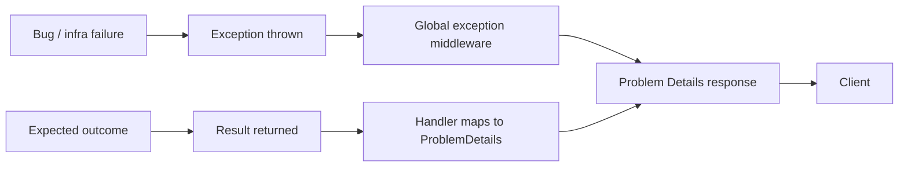

# 09 — Error Handling Standards

**Status:** Active

How LearnStack represents, propagates, surfaces, and recovers from failures.

## Two-Track Model



- **Exceptions** for *unexpected* failures: bugs, transient infra issues, contract violations.
- **`Result<T>`** for *expected* outcomes: validation failures, not-found, conflicts, business-rule violations.

Both end in **RFC 7807 Problem Details** at the API boundary.

## Result Type

```csharp
public sealed record Result<T>(bool IsSuccess, T? Value, Error? Error)
{
    public static Result<T> Ok(T value) => new(true, value, null);
    public static Result<T> Fail(Error error) => new(false, default, error);
}

public sealed record Error(
    string Code,
    string Message,
    IReadOnlyDictionary<string, string[]>? Details = null);
```

Standard error codes (machine-readable, stable):

| Code | Meaning | HTTP |
|------|---------|------|
| `validation_failed` | Field-level validation failed | 400 |
| `not_found` | Resource does not exist (or hidden cross-tenant) | 404 |
| `unauthorized` | Authentication required or invalid | 401 |
| `forbidden` | Authenticated but not permitted | 403 |
| `tenant_mismatch` | Tenant context mismatch | 404 |
| `concurrency_conflict` | Optimistic concurrency token mismatch | 409 |
| `business_rule_violation` | Domain invariant violation | 409 |
| `resource_scope_violation` | Resource-level authorization failure | 403 |
| `rate_limited` | Too many requests | 429 |
| `dependency_unavailable` | Upstream provider down | 503 |
| `recording_consent_required` | Live session requires consent | 409 |
| `unsupported_locale` | Locale not enabled for tenant | 400 |
| `feature_disabled` | Feature flag off for tenant | 403 |

## Exceptions

### Hierarchy

```
LearnStackException                  (base)
├── DomainException                  (domain invariant broken from inside, programmer error)
├── InfrastructureException          (DB, Redis, MinIO transient)
├── ProviderException                (upstream provider error)
│   ├── PaymentProviderException
│   ├── LiveClassProviderException
│   ├── StorageProviderException
│   └── ...
├── TenantContextMissingException    (no tenant resolved where one is required)
└── UnreachableException             (case branches that should be impossible)
```

Rules:
- Throw `LearnStackException` subclasses, never raw `Exception`.
- Constructors take a structured `Error` plus the underlying cause.
- Stack traces flow into logs and Sentry, never to clients.
- Don't catch `Exception` broadly; catch specific subclasses where you can act.

### Retry vs. Don't Retry

| Exception type | Retry? |
|----------------|--------|
| `InfrastructureException` (transient) | Yes, with backoff |
| `ProviderException` (5xx, timeout) | Yes, with backoff |
| `ProviderException` (4xx) | No |
| `DomainException` | No |
| `TenantContextMissingException` | No |

## API Surface

All API errors are **RFC 7807 Problem Details**:

```json
{
  "type": "https://errors.learnstack.dev/validation",
  "title": "Validation failed",
  "status": 400,
  "code": "validation_failed",
  "detail": "One or more fields are invalid.",
  "instance": "/v1/courses",
  "correlationId": "01H...",
  "errors": {
    "title": ["Title is required."],
    "slug": ["Slug already exists in this tenant."]
  }
}
```

Rules:
- `type` is a stable URL.
- `code` is the machine-readable identifier.
- `detail` is human-readable but **safe to display** (no internal info).
- `instance` is the request path.
- `correlationId` matches the trace id.
- `errors` is field-level detail (validation only).

## Validation Errors

- FluentValidation produces field-level errors.
- Always include all failures, not just the first one.
- Field names match the request shape (`camelCase`).
- Messages are localizable; the API returns the locale-appropriate message based on the request's `Accept-Language` or tenant default.

## Frontend Error Handling

### Boundaries

- **Root error boundary** catches unexpected client errors and shows a recovery page with a correlation id.
- **Route group `error.tsx`** shows a context-appropriate fallback.
- **Form errors** render inline at the field level.
- **Toasts** for transient, non-blocking failures.
- **Modals** for action-required failures.

### Mapping Problem Details → UI

```ts
type AppError =
  | { code: "validation_failed"; fieldErrors: Record<string, string[]> }
  | { code: "not_found"; resource?: string }
  | { code: "concurrency_conflict"; latestVersion?: number }
  | { code: "dependency_unavailable"; provider?: string; retryAfter?: number }
  | { code: "rate_limited"; retryAfter?: number }
  | { code: "forbidden" }
  | { code: "unauthorized" }
  | { code: "recording_consent_required" }
  | { code: "unknown"; correlationId?: string };
```

The SDK maps Problem Details payloads to `AppError`; UI code switches on `code`.

### User-Facing Copy

- Never show stack traces.
- Never show internal correlation ids without an explanatory message.
- Always offer a next step (retry, contact support, navigate elsewhere).
- Localize messages.

## Provider Failures

- Wrap every provider call with `ProviderException` mapping at the adapter boundary.
- Translate provider-specific status codes to our normalized codes.
- Don't leak provider names to end users (`detail: "Recording could not be started. Please try again."` not `"LiveKit returned 503"`).
- Capture provider raw response to logs (with redaction) for debugging.

## Background Jobs

- Jobs retry on `InfrastructureException` and `ProviderException` (5xx).
- Backoff: exponential with jitter; cap at 5 attempts default.
- Permanent failures move to dead-letter table with `last_error` and `attempts`.
- Dead-letter inspection UI lives in the platform admin tools.

## Outbox

- Outbox dispatcher catches all exceptions from a handler, logs them, increments `attempts`, sets `available_after = now() + backoff`.
- Poison messages (max attempts reached) are dead-lettered.
- Dashboard alert when dead-letter count > 0.

## Webhooks

- Inbound webhook handlers return **200** on duplicate (idempotent).
- Signature verification failure → **401** with no body.
- Tenant resolution failure → **404** with no body.
- Processing errors → **500** (provider will retry).
- Always log the full event id for traceability.

## Forbidden

- Swallowing exceptions silently.
- Returning `null` to signal an error.
- Throwing `Exception` directly.
- Throwing inside catch blocks without preserving the inner exception.
- Including stack traces or query text in Problem Details.
- `Result<T>` with `IsSuccess = true` but `Value = null` (use a Maybe / Option or throw at boundary).
- Localizing error codes (codes are stable English identifiers; only `title` and `detail` are localized).
