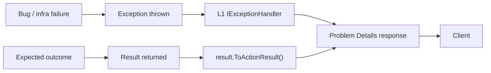

# 09 — Error Handling Standards

**Status:** Active
**Derives from:** [ADR 0002 — Initial Architecture](../decisions/0002-initial-architecture.md) (Problem Details + Result\<T\> baseline), [ADR 0032 — Exception Handling, Logging, and Observability Architecture](../decisions/0032-exception-handling-logging-and-observability.md) (implementation patterns), [04-api-design.md](04-api-design.md) § Error Responses.

How LearnStack represents, propagates, surfaces, and recovers from failures.

The conceptual deep dive and diagrams live in
[33-cross-cutting-concerns.md](../architecture/33-cross-cutting-concerns.md).
This standard contains the day-to-day rules.

## Two-Track Model



- **Exceptions** for *unexpected* failures: bugs, transient infra issues, contract violations.
- **`Result<T>`** for *expected* outcomes: validation failures, not-found, conflicts, business-rule violations.

Both end in **RFC 7807 Problem Details** at the API boundary.

## Result Type

```csharp
public sealed record Result<T> : IResultBase
{
    internal Result(bool isSuccess, T? value, Error? error, LocalizedMessage? successMessage = null) { ... }
    // The annotations are the contract, not decoration: they let a consumer
    // dereference Value or Error after one check without `!`. They do NOT flow
    // from IResultBase to its implementations, so both carry their own copy.
    [MemberNotNullWhen(true, nameof(Value)), MemberNotNullWhen(false, nameof(Error))]
    public bool IsSuccess { get; }

    [MemberNotNullWhen(false, nameof(Value)), MemberNotNullWhen(true, nameof(Error))]
    public bool IsFailure => !IsSuccess;

    public T? Value { get; }
    public Error? Error { get; }
    public LocalizedMessage? SuccessMessage { get; }

    public static Result<T> Ok(T value, LocalizedMessage? message = null); // throws on null value
    public static Result<T> Fail(Error error);
}

public sealed record Error(
    LocalizedMessage Message,
    IReadOnlyDictionary<string, IReadOnlyList<LocalizedMessage>>? Details = null)
{
    public string Code => Message.Key[LocalizedMessage.RequiredPrefix.Length..];
}

public sealed record LocalizedMessage(string Key, IReadOnlyDictionary<string, string>? Params = null)
{
    public const string RequiredPrefix = "lockey_";
    // ctor enforces Key.StartsWith(RequiredPrefix); see Phase 02a Packet 2.
}

public readonly record struct None { public static None Value { get; } }
```

The `LocalizedMessage`'s `lockey_` prefix is invariant: the constructor
rejects any key that does not start with `lockey_`. Frontend translation
catalogues are keyed by the same prefix; backend code never returns raw
English. `Error.Code` is a **stable, unprefixed** projection of
`Message.Key` (the `lockey_` prefix is stripped). Routing logic
(`Result.ToActionResult()`, Problem Details writers) reads `Code`; the
frontend reads `Message.Key` for locale resolution — two surfaces in
sync by construction. Per
[Phase 02a Packet 2](../roadmap/phase-02a-kernel-tenancy.md) and
[ADR-0032 § Error Model](../decisions/0032-exception-handling-logging-and-observability.md).

`Result<T>`'s primary constructor is `internal`; callers go through
`Ok` / `Fail` so the success-must-carry-value rule
(see § Forbidden) cannot be bypassed via positional record syntax.
`Result<None>` is the canonical payload-less success shape.

Field-level errors in `Error.Details` flow as `LocalizedMessage` lists
per key, so the `lockey_` invariant covers every user-facing string the
API ships — not just the top-level message.

Standard error codes (machine-readable, stable). The table uses the
unprefixed shape that travels on the Problem Details `code` field; the
matching localization key adds the `lockey_` prefix.

| Code | Meaning | HTTP |
|------|---------|------|
| `validation_failed` | Field-level validation failed | 400 |
| `not_found` | Resource does not exist (or hidden cross-tenant) | 404 |
| `unauthorized` | Authentication required or invalid | 401 |
| `forbidden` | Authenticated but not permitted | 403 |
| `tenant_mismatch` | Tenant context mismatch | 404 |
| `concurrency_conflict` | Optimistic concurrency token mismatch | 409 |
| `business_rule_violation` | Domain invariant violation | 409 |
| `resource_scope_violation` | Resource-level authorization failure | 403 |
| `rate_limited` | Too many requests | 429 |
| `dependency_unavailable` | Upstream provider down | 503 |
| `recording_consent_required` | Live session requires consent | 409 |
| `unsupported_locale` | Locale not enabled for tenant | 400 |
| `feature_disabled` | Feature flag off for tenant | 403 |

## Exceptions

### Hierarchy

```
LearnStackException                  (base)
├── DomainException                  (domain invariant broken from inside, programmer error)
├── InfrastructureException          (DB, Valkey, SeaweedFS transient)
├── ProviderException                (upstream provider error)
│   ├── PaymentProviderException
│   ├── LiveClassProviderException
│   ├── StorageProviderException
│   └── ...
└── TenantContextMissingException    (no tenant resolved where one is required)
```

For "case branches that should be impossible" use the BCL
`System.Diagnostics.UnreachableException` (.NET 7+) directly — adding a
custom subclass collides with the BCL name and forces every use site to
disambiguate with `using` aliases. The L1 `IExceptionHandler` treats it the
same as any unhandled exception (Sentry-captured, 500 Problem Details).

Rules:
- Throw `LearnStackException` subclasses, never raw `Exception`.
- Constructors take a structured `Error` plus the underlying cause.
- Stack traces flow into logs and Sentry, never to clients.
- Don't catch `Exception` broadly; catch specific subclasses where you can act.

### Retry vs. Don't Retry

| Exception type | Retry? |
|----------------|--------|
| `InfrastructureException` (transient) | Yes, with backoff |
| `ProviderException` (5xx, timeout) | Yes, with backoff |
| `ProviderException` (4xx) | No |
| `DomainException` | No |
| `TenantContextMissingException` | No |

## L1 Exception Handler

The first-line catch site is `LearnStackExceptionHandler : IExceptionHandler`
(.NET 8+) per
[ADR-0032 § Sub-decision 1](../decisions/0032-exception-handling-logging-and-observability.md).
Every backend host (`LearnStack.Api`, workers, background-service hosts)
registers it the same way:

```csharp
services.AddExceptionHandler<LearnStackExceptionHandler>();
services.AddProblemDetails();
// in pipeline:
app.UseExceptionHandler();
```

Responsibilities of the handler:

- Map every `LearnStackException` subclass to its standard `Error.Code` and
  HTTP status (the table under § Result Type).
- Build the RFC 7807 Problem Details body with `correlationId` set from the
  full W3C traceparent (`Activity.Current.Id`, the
  `00-<trace>-<span>-<flags>` string) — not the bare 32-hex trace id — so the
  Problem Details body, the captured Sentry/LocalFile context, and
  `ITenantContext.CorrelationId` all carry the same handle. Falls back to
  `HttpContext.TraceIdentifier` when no `Activity` is current.
- Call `Activity.Current.RecordException(ex) + SetStatus(Error, ...)` so
  Tempo sees the failure.
- Dispatch to `IErrorTrackingProvider.CaptureAsync` **only when**
  `ShouldCapture(ex)` returns true (see § Sentry vs OpenTelemetry boundary).

The older `app.UseExceptionHandler(lambda)` and `app.Use((ctx, next) => { try
{...} catch {...} })` patterns are not used in new code. There is no
`ExceptionHandlingBehavior` inside the MediatR pipeline —
`AuditLogBehavior`'s catch + rethrow + the L1 handler are the only two
catch sites below the framework.

## Sentry vs OpenTelemetry — Error Capture Boundary

Per
[ADR-0032 § Sub-decision 7](../decisions/0032-exception-handling-logging-and-observability.md),
the two backends receive complementary signals:

| Failure | OTel span | `IErrorTrackingProvider` | Rationale |
|---------|-----------|--------------------------|-----------|
| Unhandled `Exception` at L1 | `RecordException` + `SetStatus(Error)` | **Capture** | Bug or infra; high-signal |
| `LearnStackException` subclass at L1 | `RecordException` + `SetStatus(Error)` | **Capture** | Leaked from a failing layer |
| `ProviderException` with `IsClientError == false` (5xx upstream) | `RecordException` + `SetStatus(Error)` | **Capture** | Upstream infra failure |
| `ProviderException` with `IsClientError == true` (4xx upstream) | `SetStatus(Error)` only | **Skip** | Provider's user-error; not our bug |
| `Result.Fail(validation_failed / forbidden / not_found / ...)` | `SetStatus(Ok)` (runtime completed; HTTP response is the appropriate 4xx Problem Details) | **Skip** | Expected outcome; metric counter only |
| `Result.Fail(business_rule_violation)` | `SetStatus(Ok)` | **Skip** | Expected outcome; metric counter only |
| `OperationCanceledException` (client disconnect) | leave span `Unset`; **no** `RecordException` | **Skip** | Noise; not actionable. (`ActivityStatusCode` is `Unset / Ok / Error` — Unset is the right default for "we didn't finish but it wasn't a failure".) |

The boundary is the L1 handler's `ShouldCapture(Exception)` switch. Modules
never reference `Sentry.SentrySdk` directly — the architecture test
`Modules_Do_Not_Reference_Sentry_SDK_Directly` enforces it.

## API Surface

All API errors are **RFC 7807 Problem Details**:

```json
{
  "type": "https://errors.learnstack.dev/validation",
  "title": "lockey_validation_failed",
  "status": 400,
  "code": "validation_failed",
  "messageKey": "lockey_validation_failed",
  "instance": "/v1/courses",
  "correlationId": "01H...",
  "errors": {
    "title": [
      { "key": "lockey_title_required" }
    ],
    "slug": [
      { "key": "lockey_slug_already_exists_in_tenant", "params": { "slug": "intro" } }
    ]
  }
}
```

Rules:
- `type` is a stable URL.
- `code` is the machine-readable identifier — the unprefixed `Error.Code`
  (Standards 04 § Problem Details).
- `messageKey` is the `LocalizedMessage.Key` (always begins with `lockey_`)
  the frontend resolves against its i18n catalogue. The legacy
  `detail` field is omitted — backend never returns raw English.
- `instance` is the request path.
- `correlationId` is the full W3C traceparent (`Activity.Current.Id`),
  which embeds the trace id; falls back to the request id when no trace is
  active.
- `errors` is field-level detail, each entry a `LocalizedMessage` payload
  (`key` + optional `params`) so the frontend resolves field-level messages
  through the same path as the top-level one.

## Validation Errors

- FluentValidation produces field-level errors.
- Always include all failures, not just the first one.
- Field names match the request shape (`camelCase`).
- Messages are localizable; the API returns the locale-appropriate message based on the request's `Accept-Language` or tenant default.
- **`ValidationBehavior` returns `Result.Fail(validation_failed, errors)` —
  it does NOT throw `FluentValidation.ValidationException`.** Per
  [ADR-0032 § Sub-decision 3](../decisions/0032-exception-handling-logging-and-observability.md),
  the pipeline never raises a validation exception. The behavior aggregates
  `ValidationResult` failures into the `Error.Details` dictionary and
  short-circuits the request. The behavior's generic constraint is
  `where TResponse : IResultBase`; the static factory
  `Result.FailFor<TResponse>(error)` constructs the correct shape.

## Domain Exceptions

Per
[ADR-0032 § Sub-decision 4](../decisions/0032-exception-handling-logging-and-observability.md),
`DomainException` is reserved for **programmer errors** (bugs):

- Aggregate invariant violations that signal a programming mistake (e.g. a
  domain method was called in an impossible order, an aggregate's invariant
  was bypassed).
- Anything where "raising this exception means we have a bug to fix".

**Expected business-rule violations** return
`Result.Fail(business_rule_violation, ...)` from the domain method — they are
not exceptions. Examples that **must** be `Result.Fail`, not throws:

- "Course capacity reached."
- "Tenant plan limit exceeded."
- "Cannot enrol learner: enrolment closed."
- "Cannot publish course: missing required lesson."

Enforcement:

- The Roslyn analyzer `LearnStackException-DomainExceptionThrow` flags every
  `throw new DomainException(...)` outside aggregate invariant guards as a
  Warning (Phase 02a) and as an Error after Phase 03 exit.
- Architecture test `Domain_Methods_Do_Not_Throw_For_Expected_Cases` walks
  `Result<T>`-returning methods and asserts the analyzer's report is empty.

## Controller Mapping — `Result<T>` → `IActionResult`

Per
[ADR-0032 § Sub-decision 6](../decisions/0032-exception-handling-logging-and-observability.md),
the sanctioned shape is an explicit extension method:

```csharp
[HttpPost("courses")]
public async Task<IActionResult> Create(
    CreateCourseCommand command, CancellationToken ct)
    => (await _mediator.Send(command, ct)).ToActionResult();
```

`ResultExtensions.ToActionResult()` lives in `LearnStack.Api.Common`. It
matches on `Error.Code` and emits the Problem Details body with the right
HTTP status (per the table in § Result Type). There is no action filter, no
MediatR `ResultUnwrapBehavior`, no implicit conversion — the explicit pattern
keeps the diff honest and the debug experience straightforward.

## Frontend Error Handling

### Boundaries

- **Root error boundary** catches unexpected client errors and shows a recovery page with a correlation id.
- **Route group `error.tsx`** shows a context-appropriate fallback.
- **Form errors** render inline at the field level.
- **Toasts** for transient, non-blocking failures.
- **Modals** for action-required failures.

### Mapping Problem Details → UI

```ts
type AppError =
  | { code: "validation_failed"; fieldErrors: Record<string, string[]> }
  | { code: "not_found"; resource?: string }
  | { code: "concurrency_conflict"; latestVersion?: number }
  | { code: "dependency_unavailable"; provider?: string; retryAfter?: number }
  | { code: "rate_limited"; retryAfter?: number }
  | { code: "forbidden" }
  | { code: "unauthorized" }
  | { code: "recording_consent_required" }
  | { code: "unknown"; correlationId?: string };
```

The SDK maps Problem Details payloads to `AppError`; UI code switches on `code`.

### User-Facing Copy

- Never show stack traces.
- Never show internal correlation ids without an explanatory message.
- Always offer a next step (retry, contact support, navigate elsewhere).
- Localize messages.

## Provider Failures

- Wrap every provider call with `ProviderException` mapping at the adapter boundary.
- Translate provider-specific status codes to our normalized codes; set
  `ProviderException.IsClientError` based on the upstream status (`true` for
  4xx, `false` for 5xx). The L1 handler uses this flag to decide whether to
  Sentry-capture (5xx) or not (4xx).
- Don't leak provider names to end users (`detail: "Recording could not be started. Please try again."` not `"LiveKit returned 503"`).
- Capture provider raw response to logs (with redaction) for debugging.

### Provider Resilience — Polly v8 ResiliencePipeline

Per
[ADR-0032 § Sub-decision 5](../decisions/0032-exception-handling-logging-and-observability.md),
every provider adapter is wrapped with a Polly v8 `ResiliencePipeline` via
the `IProviderResilience<TPort>` decorator pattern. The composition root
wires every adapter:

```csharp
services.AddProviderResilience<ILiveClassProvider, LiveKitClient>("liveclass");
services.AddProviderResilience<IPaymentProvider, StripePaymentClient>("payment");
services.AddProviderResilience<IStorageProvider, SeaweedFSStorageClient>("storage");
// ...
```

The decorator reads `Resilience:<portName>:` from `appsettings.{env}.json`
and builds a pipeline with:

- **Retry** — exponential backoff with jitter; only retries
  `ProviderException` with `IsClientError == false` and `InfrastructureException`
  (transient).
- **Circuit breaker** — opens on `failureRatio` over `samplingDuration`;
  shields the upstream from sustained pressure.
- **Timeout** — bounds the longest single attempt.
- **Bulkhead** — caps concurrent in-flight calls per upstream.

The adapter's only exception-related job is **SDK → ProviderException
translation**. The decorator is the only place retry / circuit breaker /
timeout live. The
[add-provider-adapter](../../.claude/skills/add-provider-adapter/SKILL.md)
skill walks the canonical shape for every new adapter.

Configuration shape (excerpt):

```jsonc
{
  "Resilience": {
    "liveclass": {
      "retry": { "maxAttempts": 3, "delaySeconds": 1, "useJitter": true },
      "circuitBreaker": { "failureRatio": 0.5, "samplingDurationSeconds": 30, "minimumThroughput": 10, "breakDurationSeconds": 30 },
      "timeout": { "totalSeconds": 10 }
    }
  }
}
```

Architecture test `Adapters_Wrap_Provider_Exceptions` asserts that SDK
exception types (`LiveKit.NET.LiveKitException`, `Stripe.StripeException`,
`Meilisearch.MeilisearchApiError`, …) never leave the
`LearnStack.Infrastructure.<Adapter>` namespaces.

## Background Jobs

- Jobs retry on `InfrastructureException` and `ProviderException` (5xx).
- Backoff: exponential with jitter; cap at 5 attempts default.
- Permanent failures move to dead-letter table with `last_error` and `attempts`.
- Dead-letter inspection UI lives in the platform admin tools.

## Outbox

- Outbox dispatcher catches all exceptions from a handler, logs them, increments `attempts`, sets `available_after = now() + backoff`.
- Poison messages (max attempts reached) are dead-lettered.
- Dashboard alert when dead-letter count > 0.

## Webhooks

- Inbound webhook handlers return **200** on duplicate (idempotent).
- Signature verification failure → **401** with no body.
- Tenant resolution failure → **404** with no body.
- Processing errors → **500** (provider will retry).
- Always log the full event id for traceability.

## Forbidden

- Swallowing exceptions silently.
- Returning `null` to signal an error.
- Throwing `Exception` directly.
- Throwing inside catch blocks without preserving the inner exception.
- Including stack traces or query text in Problem Details.
- `Result<T>` with `IsSuccess = true` but `Value = null` (use a Maybe / Option or throw at boundary).
- Localizing error codes (codes are stable English identifiers; only `title` and `detail` are localized).
- Throwing `DomainException` for expected business-rule violations — use
  `Result.Fail(business_rule_violation, ...)` instead. The Roslyn analyzer
  flags violations.
- Throwing `FluentValidation.ValidationException` from the
  `ValidationBehavior`. The behavior returns `Result.Fail(validation_failed)`.
- Importing `Sentry.SentrySdk` from any module assembly. Capture happens
  centrally via `IErrorTrackingProvider`; the L1 `IExceptionHandler` is the
  only sanctioned caller in application code.
- Adding an `ExceptionHandlingBehavior` to the MediatR pipeline. The
  `AuditLogBehavior` + L1 `IExceptionHandler` cover the two needed catch
  sites; a third behavior would duplicate the responsibility.
- Importing a provider SDK exception type (`LiveKit.NET.LiveKitException`,
  `Stripe.StripeException`, …) outside the adapter's
  `LearnStack.Infrastructure.<Adapter>` namespace.

The architecture tests and Roslyn analyzers that enforce the rules above
are listed in
[21-architecture-tests-catalogue.md § Cross-cutting: error handling, logging, observability](21-architecture-tests-catalogue.md);
that catalogue is the canonical reference for every identifier.
