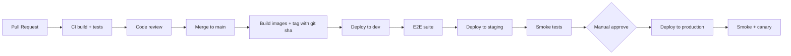

# 12 — Infrastructure Standards

**Status:** Active
**Derives from:** [ADR-0002 Initial Architecture](../decisions/0002-initial-architecture.md),
[ADR-0005 Live Classroom Media Stack](../decisions/0005-live-classroom-media-stack.md),
[ADR-0014 Adopt Dapr](../decisions/0014-adopt-dapr.md),
[ADR-0015 API Gateway: APISIX](../decisions/0015-api-gateway-apisix.md),
[ADR-0019 LearnStack Hub](../decisions/0019-learnstack-hub.md),
[ADR-0020 Triple Deployment + Hybrid License](../decisions/0020-triple-deployment-hybrid-license.md),
[ADR-0029 Object Storage — SeaweedFS](../decisions/0029-object-storage-seaweedfs.md),
[ADR-0030 Redis-Compatible Store — Valkey](../decisions/0030-redis-compatible-store-valkey.md),
[ADR-0031 PostgreSQL — Start on 18.x](../decisions/0031-postgresql-major-version.md).

How LearnStack is built, packaged, deployed, configured, and observed at the
infrastructure level. The application-code rules for the foundation building blocks
(Dapr `IEventBus` / `ICacheService` / `ISecretProvider`, APISIX, the Hub HTTPS surface,
the entitlement projection, outbox / inbox) live in
[20-infrastructure-stack.md](20-infrastructure-stack.md); this standard covers the
*operational* concerns: containers, environments, CI/CD, database operations,
observability, DR, deployment models.

## Environments

| Environment | Purpose |
|-------------|---------|
| `local` | Developer workstation. Docker Compose. |
| `ci` | CI runners. Ephemeral. |
| `dev` | Shared dev environment for backend/frontend integration. |
| `staging` | Pre-production rehearsal. Same shape as production, smaller scale. |
| `production` | Live. |

Configuration differences are explicit and documented.

## Deployment Modes

LearnStack ships in three production deployment models per
[ADR-0020](../decisions/0020-triple-deployment-hybrid-license.md) plus a local
development mode:

| Mode | Owner of infra | Hub presence | Entitlement source |
|------|----------------|--------------|--------------------|
| `Development` | Developer workstation | none | `NullEntitlementProvider` |
| `SaaS` | LearnStack vendor | Yes (multi-tenant Hub instance) | `HubEntitlementProvider` (HTTPS) |
| `Dedicated` | LearnStack vendor on a tenant-isolated cluster | Yes (Hub points at that cluster) | `HubEntitlementProvider` (HTTPS) |
| `SelfHostedOnline` | Customer | LearnStack-hosted Hub reachable | `HubEntitlementProvider` (phone-home, 30-day grace) |
| `SelfHostedAirGapped` | Customer | None (no outbound network) | `SignedLicenseKeyEntitlementProvider` (RSA-2048 `.lic` file, no phone-home) |

The application code is the same binary across all five modes; selection happens at
the composition root via `DeploymentMode`. See
[20-infrastructure-stack.md](20-infrastructure-stack.md) § Composition Root for the
adapter table.

## Local Infrastructure (Docker Compose)

Shipped in Phase 01 packets 1-6 (`infra/compose/dev.yml`):

```text
postgres                # PostgreSQL 18.x per ADR-0031
valkey                  # Linux-Foundation BSD-3 fork of Redis 7.2.4 per ADR-0030
seaweedfs               # single dev binary: master + volume + filer + S3 gateway per ADR-0029
meilisearch
mailpit
keycloak                # two realms: learnstack + learnstack-hub
livekit                 # SFU (livekit-server image)
coturn                  # TURN/STUN
kafka                   # KRaft mode (no ZooKeeper) — Dapr pub/sub backend
kafka-ui                # ghcr.io/kafbat fork (dev only)
vault                   # Dapr secrets backend (dev mode)
dapr-placement          # Dapr building blocks
dapr-sidecar-api        # one sidecar per backend service
apisix                  # gateway in file-driven standalone (data_plane) mode — no etcd, no Admin API, no dashboard companion
```

Deferred — added by a later phase, not in the Phase 01 stack:

```text
livekit-egress          # Phase 08c (recording / consent / cost model)
otel-collector          # Phase 11 (Production hardening — observability stack)
```

- Application projects run **outside** containers during active development; the Dapr
  sidecar still runs alongside via `dapr run` or compose.
- CI runs the same image tags as developers.
- `.env.example` is the source of truth for required env vars; secrets in real
  environments come from Vault via `ISecretProvider`, not env files.
- `infra/apisix/config.yaml` is the canonical APISIX standalone config; routes / plugins
  hot-reload on file change.

### Healthchecks and the readiness gate

**Derives from:** [ADR-0002 Initial Architecture](../decisions/0002-initial-architecture.md)
— these tighten how the local development stack that ADR describes is operated;
they introduce no new architectural decision.

- **A service in the default compose profile declares a `healthcheck` when one can be
  written.** `make seed` waits on the default-profile set and treats a service that is
  running but not `healthy` as not ready.
- **`daprio/placement` and `daprio/daprd` are the only exempt images.** Both are
  single-binary images on an empty base — `docker run --entrypoint sh` fails with
  `exec: "sh": executable file not found in $PATH`, and neither ships `wget`, `curl` or
  `nc`. Every other image in the stack can carry a probe, `coturn/coturn` included
  (`turnutils_stunclient`), so "no healthcheck" is a gap to close rather than a state to
  tolerate.
- **The gate skips a service that declares no healthcheck; it does not fail on one.**
  A gate that fails on a missing healthcheck fails on every run, which is a gate nobody
  can act on. The exemption is marked in `dev.yml` at the service, so the skip is
  readable where it applies and the service list is not duplicated into `scripts/`.
- **A service outside the default profile is not waited on at all.** Opt-in profiles are
  started deliberately; the daily loop must not block on them.

### Published ports

**Derives from:** [ADR-0002 Initial Architecture](../decisions/0002-initial-architecture.md)
and [Security Standards § Transport](11-security.md#transport).

- **Every published port binds `127.0.0.1`** — `"127.0.0.1:5432:5432"`, never
  `"5432:5432"`. A bare mapping listens on every interface, so a laptop on a café
  network publishes its development database, and `dev.yml` ships committed development
  credentials. There is no exemption: LiveKit is already pinned to a single machine by
  `--node-ip 127.0.0.1`, so binding its media range wider buys nothing.
- **A published port with no supported host-side workflow is removed, not rebound.**
  Reachability is not the test — a port can be reachable and still have no sanctioned
  use. Kafka's 9092 resolves only if the developer adds `127.0.0.1 kafka` to
  `/etc/hosts`, and Phase 01 made `kafka-ui` (`localhost:8081`) the canonical
  workstation path, with an EXTERNAL listener deferred to
  [Phase 11](../roadmap/phase-11-production-hardening.md); `dapr-placement`'s 50005 is
  spoken only by sidecars. Both mappings go. When one does, the listener note in
  `dev.yml` and `infra/compose/README.md` § Eventing are corrected in the same
  commit — a removed mapping whose comment three lines above still tells developers to
  use it is worse than leaving it.

### Development credentials

**Derives from:** [ADR-0035 Demand-Gated Infrastructure](../decisions/0035-demand-gated-infrastructure.md)
— `ConfigurationSecretProvider` is the shipped default, so `.env` is the local
expression of the secret port rather than a parallel mechanism.

- **Compose files carry no bare credential literals.** Every credential is
  `${VAR:-fallback}` so `.env` can override it and the fallback is visibly a default.
  `.env.example` lists every such variable — it is the source of truth for what a
  developer must set.

## Image Conventions

- **Production images pinned by digest** (`image: registry/foo@sha256:…`)
  so a re-pushed tag cannot ship under us.
- **Dev compose images pinned by explicit version tag** (`image: registry/foo:1.2.3`,
  never `:latest`). Dev-side digest pinning is operationally heavy
  (every minor bump requires `docker pull && docker inspect`); the
  re-push risk for the official images we use is vanishingly low. The
  tag-pin policy is documented in `infra/compose/dev.yml` and enforced
  by code review.
- Non-root user.
- Read-only filesystem where feasible.
- Drop unneeded Linux capabilities.
- One process per container.
- Image vulnerability scan in CI (Trivy / equivalent).

## Configuration

- Strongly-typed `IOptions<T>` bound in code.
- Sources, in order: `ISecretProvider` (Vault via Dapr) → env vars →
  `appsettings.{env}.json` → `appsettings.json`. Vault wins.
- No secrets in git.
- Secrets stored in Vault for `SaaS` / `Dedicated`; in Vault or a sealed file for
  `SelfHosted`; in env files (gitignored) for `Development`.
- Production secrets rotated at least every 90 days where rotation is feasible.
- `IOptionsMonitor<T>` is used where dynamic refresh is required (e.g. Hub URL, HMAC
  secret); a Vault watcher pushes updates.

## CI/CD



Rules:
- Every merge to `main` builds and tags an image.
- Staging is auto-deployed; production requires manual approval.
- Rollback is git-sha based; the previous image is always available.

## Deployment Targets

- MVP: container-based deployment (Kubernetes or Nomad). Specific platform decided in Phase 11.
- Frontend deployed independently from backend.
- Migrations run as a separate job before the new app version starts; rollback strategy includes a tolerant code window.

## Database Operations

- Daily logical backups for dev-grade restore.
- Continuous WAL archiving in production.
- Restore drills quarterly. A drill counts only if integration tests pass against a restored instance.
- Replication: read replicas optional from Phase 11.
- PgBouncer in transaction pooling mode in production.

## Object Storage Operations

- SeaweedFS local; S3-compatible cloud storage in production.
- One bucket per environment; tenant isolation enforced by key prefix (`{tenant_id}/...`). Bucket-per-tenant is not used. See [Media Pipeline § Key Layout](../architecture/16-media-pipeline.md) and [Tenant Isolation](../architecture/09-tenant-isolation.md).
- Lifecycle policies for recording retention.
- Cross-region replication for production buckets (optional, behind ADR).

## Live Classroom Infrastructure

- Self-hosted LiveKit OSS, coturn, LiveKit Egress.
- Bandwidth-friendly cloud provider preferred for the SFU node.
- TLS termination at the proxy; WebRTC media over UDP.
- Single region for MVP; multi-region behind a separate ADR.
- Cost dashboards live (participant minutes, bandwidth, recording minutes).

## Observability Stack

- OTel Collector centrally.
- Traces → Tempo / Jaeger.
- Metrics → Prometheus / Mimir + Grafana.
- Logs → Loki / Elastic.
- Errors → Sentry.

See [10-observability.md](10-observability.md).

## Secrets Management

- All non-development modes use **HashiCorp Vault** accessed via Dapr's secret store
  building block ([ADR-0014](../decisions/0014-adopt-dapr.md)). Application code uses
  `ISecretProvider`; direct `VaultClient` usage is forbidden.
- Local: `.env` (not committed) — sufficient for `Development` mode.
- **Development-only defaults in `infra/compose/*.yml` are not committed secrets.** A
  `${VAR:-literal}` fallback that only ever reaches a container in `Development` mode is
  exempt from [Standards 17 § Blockers](17-code-review.md)'s committed-secret rule, and
  `.leakwatchignore` records the exemption. The exemption is narrow: it does not extend
  to a bare literal with no `${VAR:-…}` indirection, to any value reachable from a
  non-`Development` deployment, or to anything outside `infra/compose/`.
- CI: GitHub Actions secrets feed a short-lived Vault token for integration tests.
- Rotation: documented per provider; quarterly minimum for keys we control. Hub
  HMAC shared secret and mTLS client certificates are rotated yearly.

## Networking

- TLS everywhere; HTTP → HTTPS redirect at the edge.
- **APISIX is the only tenant-facing ingress** ([ADR-0015](../decisions/0015-api-gateway-apisix.md)).
  Direct ingress to backend pods is blocked by network policy.
- The `/api/internal/*` route set is reachable only through an APISIX route bound
  to an SSL object that pins the LearnStack-internal CA via `client.ca` /
  `client.depth` (mTLS in APISIX is SSL-object config, not a route plugin), plus a
  route-level `ip-restriction` constraint on the Hub egress range. See the commented
  `/api/internal/*` stub in `infra/apisix/apisix.yaml` for the canonical shape.
- Strict ingress rules; only documented ports open.
- Private VPC for backend services; database, Valkey, Kafka, Vault not on public
  internet.
- Outbound calls allow-listed where feasible. Hub outbound traffic is allow-listed
  per environment.

## Resource Budgets (initial)

| Service | CPU | Memory | Notes |
|---------|-----|--------|-------|
| API (per instance) | 1 vCPU | 2 GB | autoscale 2–8 |
| Dapr sidecar (per API/worker pod) | 0.25 vCPU | 256 MB | runs alongside each pod |
| Workers (per instance) | 1 vCPU | 2 GB | autoscale 1–4 |
| Postgres | 4 vCPU | 16 GB | initial; scale as needed |
| Valkey | 1 vCPU | 2 GB | initial |
| Kafka (per broker) | 2 vCPU | 4 GB | 3-broker cluster baseline |
| Vault | 1 vCPU | 1 GB | HA mode in production (3 nodes) |
| APISIX | 1 vCPU | 1 GB | autoscale 2–4 |
| SeaweedFS | 2 vCPU | 4 GB | scaled by storage tier |
| LiveKit SFU | 2 vCPU | 4 GB | per 250 concurrent participants |
| LiveKit Egress | 2 vCPU | 4 GB | per ~1.5 concurrent recordings |
| coturn | 1 vCPU | 1 GB | bandwidth-bound |

Budgets are reviewed quarterly. Cost dashboards drive the next review.

## Disaster Recovery

- RTO target: 4 hours for production restore.
- RPO target: 15 minutes (WAL archiving cadence).
- Runbooks live in `docs/runbooks/` (Phase 11 deliverable).
- Annual full DR drill required.

## Forbidden

- Manual changes in production (use the pipeline).
- SSH into production for routine work (use audited admin tools).
- Pushing images without a git sha tag.
- Deploys without rollback plan documented in the PR.
- Long-running interactive sessions on the database (audit log records them).
