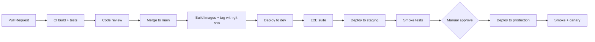

# 12 — Infrastructure Standards

**Status:** Active
**Derives from:** [ADR 0002 — Initial Architecture](../decisions/0002-initial-architecture.md), [ADR 0005 — Live Classroom Media Stack](../decisions/0005-live-classroom-media-stack.md).

How LearnStack is built, packaged, deployed, configured, and observed at the infrastructure level.

## Environments

| Environment | Purpose |
|-------------|---------|
| `local` | Developer workstation. Docker Compose. |
| `ci` | CI runners. Ephemeral. |
| `dev` | Shared dev environment for backend/frontend integration. |
| `staging` | Pre-production rehearsal. Same shape as production, smaller scale. |
| `production` | Live. |

Configuration differences are explicit and documented.

## Local Infrastructure (Docker Compose)

```
postgres
redis
minio + minio-console
meilisearch
keycloak
livekit-server
livekit-egress
coturn
mailhog
otel-collector
```

- Application projects run **outside** containers during active development.
- CI runs the same image tags as developers.
- `.env.example` is the source of truth for required env vars.

## Image Conventions

- Base images pinned by digest.
- Non-root user.
- Read-only filesystem where feasible.
- Drop unneeded Linux capabilities.
- One process per container.
- Image vulnerability scan in CI (Trivy / equivalent).

## Configuration

- Strongly-typed `IOptions<T>` bound in code.
- Sources, in order: env vars → secret manager → `appsettings.{env}.json` → `appsettings.json`.
- No secrets in git.
- Secrets stored in the deployment platform's secret manager.
- Production secrets rotated at least every 90 days where rotation is feasible.

## CI/CD



Rules:
- Every merge to `main` builds and tags an image.
- Staging is auto-deployed; production requires manual approval.
- Rollback is git-sha based; the previous image is always available.

## Deployment Targets

- MVP: container-based deployment (Kubernetes or Nomad). Specific platform decided in Phase 11.
- Frontend deployed independently from backend.
- Migrations run as a separate job before the new app version starts; rollback strategy includes a tolerant code window.

## Database Operations

- Daily logical backups for dev-grade restore.
- Continuous WAL archiving in production.
- Restore drills quarterly. A drill counts only if integration tests pass against a restored instance.
- Replication: read replicas optional from Phase 11.
- PgBouncer in transaction pooling mode in production.

## Object Storage Operations

- MinIO local; S3-compatible cloud storage in production.
- Bucket per tenant or prefix per tenant (decided in [Tenant Isolation](../architecture/09-tenant-isolation.md)).
- Lifecycle policies for recording retention.
- Cross-region replication for production buckets (optional, behind ADR).

## Live Classroom Infrastructure

- Self-hosted LiveKit OSS, coturn, LiveKit Egress.
- Bandwidth-friendly cloud provider preferred for the SFU node.
- TLS termination at the proxy; WebRTC media over UDP.
- Single region for MVP; multi-region behind a separate ADR.
- Cost dashboards live (participant minutes, bandwidth, recording minutes).

## Observability Stack

- OTel Collector centrally.
- Traces → Tempo / Jaeger.
- Metrics → Prometheus / Mimir + Grafana.
- Logs → Loki / Elastic.
- Errors → Sentry.

See [10-observability.md](10-observability.md).

## Secrets Management

- Local: `.env` (not committed).
- CI: GitHub Actions secrets / Vault.
- Cloud: native secret manager (AWS SM / GCP SM / HashiCorp Vault).
- Rotation: documented per provider; quarterly minimum for keys we control.

## Networking

- TLS everywhere.
- Strict ingress rules; only documented ports open.
- Private VPC for backend services; database not on public internet.
- Outbound calls allow-listed where feasible.

## Resource Budgets (initial)

| Service | CPU | Memory | Notes |
|---------|-----|--------|-------|
| API (per instance) | 1 vCPU | 2 GB | autoscale 2–8 |
| Workers (per instance) | 1 vCPU | 2 GB | autoscale 1–4 |
| Postgres | 4 vCPU | 16 GB | initial; scale as needed |
| Redis | 1 vCPU | 2 GB | initial |
| MinIO | 2 vCPU | 4 GB | scaled by storage tier |
| LiveKit SFU | 2 vCPU | 4 GB | per 250 concurrent participants |
| LiveKit Egress | 2 vCPU | 4 GB | per ~1.5 concurrent recordings |
| coturn | 1 vCPU | 1 GB | bandwidth-bound |

Budgets are reviewed quarterly. Cost dashboards drive the next review.

## Disaster Recovery

- RTO target: 4 hours for production restore.
- RPO target: 15 minutes (WAL archiving cadence).
- Runbooks live in `docs/runbooks/` (Phase 11 deliverable).
- Annual full DR drill required.

## Forbidden

- Manual changes in production (use the pipeline).
- SSH into production for routine work (use audited admin tools).
- Pushing images without a git sha tag.
- Deploys without rollback plan documented in the PR.
- Long-running interactive sessions on the database (audit log records them).
