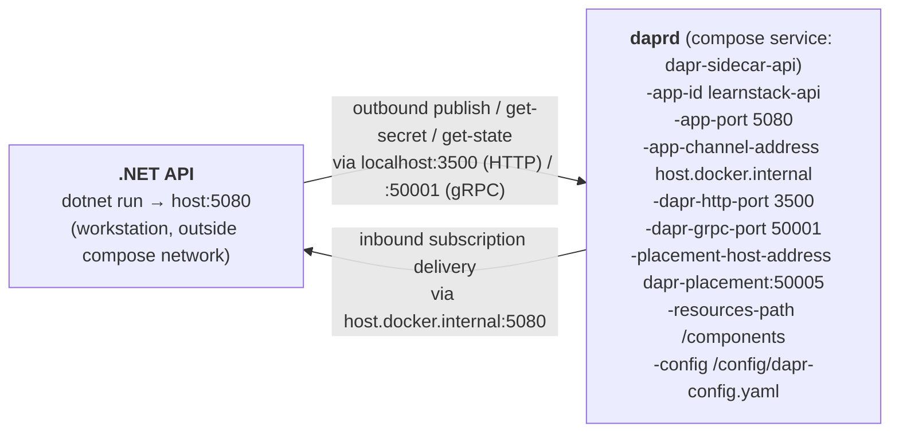

# Dapr Sidecar (Dev)

Cross-cutting infrastructure runtime per
[ADR-0014 (Adopt Dapr)](../../docs/decisions/0014-adopt-dapr.md). Three
building blocks are adopted; everything else is **out of scope** per ADR-0014
non-goals.

| Building block | Backend (dev) | Component file | Application interface |
|----------------|---------------|----------------|-----------------------|
| Pub/Sub | Kafka (`kafka:9092`) | `components/pubsub-kafka.yaml` | `IEventBus` |
| State store | Valkey (`valkey:6379`, RESP protocol) | `components/statestore-redis.yaml` | `ICacheService` |
| Secret store | Vault (`http://vault:8200`, dev mode) | `components/secretstore-vault.yaml` | `ISecretProvider` |

Phase ownership (per [phase-02a](../../docs/roadmap/phase-02a-kernel-tenancy.md)
§ Shared Kernel and § Dapr Building Blocks, and
[phase-02b](../../docs/roadmap/phase-02b-events-outbox-identity.md)):

- **Phase 02a** declares all three interfaces in `LearnStack.SharedKernel`
  with default in-process implementations (`InProcessEventBus`,
  `InMemoryCacheService`, `EnvironmentSecretProvider`) **and** ships the
  Dapr-backed implementations (`DaprEventBus`, `DaprCacheService`,
  `DaprSecretProvider`) in `LearnStack.Infrastructure`. The composition
  root picks between in-process and Dapr-backed per `DeploymentMode`.
- **Phase 02b** wires the `OutboxProcessor`, which is the only sanctioned
  caller of `IEventBus.PublishAsync` per ADR-0010 Amendment 1. Modules
  therefore *consume* `ICacheService` and `ISecretProvider` from 02a but
  do not *write* to `IEventBus` directly until the outbox path exists in
  02b.

Service invocation, workflow, bindings, **actors**, configuration, and
distributed lock are **not adopted**; if a future need appears the gate is a
new ADR. The state store's `actorStateStore` flag is therefore pinned to
`"false"` — see the comment at the top of `components/statestore-redis.yaml`.

## Sidecar topology

Dev compose runs one sidecar bound to the `learnstack-api` app id:



Text fallback for non-Mermaid renderers:

- **App** — `dotnet run` on the developer's workstation, listening on
  `host:5080` (outside the compose network).
- **daprd** — compose service `dapr-sidecar-api`, run with flags:
  `-app-id learnstack-api`, `-app-port 5080`,
  `-app-channel-address host.docker.internal`, `-dapr-http-port 3500`,
  `-dapr-grpc-port 50001`, `-placement-host-address dapr-placement:50005`,
  `-resources-path /components`, `-config /config/dapr-config.yaml`.
- **daprd → app** — inbound subscription deliveries reach the workstation
  via `host.docker.internal:5080`.
- **app → daprd** — outbound publish / state / secret calls hit
  `localhost:3500` (HTTP) or `localhost:50001` (gRPC).

The .NET host runs **outside the container network** during active dev
(developers `dotnet run` from their workstation). `-app-channel-address
host.docker.internal` is what makes inbound subscription deliveries reach
the host — daprd's default of `127.0.0.1` would resolve to inside the
sidecar container, and every subscription would silently fail to deliver.
The `extra_hosts: host.docker.internal:host-gateway` YAML anchor in
`infra/compose/dev.yml` maps the alias on Linux (Docker Desktop does it
automatically).

The placement service (`dapr-placement`) is required even though actors are
out of scope — `daprd` won't start without it.

## Application access pattern

Per ADR-0014 + Standards 20, modules **never** import `Dapr.Client`. They
consume:

```csharp
public interface IEventBus { Task PublishAsync<T>(T @event, CancellationToken ct) where T : IIntegrationEvent; }
public interface ICacheService { Task<T?> GetAsync<T>(string key, CancellationToken ct); /* … */ }
public interface ISecretProvider { Task<string> GetSecretAsync(string key, CancellationToken ct); /* … */ }
```

`DaprEventBus`, `DaprCacheService`, `DaprSecretProvider` are the **only**
Dapr-aware types in the codebase; they live in `LearnStack.Infrastructure`
and ship in Phase 02a (composition-root selected per `DeploymentMode`).
Architecture tests
`Dapr_SDK_Types_NotImportedOutsideInfrastructure`,
`Modules_DoNotReference_DaprPackage`, and
`ICacheService_Is_OnlyCacheAbstraction` keep this honest.

## Dev credentials

| Surface | Credential |
|---------|------------|
| Vault root token | `learnstack-dev-root-token` |
| Kafka auth | none (`authType: none`, `disableTls: true`) |
| Valkey password | (empty) |

All dev-only. Production wires Vault with AppRole / Kubernetes auth and
loads the token through Dapr's `secretKeyRef` indirection so the literal
token never appears in the component YAML.

### Vault token duplication

The literal `learnstack-dev-root-token` appears in **two files**:

- `infra/compose/dev.yml` — `vault` service command + env var (the token
  Vault `-dev` mode boots with).
- `infra/dapr/components/secretstore-vault.yaml` — `vaultToken` metadata
  (the token Dapr authenticates to Vault with).

These MUST stay in lockstep. Phase 07 (DX) wires both to a single
`.env.example` source so the duplication goes away; until then, change
both places together.

## What does NOT live here

- The `IEventBus` / `ICacheService` / `ISecretProvider` implementations —
  Phase 02b (`LearnStack.Infrastructure`).
- Outbox dispatcher (`OutboxProcessor` polling + dispatch) — Phase 02b.
- Per-module `inbox_messages` table + `IInboxGuard` — Phase 02b.
- Production Vault setup (HA mode, auto-unseal, AppRole policies) — Phase 11.
- Additional sidecars for the Hub overlay (separate app id, separate
  consumer group) — Phase 02c.
